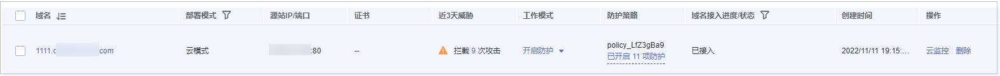

# 查看基本信息

您可以通过WAF管理控制台，查看防护域名的对外协议类型、策略名称、告警页面、CNAME、CNAME IP等信息。

> **说明：** 
>如果您已开通企业项目，您可以在“企业项目“下拉列表中选择您所在的企业项目，查看该企业项目下域名。

## 前提条件

已成功添加防护网站。

## 操作步骤

1.  [登录管理控制台](https://console.huaweicloud.com/?locale=zh-cn)。
2.  单击管理控制台左上角的，选择区域或项目。
3.  单击页面左上方的，选择“安全与合规  \>  Web应用防火墙 WAF“。
4.  在左侧导航树中，选择“网站设置“，进入“网站设置“页面。
5.  查看防护网站信息如[图1](#fig1836152917376)所示，参数说明如[表1](#table4743134133914)所示。

    **图 1**  网站列表  
    

    **表 1**  参数说明

    
    <table><thead align="left"><tr id="row77441949397"><th class="cellrowborder" valign="top" width="22.18%" id="mcps1.2.3.1.1">
参数名称

    </th>
    <th class="cellrowborder" valign="top" width="77.82%" id="mcps1.2.3.1.2">
参数说明

    </th>
    </tr>
    </thead>
    <tbody><tr id="row374414443914"><td class="cellrowborder" valign="top" width="22.18%" headers="mcps1.2.3.1.1 ">
域名

    </td>
    <td class="cellrowborder" valign="top" width="77.82%" headers="mcps1.2.3.1.2 ">
防护的域名或IP。

    </td>
    </tr>
    <tr id="row127441643397"><td class="cellrowborder" valign="top" width="22.18%" headers="mcps1.2.3.1.1 ">
部署模式

    </td>
    <td class="cellrowborder" valign="top" width="77.82%" headers="mcps1.2.3.1.2 ">
防护网站的部署模式，包括“云模式”、“独享模式”。

    </td>
    </tr>
    <tr id="row11466345121716"><td class="cellrowborder" valign="top" width="22.18%" headers="mcps1.2.3.1.1 ">
源站IP/端口

    </td>
    <td class="cellrowborder" valign="top" width="77.82%" headers="mcps1.2.3.1.2 ">
客户端访问的网站服务器的公网IP地址和WAF转发客户端请求到服务器的业务端口。

    </td>
    </tr>
    <tr id="row97401742131712"><td class="cellrowborder" valign="top" width="22.18%" headers="mcps1.2.3.1.1 ">
证书

    </td>
    <td class="cellrowborder" valign="top" width="77.82%" headers="mcps1.2.3.1.2 ">
绑定该域名的证书，单击证书名称，可跳转到“证书管理”页面。

    </td>
    </tr>
    <tr id="row14745174203915"><td class="cellrowborder" valign="top" width="22.18%" headers="mcps1.2.3.1.1 ">
近3天威胁

    </td>
    <td class="cellrowborder" valign="top" width="77.82%" headers="mcps1.2.3.1.2 ">
该域名3天内的防护情况。

    </td>
    </tr>
    <tr id="row57453415396"><td class="cellrowborder" valign="top" width="22.18%" headers="mcps1.2.3.1.1 ">
工作模式

    </td>
    <td class="cellrowborder" valign="top" width="77.82%" headers="mcps1.2.3.1.2 ">
防护模式。单击，可以选择以下三种防护模式：

    <ul id="ul57463415399"><li>“开启防护”：开启状态。</li><li>“暂停防护”：关闭状态。如果大量的正常业务被拦截，比如大量返回418返回码，可以将“工作模式”切换为“暂停防护”。该模式下，WAF对所有的流量请求只转发不检测。该模式存在风险，建议您优先选择全局白名单（原误报屏蔽）规则处理正常业务拦截问题。</li><li>“Bypass”：该域名的请求直接到达其后端服务器，不再经过WAF。
 说明： 

只有防护网站“部署模式”为“云模式”，且出现以下情况，才能将工作模式切换为“Bypass”：

    <ul id="ul13747114153910"><li>当有测试等特殊场景，需要将业务恢复到没有接入WAF的状态，可以通过Bypass功能切换。</li><li>排查网站异常，例如报502、504或其他不兼容等问题。</li><li>在Web应用防火墙前面未使用代理。</li></ul>
    

    
详细操作请参见<a href="切换工作模式.md">切换工作模式</a>。

    </li></ul>
    </td>
    </tr>
    <tr id="row51946504535"><td class="cellrowborder" valign="top" width="22.18%" headers="mcps1.2.3.1.1 ">
防护策略

    </td>
    <td class="cellrowborder" valign="top" width="77.82%" headers="mcps1.2.3.1.2 ">
显示通过WAF配置的防护策略总数。单击数字可跳转到规则配置页面，配置具体的防护规则，具体的配置方法参见<a href="步骤二-为策略配置防护规则.md">步骤二：为策略配置防护规则</a>。

    </td>
    </tr>
    <tr id="row1474794113913"><td class="cellrowborder" valign="top" width="22.18%" headers="mcps1.2.3.1.1 ">
域名接入进度

    </td>
    <td class="cellrowborder" valign="top" width="77.82%" headers="mcps1.2.3.1.2 ">
展示网站接入WAF未完成的步骤或者接入状态。

    <ul id="ul97486413391"><li>“未接入”：网站未接入WAF或者接入不成功。</li><li>“已接入”：网站接入WAF成功。</li></ul>
    
 须知： 

防护网站“部署模式”为“独享模式”时，防护网站的初始接入状态为“未接入”，当访问请求到达该网站的实例时，该防护网站的接入状态将自动切换为“已接入”。

    

    </td>
    </tr>
    <tr id="row13479114319239"><td class="cellrowborder" valign="top" width="22.18%" headers="mcps1.2.3.1.1 ">
创建时间

    </td>
    <td class="cellrowborder" valign="top" width="77.82%" headers="mcps1.2.3.1.2 ">
在WAF中添加该网站的时间。

    </td>
    </tr>
    <tr id="row67491748391"><td class="cellrowborder" valign="top" width="22.18%" headers="mcps1.2.3.1.1 ">
操作

    </td>
    <td class="cellrowborder" valign="top" width="77.82%" headers="mcps1.2.3.1.2 "><ul id="ul13529184820254"><li>单击“云监控”，跳转到云监控，查看防护网站的监控信息。</li><li>单击“删除”，可删除目标防护网站。</li></ul>
    
单击“删除”，可删除目标防护网站。

    
 说明： 
<ul id="ul17817193473312"><li>防护网站“部署模式”为“云模式”时，如果要删除的防护网站已经接入Web应用防火墙，在删除防护网站前，请您先到DNS服务商处将域名重新解析，指向源站服务器IP地址，否则该域名的流量将无法切回服务器，影响正常访问。</li><li>删除网站后，1分钟内生效，且不可恢复，请谨慎删除防护网站。</li></ul>
    

    </td>
    </tr>
    </tbody>
    </table>

6.  在目标网站所在行的“域名“列中，单击目标网站，进入网站基本信息页面。
7.  查看防护网站的信息，以云模式部署为例说明，如[图2](#fig1068529619241)所示。

    **图 2**  查看基本信息  
    

    -   您可以单击，复制“CNAME“、“Web应用防火墙IP段“。
    -   获取“子域名“、“TXT记录“： 在“接入状态“所在行，单击“如何接入？“，在弹出的“接入指导“对话框中，复制“子域名“和“TXT记录“。
    -   当客户端协议选择HTTPS时，若需要更新证书，在“证书“所在行的证书名称后，单击，在弹出的对话框中，上传新证书或者选择已有证书。关于证书更新的详细内容请参见[更新证书](更新证书.md)。
    -   当客户端协议选择HTTPS时，若需要更新访问源站的TLS版本和TLS的加密套件，单击，在弹出的对话框中，重新选择TLS版本和TLS的加密套件。关于配置TLS的详细内容请参见[配置PCI DSS/3DS合规与TLS](配置PCI-DSS-3DS合规与TLS.md)。
    -   若需要修改“是否已使用代理“，可以单击，在弹出的对话框中，重新配置是否需要使用代理，如果需要使用代理，设置成“是“。
    -   “告警页面“默认为“系统默认“的页面，您也可以单击，在弹出的对话框中，配置“自定义“或者“重定向“页面。
    -   如果您的网站需要IPv6的防护，可以单击，在弹出的对话框中，选择“开启“，开启后，WAF将为域名分配IPv6的接入地址，具体的请参见[开启IPv6防护](开启IPv6防护.md)。
    -   如果您的网站需要支持HTTP2协议的访问，在“是否使用HTTP2协议“所在行，单击，选择“是“。当客户端协议包含HTTPS时，该项设置生效。具体的操作请参见[开启HTTP2协议](开启HTTP2协议.md)。
    -   如果您需要针对域名的每个请求设置超时时间，开启“超时配置“并单击，设置“连接超时“、“读超时“、“写超时“的时间。开启后不支持关闭，具体的操作请参见[配置WAF到网站服务器的连接超时时间](配置WAF到网站服务器的连接超时时间.md)。
    -   如果您需要修改网站的负载均衡算法，单击，在弹出的对话框中，选择“负载均衡算法“并单击“确定“，更多详细操作参见[修改负载均衡算法](修改负载均衡算法.md)。

