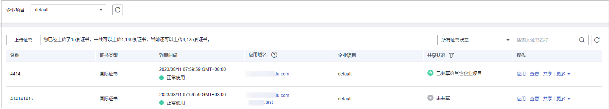

# 查看证书信息

您可以查看证书的名称、绑定的域名和到期时间等详细信息。

> **说明：** 
>如果您已开通企业项目，您可以在“企业项目“下拉列表中选择您所在的企业项目，查看该企业项目下的证书信息。

## 前提条件

已推送证书到WAF或在WAF上创建了证书。

## 约束条件

-   手动[上传的证书](上传证书.md)，WAF不支持证书到期提醒。
-   在云证书管理服务界面绑定证书后推送到WAF中证书，需要在CCM页面配置了SSL证书到期提醒功能，才能在WAF的证书管理页面查看证书的到期时间。

## 操作步骤

1.  [登录管理控制台](https://console.huaweicloud.com/?locale=zh-cn)。
2.  单击管理控制台左上角的，选择区域或项目。
3.  单击页面左上方的，选择“安全与合规  \>  Web应用防火墙 WAF“。
4.  在左侧导航树中，选择“对象管理  \>  证书管理“，进入“证书管理“页面。
5.  查看证书信息，相关参数说明如[表1](#table42671747141413)所示。

    **图 1**  证书列表  
    

    **表 1**  证书参数说明

    
    <table><thead align="left"><tr id="row52651447151419"><th class="cellrowborder" valign="top" width="34.75%" id="mcps1.2.3.1.1">
参数名称

    </th>
    <th class="cellrowborder" valign="top" width="65.25%" id="mcps1.2.3.1.2">
参数说明

    </th>
    </tr>
    </thead>
    <tbody><tr id="row5266647151417"><td class="cellrowborder" valign="top" width="34.75%" headers="mcps1.2.3.1.1 ">
名称

    </td>
    <td class="cellrowborder" valign="top" width="65.25%" headers="mcps1.2.3.1.2 ">
证书名称。

    </td>
    </tr>
    <tr id="row12661047171413"><td class="cellrowborder" valign="top" width="34.75%" headers="mcps1.2.3.1.1 ">
证书类型

    </td>
    <td class="cellrowborder" valign="top" width="65.25%" headers="mcps1.2.3.1.2 ">
仅支持“国际证书”。

    </td>
    </tr>
    <tr id="row62661047181412"><td class="cellrowborder" valign="top" width="34.75%" headers="mcps1.2.3.1.1 ">
到期时间

    </td>
    <td class="cellrowborder" valign="top" width="65.25%" headers="mcps1.2.3.1.2 ">
证书到期时间。

    
证书过期后，对源站的影响是覆灭性的，比主机崩溃和网站无法访问的影响还要大，且会造成WAF的防护规则不生效，建议您在证书到期前及时更新证书。有关更新证书的详细操作，请参见<a href="更新证书.md">更新证书</a>。

    </td>
    </tr>
    <tr id="row9267194718144"><td class="cellrowborder" valign="top" width="34.75%" headers="mcps1.2.3.1.1 ">
应用域名

    </td>
    <td class="cellrowborder" valign="top" width="65.25%" headers="mcps1.2.3.1.2 ">
已使用该证书的域名。域名与证书是一一对应的，同一个证书可以绑定到多个域名。

    </td>
    </tr>
    <tr id="row1039818910173"><td class="cellrowborder" valign="top" width="34.75%" headers="mcps1.2.3.1.1 ">
企业项目

    </td>
    <td class="cellrowborder" valign="top" width="65.25%" headers="mcps1.2.3.1.2 ">
该证书在哪个企业项目下。

    </td>
    </tr>
    <tr id="row5634141212176"><td class="cellrowborder" valign="top" width="34.75%" headers="mcps1.2.3.1.1 ">
共享状态

    </td>
    <td class="cellrowborder" valign="top" width="65.25%" headers="mcps1.2.3.1.2 ">
该证书是否已共享给其他企业项目使用。

    <ul id="ul181761097196"><li>已共享给其他企业项目</li><li>未共享</li></ul>
    </td>
    </tr>
    </tbody>
    </table>

## 相关操作

-   当鼠标移到目标证书的名称后时，单击，您可以修改证书的名称。

    > **须知：** 
    >如果证书正在使用中，请先解除域名和证书的绑定关系，否则无法修改证书名称。

-   在目标证书所在行的“操作“列中，单击“查看“，您可以查看证书的证书文件和证书私钥信息。
-   在目标证书所在行的“操作“列中，单击“应用“，您可以将证书绑定到对应的域名。
-   在目标证书所在行的“操作“列中，单击“更多  \>  删除“，您可以删除该证书。
-   在目标证书所在行的“操作“列中，单击“更多  \>  更新“，您可以重新更新该域名绑定的证书。
-   在目标证书所在行的“操作“列中，单击“共享“，您可以将证书共享给其他企业项目使用。

