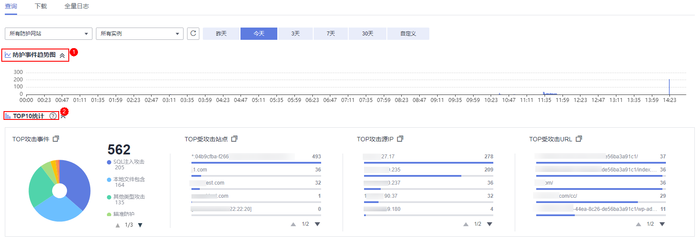
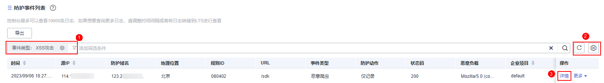

# 查看防护日志

Web应用防火墙将拦截或者仅记录攻击事件记录在“防护事件“页面。您可以查看WAF的防护日志，包括事件发生的时间、源站IP、源站IP所在地理位置、恶意负载、命中规则等信息。

> **说明：** 
>如果您已开通企业项目，您可以在“企业项目“下拉列表中选择您所在的企业项目，查看该企业项目的防护日志。

## 前提条件

防护网站已接入WAF。

## 约束条件

-   下载防护事件文件时，如果您本地安装的安全软件拦截了下载文件，请关闭该软件后重新下载防护事件文件。
-   在WAF控制台只能查看所有防护域名最近30天的防护事件数据。您可以通过开启全量日志长期保存日志，并查看攻击日志和访问日志的详细信息。有关开启全量日志的详细操作，请参见[开启全量日志](开启全量日志.md)。
-   如果您将防护网站的“工作模式“切换为“暂停防护“模式，WAF将对该防护网站所有的流量请求只转发不检测，同时，日志也不会记录。

## 操作步骤

1.  [登录管理控制台](https://console.huaweicloud.com/?locale=zh-cn)。
2.  单击管理控制台左上角的，选择区域或项目。
3.  单击页面左上方的，选择“安全与合规  \>  Web应用防火墙 WAF“。
4.  在左侧导航树中，选择“防护事件“，进入“防护事件“页面。
5.  选择“查询“页签，在网站或实例下拉列表中选择待查看的防护网站，可查看“昨天“、“今天“、“3天“、“7天“、“30天“或者自定义时间范围内的防护日志。

    -   “防护事件趋势图“：展示所选网站在选择的时间段内WAF的防护情况。
    -   “TOP10统计“：针对当前所选时间段的攻击事件、受攻击站点、攻击源IP、受攻击URL的TOP 10网站进行统计，单击可复制统计图表的数据。

    **图 1**  防护事件  
    

6.  在“防护事件列表“中，查看防护详情。

    -   根据筛选条件字段匹配值进行筛选，可设置多项匹配条件，单击“确定“后，匹配条件会展示在事件列表的上方，条件字段参数说明如[表2](#table188191012103314)所示。
    -   在事件列表的左上角，单击“导出“，可导出防护事件列表数据，防护事件数据小于200条将直接导出到本地；防护事件数据大于等于200条时，将在“下载“页面生成一条防护事件数据，您可以在下载页面去下载防护事件数据。
    -   单击，可选择防护事件列表展示的字段。
    -   在目标事件的“操作“列单击“详情“，可查看目标域名攻击事件详情。

    **图 2**  防护事件列表  
    

    **表 1**  支持筛选搜索的条件字段

    
    <table><thead align="left"><tr id="row11342453212"><th class="cellrowborder" valign="top" width="32.85%" id="mcps1.2.3.1.1">
参数名称

    </th>
    <th class="cellrowborder" valign="top" width="67.15%" id="mcps1.2.3.1.2">
参数说明

    </th>
    </tr>
    </thead>
    <tbody><tr id="row16628113593315"><td class="cellrowborder" valign="top" width="32.85%" headers="mcps1.2.3.1.1 ">
事件ID

    </td>
    <td class="cellrowborder" valign="top" width="67.15%" headers="mcps1.2.3.1.2 ">
标识该防护事件的ID。

    </td>
    </tr>
    <tr id="row913412411324"><td class="cellrowborder" valign="top" width="32.85%" headers="mcps1.2.3.1.1 ">
事件类型

    </td>
    <td class="cellrowborder" valign="top" width="67.15%" headers="mcps1.2.3.1.2 ">
发生攻击的类型。

    
默认选择“全部”，查看所有攻击类型的日志信息，也可以根据需要，选择攻击类型查看攻击日志信息。

    </td>
    </tr>
    <tr id="row168604863513"><td class="cellrowborder" valign="top" width="32.85%" headers="mcps1.2.3.1.1 ">
规则ID

    </td>
    <td class="cellrowborder" valign="top" width="67.15%" headers="mcps1.2.3.1.2 ">
内置Web基础防护规则ID。

    </td>
    </tr>
    <tr id="row1713518410324"><td class="cellrowborder" valign="top" width="32.85%" headers="mcps1.2.3.1.1 ">
防护动作

    </td>
    <td class="cellrowborder" valign="top" width="67.15%" headers="mcps1.2.3.1.2 ">
防护配置中设置的防护动作，包含：拦截、仅记录、人机验证等。

    </td>
    </tr>
    <tr id="row21355417324"><td class="cellrowborder" valign="top" width="32.85%" headers="mcps1.2.3.1.1 ">
源IP

    </td>
    <td class="cellrowborder" valign="top" width="67.15%" headers="mcps1.2.3.1.2 ">
Web访问者的公网IP地址（攻击者IP地址）。

    
默认选择“全部”，查看所有的日志信息，也可以根据需要，选择或者自定义攻击者IP地址查看攻击日志信息。

    </td>
    </tr>
    <tr id="row0135164163219"><td class="cellrowborder" valign="top" width="32.85%" headers="mcps1.2.3.1.1 ">
URL

    </td>
    <td class="cellrowborder" valign="top" width="67.15%" headers="mcps1.2.3.1.2 ">
攻击的防护域名的URL。

    </td>
    </tr>
    <tr id="row12713742165216"><td class="cellrowborder" valign="top" width="32.85%" headers="mcps1.2.3.1.1 ">
状态码

    </td>
    <td class="cellrowborder" valign="top" width="67.15%" headers="mcps1.2.3.1.2 ">
拦截页面返回的HTTP状态码。

    </td>
    </tr>
    <tr id="row159616459528"><td class="cellrowborder" valign="top" width="32.85%" headers="mcps1.2.3.1.1 ">
防护域名

    </td>
    <td class="cellrowborder" valign="top" width="67.15%" headers="mcps1.2.3.1.2 ">
被攻击的防护域名。

    </td>
    </tr>
    </tbody>
    </table>

    **表 2**  防护事件列表可展示字段参数说明

    
    <table><thead align="left"><tr id="row168191412113312"><th class="cellrowborder" valign="top" width="26.8%" id="mcps1.2.4.1.1">
参数

    </th>
    <th class="cellrowborder" valign="top" width="45.06%" id="mcps1.2.4.1.2">
说明

    </th>
    <th class="cellrowborder" valign="top" width="28.139999999999997%" id="mcps1.2.4.1.3">
示例

    </th>
    </tr>
    </thead>
    <tbody><tr id="row1682071233315"><td class="cellrowborder" valign="top" width="26.8%" headers="mcps1.2.4.1.1 ">
时间

    </td>
    <td class="cellrowborder" valign="top" width="45.06%" headers="mcps1.2.4.1.2 ">
本次攻击发生的时间。

    </td>
    <td class="cellrowborder" valign="top" width="28.139999999999997%" headers="mcps1.2.4.1.3 ">
2021/02/04 13:20:04

    </td>
    </tr>
    <tr id="row48201012173311"><td class="cellrowborder" valign="top" width="26.8%" headers="mcps1.2.4.1.1 ">
源IP

    </td>
    <td class="cellrowborder" valign="top" width="45.06%" headers="mcps1.2.4.1.2 ">
Web访问者的公网IP地址（攻击者IP地址）。

    </td>
    <td class="cellrowborder" valign="top" width="28.139999999999997%" headers="mcps1.2.4.1.3 ">
-

    </td>
    </tr>
    <tr id="row982019125338"><td class="cellrowborder" valign="top" width="26.8%" headers="mcps1.2.4.1.1 ">
防护域名

    </td>
    <td class="cellrowborder" valign="top" width="45.06%" headers="mcps1.2.4.1.2 ">
被攻击的防护域名。

    </td>
    <td class="cellrowborder" valign="top" width="28.139999999999997%" headers="mcps1.2.4.1.3 ">
www.example.com

    </td>
    </tr>
    <tr id="row41911632123919"><td class="cellrowborder" valign="top" width="26.8%" headers="mcps1.2.4.1.1 ">
地理位置

    </td>
    <td class="cellrowborder" valign="top" width="45.06%" headers="mcps1.2.4.1.2 ">
攻击者来源IP所在地区。

    </td>
    <td class="cellrowborder" valign="top" width="28.139999999999997%" headers="mcps1.2.4.1.3 ">
-

    </td>
    </tr>
    <tr id="row1923171184418"><td class="cellrowborder" valign="top" width="26.8%" headers="mcps1.2.4.1.1 ">
规则ID

    </td>
    <td class="cellrowborder" valign="top" width="45.06%" headers="mcps1.2.4.1.2 ">
内置Web基础防护规则ID。

    </td>
    <td class="cellrowborder" valign="top" width="28.139999999999997%" headers="mcps1.2.4.1.3 ">
-

    </td>
    </tr>
    <tr id="row1484820138452"><td class="cellrowborder" valign="top" width="26.8%" headers="mcps1.2.4.1.1 ">
URL

    </td>
    <td class="cellrowborder" valign="top" width="45.06%" headers="mcps1.2.4.1.2 ">
攻击的防护域名的URL。

    </td>
    <td class="cellrowborder" valign="top" width="28.139999999999997%" headers="mcps1.2.4.1.3 ">
/admin

    </td>
    </tr>
    <tr id="row382111128335"><td class="cellrowborder" valign="top" width="26.8%" headers="mcps1.2.4.1.1 ">
事件类型

    </td>
    <td class="cellrowborder" valign="top" width="45.06%" headers="mcps1.2.4.1.2 ">
发生攻击的类型。

    </td>
    <td class="cellrowborder" valign="top" width="28.139999999999997%" headers="mcps1.2.4.1.3 ">
SQL注入攻击

    </td>
    </tr>
    <tr id="row982216122332"><td class="cellrowborder" valign="top" width="26.8%" headers="mcps1.2.4.1.1 ">
防护动作

    </td>
    <td class="cellrowborder" valign="top" width="45.06%" headers="mcps1.2.4.1.2 ">
防护配置中设置的防护动作，包含：拦截、仅记录、人机验证等。

    
 说明： 

配置网页防篡改、防敏感信息泄露、隐私屏蔽防护规则后，如果访问请求命中防护规则，则防护动作显示为“不匹配”。

    

    </td>
    <td class="cellrowborder" valign="top" width="28.139999999999997%" headers="mcps1.2.4.1.3 ">
拦截

    </td>
    </tr>
    <tr id="row12220152044414"><td class="cellrowborder" valign="top" width="26.8%" headers="mcps1.2.4.1.1 ">
状态码

    </td>
    <td class="cellrowborder" valign="top" width="45.06%" headers="mcps1.2.4.1.2 ">
拦截页面返回的HTTP状态码。

    </td>
    <td class="cellrowborder" valign="top" width="28.139999999999997%" headers="mcps1.2.4.1.3 ">
418

    </td>
    </tr>
    <tr id="row9831142212445"><td class="cellrowborder" valign="top" width="26.8%" headers="mcps1.2.4.1.1 ">
恶意负载

    </td>
    <td class="cellrowborder" valign="top" width="45.06%" headers="mcps1.2.4.1.2 ">
本次攻击对防护域名造成伤害的位置、组成部分或访问URL的次数。

    
 说明： 
<ul id="ul122581318540"><li>对于CC攻击事件，恶意负载表示当时访问URL的次数。</li><li>对于黑名单防护事件，恶意负载为空。</li></ul>
    

    </td>
    <td class="cellrowborder" valign="top" width="28.139999999999997%" headers="mcps1.2.4.1.3 ">
id=1 and 1='1

    </td>
    </tr>
    <tr id="row185201048134213"><td class="cellrowborder" valign="top" width="26.8%" headers="mcps1.2.4.1.1 ">
企业项目

    </td>
    <td class="cellrowborder" valign="top" width="45.06%" headers="mcps1.2.4.1.2 ">
网站所在的企业项目。

    </td>
    <td class="cellrowborder" valign="top" width="28.139999999999997%" headers="mcps1.2.4.1.3 ">
default

    </td>
    </tr>
    </tbody>
    </table>

