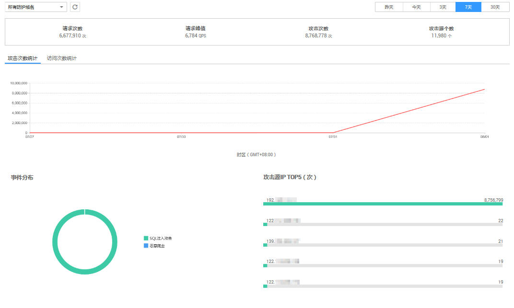

# 查看防护日志

该任务指导用户通过Web应用防火墙服务查看防护日志，可查看到昨天、今天、7天或者30天的访问与攻击统计次数、攻击分布、攻击源IP TOP5的次数。

## 前提条件

已获取管理控制台的帐号和密码。

## 操作步骤

1.  登录管理控制台（https://console.huaweicloud.com/）。
2.  单击页面上方的“服务列表“，选择“安全  \>  Web应用防火墙“，进入Web应用防火墙“安全总览“页面。
3.  在域名下拉列表中，选择待查看的防护域名的防护日志，以“所有域名“为例，可查看“昨天“、“今天“、“3天““7天“或者“30天“的防护概况，如[图1](#fig5451829111656)所示。

    > **说明：**   
    >可在防护域名下拉列表中查看“所有域名“或者某一个域名的防护日志。  

    **图 1**  查看防护日志  
    

    **表 1**  防护日志参数说明

    
    <table><thead align="left"><tr id="row2386908311453"><th class="cellrowborder" valign="top" width="25.81258125812581%" id="mcps1.2.4.1.1">
参数

    </th>
    <th class="cellrowborder" valign="top" width="38.033803380338036%" id="mcps1.2.4.1.2">
说明

    </th>
    <th class="cellrowborder" valign="top" width="36.153615361536154%" id="mcps1.2.4.1.3">
界面说明

    </th>
    </tr>
    </thead>
    <tbody><tr id="row2572158511453"><td class="cellrowborder" valign="top" width="25.81258125812581%" headers="mcps1.2.4.1.1 ">
请求次数

    </td>
    <td class="cellrowborder" valign="top" width="38.033803380338036%" headers="mcps1.2.4.1.2 ">
访问者访问指定域名的总次数。

    
若“所有域名”下拉列表中选择的是“所有域名”，则统计的是访问所有域名的总次数。

    </td>
    <td class="cellrowborder" valign="top" width="36.153615361536154%" headers="mcps1.2.4.1.3 ">
-

    </td>
    </tr>
    <tr id="row3264961511453"><td class="cellrowborder" valign="top" width="25.81258125812581%" headers="mcps1.2.4.1.1 ">
请求峰值

    </td>
    <td class="cellrowborder" valign="top" width="38.033803380338036%" headers="mcps1.2.4.1.2 ">
每秒访问指定域名的最高的次数。

    </td>
    <td class="cellrowborder" valign="top" width="36.153615361536154%" headers="mcps1.2.4.1.3 ">
-

    </td>
    </tr>
    <tr id="row4258356411453"><td class="cellrowborder" valign="top" width="25.81258125812581%" headers="mcps1.2.4.1.1 ">
攻击次数

    </td>
    <td class="cellrowborder" valign="top" width="38.033803380338036%" headers="mcps1.2.4.1.2 ">
攻击指定域名的次数。

    </td>
    <td class="cellrowborder" valign="top" width="36.153615361536154%" headers="mcps1.2.4.1.3 ">
-

    </td>
    </tr>
    <tr id="row6402915811453"><td class="cellrowborder" valign="top" width="25.81258125812581%" headers="mcps1.2.4.1.1 ">
攻击源个数

    </td>
    <td class="cellrowborder" valign="top" width="38.033803380338036%" headers="mcps1.2.4.1.2 ">
攻击指定域名的攻击源个数。

    </td>
    <td class="cellrowborder" valign="top" width="36.153615361536154%" headers="mcps1.2.4.1.3 ">
-

    </td>
    </tr>
    <tr id="row5712464411453"><td class="cellrowborder" valign="top" width="25.81258125812581%" headers="mcps1.2.4.1.1 ">
攻击次数统计

    </td>
    <td class="cellrowborder" valign="top" width="38.033803380338036%" headers="mcps1.2.4.1.2 ">
攻击次数趋势图。

    </td>
    <td class="cellrowborder" valign="top" width="36.153615361536154%" headers="mcps1.2.4.1.3 ">
默认展示攻击次数统计趋势图。

    </td>
    </tr>
    <tr id="row5067778111453"><td class="cellrowborder" valign="top" width="25.81258125812581%" headers="mcps1.2.4.1.1 ">
访问次数统计

    </td>
    <td class="cellrowborder" valign="top" width="38.033803380338036%" headers="mcps1.2.4.1.2 ">
访问次数趋势图。

    </td>
    <td class="cellrowborder" valign="top" width="36.153615361536154%" headers="mcps1.2.4.1.3 ">
单击“访问次数统计”，查看访问次数统计趋势图。

    </td>
    </tr>
    <tr id="row1844865611453"><td class="cellrowborder" valign="top" width="25.81258125812581%" headers="mcps1.2.4.1.1 ">
事件分布

    </td>
    <td class="cellrowborder" valign="top" width="38.033803380338036%" headers="mcps1.2.4.1.2 ">
查看攻击事件类型。

    </td>
    <td class="cellrowborder" valign="top" width="36.153615361536154%" headers="mcps1.2.4.1.3 "><ul id="ul5009385314278"><li>单击“事件分布”中的其中一个颜色区域，可查看指定域名被攻击的类型、攻击的次数、以及攻击占比。</li><li>当不需要展示某种类型的攻击时，单击事件分布图右侧攻击类型对应的颜色方块，取消在事件分布圆环中的展示。</li></ul>
    </td>
    </tr>
    <tr id="row53276882114737"><td class="cellrowborder" valign="top" width="25.81258125812581%" headers="mcps1.2.4.1.1 ">
攻击源IP TOP5(次)

    </td>
    <td class="cellrowborder" valign="top" width="38.033803380338036%" headers="mcps1.2.4.1.2 ">
攻击源IP TOP5的攻击次数统计。

    </td>
    <td class="cellrowborder" valign="top" width="36.153615361536154%" headers="mcps1.2.4.1.3 ">
-

    </td>
    </tr>
    </tbody>
    </table>

