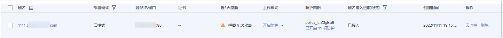

# 查看防护网站的云监控信息

将防护网站接入WAF后，可查看防护网站的云监控信息。

> **说明：** 
>如果您已开通企业项目，您需要在“企业项目“下拉列表中选择您所在的企业项目并确保已开通操作权限，才能查看该企业项目下防护网站的云监控信息。

## 前提条件

已添加防护网站。

## 操作步骤

1.  [登录管理控制台](https://console.huaweicloud.com/?locale=zh-cn)。
2.  单击管理控制台左上角的，选择区域或项目。
3.  单击页面左上方的，选择“安全与合规  \>  Web应用防火墙 WAF“。
4.  在左侧导航树中，选择“网站设置“，进入“网站设置“页面。

    **图 1**  网站列表  
    

5.  在目标防护域名所在行的“操作“列中，单击“云监控“，跳转到云监控，查看防护网站的云监控信息。

