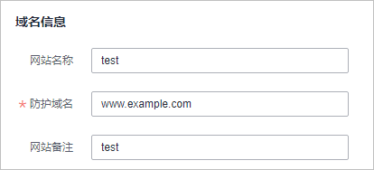
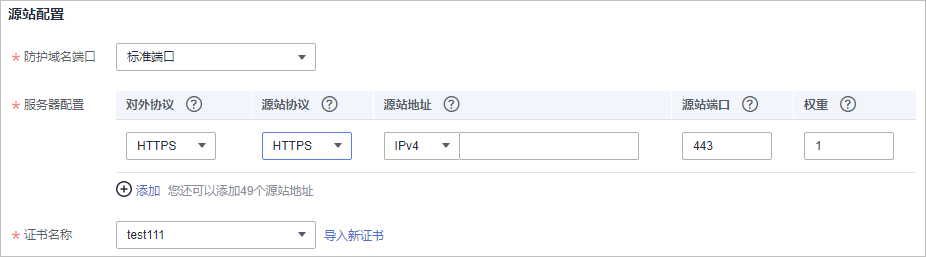
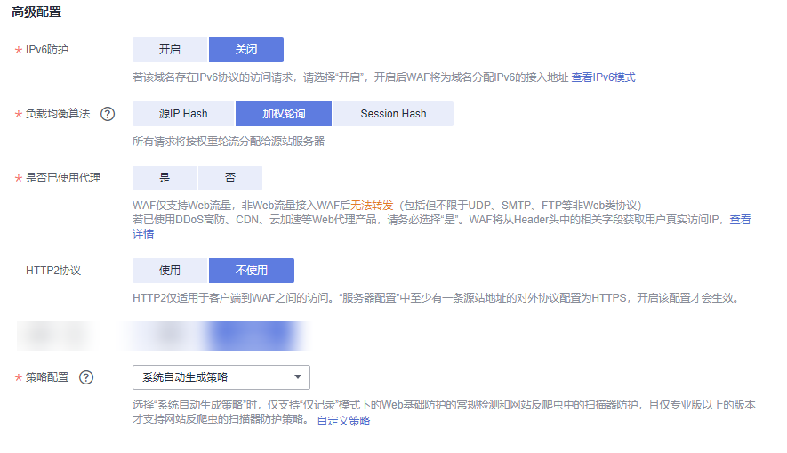
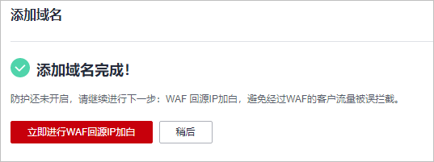

# 步骤一：添加防护域名（云模式）

该章节指导您将网站域名添加到Web应用防火墙，并完成域名接入，使网站流量切入WAF。域名接入WAF后，WAF作为一个反向代理存在于客户端和服务器之间，服务器的真实IP被隐藏起来，Web访问者只能看到WAF的IP地址。

> **说明：** 
>如果您已开通企业项目，您可以在“企业项目“下拉列表中选择您所在的企业项目，在该企业项目下添加防护域名。

## 前提条件

-   已购买WAF云模式。
-   防护域名未添加到WAF，且域名已备案。

## 约束条件

<table><thead align="left"><tr id="row19392634136"><th class="cellrowborder" valign="top" width="23.93%" id="mcps1.1.3.1.1">
限制项

</th>
<th class="cellrowborder" valign="top" width="76.07000000000001%" id="mcps1.1.3.1.2">
限制条件

</th>
</tr>
</thead>
<tbody><tr id="row33925341315"><td class="cellrowborder" valign="top" width="23.93%" headers="mcps1.1.3.1.1 ">
域名限制

</td>
<td class="cellrowborder" valign="top" width="76.07000000000001%" headers="mcps1.1.3.1.2 "><ul id="ul108123404517"><li>WAF支持防护多级别单域名（例如，一级域名example.com，二级域名www.example.com等）和泛域名（例如，*.example.com）。
 须知： 

WAF不支持添加带有下划线（_）的泛域名。

泛域名添加说明如下：<ul id="ul26357551776"><li>如果各子域名对应的服务器IP地址相同：输入防护的泛域名。例如：子域名a.example.com，b.example.com和c.example.com对应的服务器IP地址相同，可以直接添加泛域名*.example.com。</li><li>如果各子域名对应的服务器IP地址不相同：请将子域名按“单域名”方式逐条添加。</li></ul>

</li><li>同一防护域名不能重复添加到WAF云模式。
同一个域名对应不同非标准端口视为不同的防护对象，例如www.example.com:8080和www.example.com:8081为两个不同的防护对象，且占用两个域名防护配额。如果您需要防护同一域名的多个端口，您需要将该域名和端口逐一添加到WAF。

</li><li>请确保域名经过ICP备案，WAF会检查域名备案情况，未备案域名将无法添加。</li></ul>
</td>
</tr>
<tr id="row143926341137"><td class="cellrowborder" valign="top" width="23.93%" headers="mcps1.1.3.1.1 ">
服务版本限制

</td>
<td class="cellrowborder" valign="top" width="76.07000000000001%" headers="mcps1.1.3.1.2 "><ul id="ul1409257138"><li>入门版不支持添加泛域名。</li><li>仅专业版和铂金版支持IPv6防护、HTTP2协议、负载均衡算法。</li><li>入门版、标准版“策略配置”只能选择“系统自动生成策略”。</li></ul>
</td>
</tr>
<tr id="row133922341830"><td class="cellrowborder" valign="top" width="23.93%" headers="mcps1.1.3.1.1 ">
证书限制

</td>
<td class="cellrowborder" valign="top" width="76.07000000000001%" headers="mcps1.1.3.1.2 "><ul id="ul176461458131717"><li>WAF当前仅支持PEM格式证书。</li><li>目前华为云SCM证书只能推送到“default”企业项目下。如果您使用其他企业项目，则不能选择使用SCM推送的SSL证书。</li><li>拥有“SCM Administrator”和“SCM FullAccess”权限的账号才能选择SCM证书。</li></ul>
</td>
</tr>
<tr id="row73928341133"><td class="cellrowborder" valign="top" width="23.93%" headers="mcps1.1.3.1.1 ">
WebSocket协议限制

</td>
<td class="cellrowborder" valign="top" width="76.07000000000001%" headers="mcps1.1.3.1.2 ">
WAF支持WebSocket协议，且默认为开启状态。<ul id="ul1242045101614"><li>“对外协议”选择“HTTP”时，默认支持WebSocket</li><li>“对外协议”选择“HTTPS”时，默认支持WebSockets</li></ul>

</td>
</tr>
<tr id="row13921234537"><td class="cellrowborder" valign="top" width="23.93%" headers="mcps1.1.3.1.1 ">
代理限制

</td>
<td class="cellrowborder" valign="top" width="76.07000000000001%" headers="mcps1.1.3.1.2 ">
若已使用DDoS高防等四层Web代理产品，“是否已使用代理”选择“是”；同时为了保证WAF能从Header头中的相关字段获取用户真实访问IP，完成域名接入后，在域名的基本信息页面，“是否已使用代理”修改为“否”。

</td>
</tr>
<tr id="row113926341337"><td class="cellrowborder" valign="top" width="23.93%" headers="mcps1.1.3.1.1 ">
账号限制

</td>
<td class="cellrowborder" valign="top" width="76.07000000000001%" headers="mcps1.1.3.1.2 ">
主账号可以查看子账号添加的域名，但子账号不能查看主账号添加的域名。

</td>
</tr>
<tr id="row153921134331"><td class="cellrowborder" valign="top" width="23.93%" headers="mcps1.1.3.1.1 ">
其他限制

</td>
<td class="cellrowborder" valign="top" width="76.07000000000001%" headers="mcps1.1.3.1.2 "><ul id="ul33143288197"><li>WAF不支持自定义防护域名的HTTP Header消息头。</li><li>将网站接入WAF后，网站的文件上传请求限制为10G。</li></ul>
</td>
</tr>
</tbody>
</table>

## 规格限制

将网站接入WAF后，网站的文件上传请求限制为10G。

## 系统影响

如果配置了非标准端口，访问网站时，需要在网址后面增加非标准端口进行访问，否则访问网站时会出现[404错误](https://support.huaweicloud.com/waf_faq/waf_01_0066.html#section0)。

## 操作步骤

1.  [登录管理控制台](https://console.huaweicloud.com/?locale=zh-cn)。
2.  单击管理控制台左上角的，选择区域或项目。
3.  单击页面左上方的，选择“安全与合规  \>  Web应用防火墙 WAF“。
4.  在左侧导航树中，选择“网站设置“，进入“网站设置“页面。
5.  在网站列表左上角，单击“添加防护网站“。
6.  选择“云模式“并单击“确定“。
7.  在“防护域名“文本框中输入防护域名后，单击“确认“。

    **图 1**  添加防护域名  
    

    防护域名支持多级别单域名（例如，一级域名example.com，二级域名www.example.com等）和泛域名（例如，\*.example.com）。

    > **须知：** 
    >-   入门版不支持添加泛域名。
    >-   泛域名不支持下划线（\_）。
    >-   泛域名添加说明如下：
    >    -   如果各子域名对应的服务器IP地址相同：输入防护的泛域名。例如：子域名a.example.com，b.example.com和c.example.com对应的服务器IP地址相同，可以直接添加泛域名\*.example.com。
    >    -   如果各子域名对应的服务器IP地址不相同：请将子域名按“单域名“方式逐条添加。

    如果您的域名托管在华为云云解析服务上，您可以直接单击“快速添加华为云内域名“，在弹出的“选择域名“对话框中选择待防护的域名，单击“确定“，托管的域名信息将自动添加到防护域名配置框中。

8.  配置“域名信息“，如[图2](#fig1625231071718)所示。

    -   “网站名称“：可选参数，自定义网站名称。
    -   “防护域名“：需要添加到WAF进行防护的域名，支持单域名（例如，一级域名example.com，二级域名www.example.com等）和泛域名（例如，\*.example.com）。
    -   “网站备注“：可选参数，网站的备注信息。

    **图 2**  配置域名信息  
    

9.  源站配置，如[图3](#fig185369267307)所示，参数说明如[表1](#table179612364712)所示。

    **图 3**  源站配置  
    

    **表 1**  基本信息参数说明

    
    <table><thead align="left"><tr id="row379616394718"><th class="cellrowborder" valign="top" width="15%" id="mcps1.2.4.1.1">
参数

    </th>
    <th class="cellrowborder" valign="top" width="64.21%" id="mcps1.2.4.1.2">
参数说明

    </th>
    <th class="cellrowborder" valign="top" width="20.79%" id="mcps1.2.4.1.3">
取值样例

    </th>
    </tr>
    </thead>
    <tbody><tr id="row1779653134716"><td class="cellrowborder" valign="top" width="15%" headers="mcps1.2.4.1.1 ">
防护域名端口

    </td>
    <td class="cellrowborder" valign="top" width="64.21%" headers="mcps1.2.4.1.2 ">
在下拉框中选择面要防护的端口。

    
配置80/443端口，在下拉框中选择“标准端口”。

    
Web应用防火墙支持的端口请参见<a href="WAF支持的端口范围.md">WAF支持的端口范围</a>。

    
 说明： 

如果配置了除80/443以外的其他端口，访问网站时，需要在网址后面增加非标准端口进行访问，否则访问网站时会出现<a href="https://support.huaweicloud.com/waf_faq/waf_01_0066.html#section0" target="_blank" rel="noopener noreferrer">404错误</a>。

    

    </td>
    <td class="cellrowborder" valign="top" width="20.79%" headers="mcps1.2.4.1.3 ">
81

    </td>
    </tr>
    <tr id="row207971238479"><td class="cellrowborder" valign="top" width="15%" headers="mcps1.2.4.1.1 ">
服务器配置

    </td>
    <td class="cellrowborder" valign="top" width="64.21%" headers="mcps1.2.4.1.2 ">
网站服务器地址的配置。包括对外协议、源站协议、源站地址、源站端口和权重。

    <ul id="ul1279793174710"><li>对外协议：客户端请求访问服务器的协议类型。包括“HTTP”、“HTTPS”两种协议类型。
“对外协议”选择“HTTPS”时，支持<a href="开启HTTP2协议.md">开启HTTP2协议</a>。

    </li><li>源站协议：Web应用防火墙转发客户端请求的协议类型。包括“HTTP”、“HTTPS”两种协议类型。
 说明： 
<ul id="ul97985319471"><li>对外协议与源站协议的具体配置规则，请参见<a href="配置示例-添加防护域名.md#section1420718546612">示例四：不同访问模式的协议配置规则</a>。</li><li>WAF支持WebSocket/WebSockets协议，且默认为开启状态。</li></ul>
    

    </li><li>源站地址：客户端访问的网站服务器的公网IP地址（一般对应该域名在DNS服务商处配置的A记录）或者域名（一般对应该域名在DNS服务商处配置的CNAME）。支持以下两种IP格式：<ul id="ul18798153104712"><li>IPv4，例如：XXX.XXX.1.1</li><li>IPv6，例如：fe80:0000:0000:0000:0000:0000:0000:0000</li></ul>
    
 须知： 

仅专业版和铂金版支持IPv6防护。

    

    </li><li>源站端口：WAF转发客户端请求到服务器的业务端口。</li><li>权重：负载均衡算法将按权重将请求分配给源站。</li></ul>
    </td>
    <td class="cellrowborder" valign="top" width="20.79%" headers="mcps1.2.4.1.3 ">
对外协议：HTTP

    
源站协议：HTTP

    
源站地址：IPv4 XXX .XXX.1.1

    
源站端口：80

    </td>
    </tr>
    <tr id="row11802143174718"><td class="cellrowborder" valign="top" width="15%" headers="mcps1.2.4.1.1 ">
证书名称

    </td>
    <td class="cellrowborder" valign="top" width="64.21%" headers="mcps1.2.4.1.2 ">
“对外协议”设置为“HTTPS”时，需要选择证书。您可以选择已创建的证书或选择导入的新证书。导入新证书的操作请参见<a href="#section17868487278">导入新证书</a>。

    
成功导入的新证书，将添加到“证书管理”页面的证书列表中。有关证书管理的操作，请参见<a href="上传证书.md">上传证书</a>。

    
您也可以在CCM管理控制台购买证书并推送到WAF。有关CCM证书推送到WAF的详细操作，请参见<a href="https://support.huaweicloud.com/usermanual-ccm/ccm_01_0141.html" target="_blank" rel="noopener noreferrer">推送证书到云产品</a>。

    
 须知： 
<ul id="ul108022334719"><li>WAF当前仅支持PEM格式证书。如果证书为非PEM格式，请参考<a href="#table1292125414516">表3</a>将证书转换为PEM格式，再上传。</li><li>目前华为云SCM证书只能推送到“default”企业项目下。如果您使用其他企业项目，则不能选择使用SCM推送的SSL证书。</li><li>如果您的证书即将到期，为了不影响网站的使用，建议您在到期前重新使用新的证书，并在WAF中同步更新网站绑定的证书。</li><li>域名和证书需要一一对应，泛域名只能使用泛域名证书。如果您没有泛域名证书，只有单域名对应的证书，则只能在WAF中按照单域名的方式逐条添加域名进行防护。</li></ul>
    

    </td>
    <td class="cellrowborder" valign="top" width="20.79%" headers="mcps1.2.4.1.3 ">
--

    </td>
    </tr>
    </tbody>
    </table>

10. 高级配置，如[图4](#fig1831195410431)所示。

    **图 4**  高级配置  
    

    -   “IPv6防护“：若该域名存在IPv6协议的访问请求，请选择“开启“，开启后WAF将为域名分配IPv6的接入地址。

        -   “源站地址“选择“IPv6“时，默认开启“IPv6防护“。
        -   “源站地址“选择“IPv4“时，开启“IPv6防护“后，WAF将为域名分配IPv6的接入地址，即将IPv4源站转化成IPv6网站，将外部IPv6访问流量转化成对内的IPv4流量。具体的请参见[WAF如何解析/访问IPv6源站？](https://support.huaweicloud.com/waf_faq/waf_01_0360.html)。

        > **说明：** 
        >当源站存在IPv6地址，默认开启IPv6防护。WAF为了防止客户IPv6的业务中断，禁止关闭IPv6的开关，如果确定不需要IPv6防护，需要先修改服务器配置，在源站删除IPv6的配置，具体的操作方法请参见[修改服务器配置信息](https://support.huaweicloud.com/usermanual-waf/waf_01_0001.html)。

    -   配置“负载均衡算法“：

        -   源IP Hash：将某个IP的请求定向到同一个服务器。
        -   加权轮询：所有请求将按权重轮流分配给源站服务器，权重越大，回源到该源站的几率越高。
        -   Session Hash：将某个Session标识的请求定向到同一个源站服务器，请确保在域名添加完毕后[配置攻击惩罚的流量标识](配置攻击惩罚的流量标识.md)，否则Session Hash配置不生效。

        更多信息请见[修改负载均衡算法](修改负载均衡算法.md)。

    -   “是否已使用代理“：若已使用DDoS高防、CDN、云加速等Web代理产品，请务必选择“是“。

        如果已使用DDoS高防等四层Web代理产品，“是否已使用代理“选择“是“，同时为了保证WAF的安全策略能够针对真实源IP生效，成功获取Web访问者请求的真实IP地址，完成[步骤四：修改域名DNS解析设置](步骤四-修改域名DNS解析设置.md)后，在域名的基本信息页面，“是否已使用代理“修改为“否“。

        > **须知：** 
        >-   当在Web应用防火墙前使用代理时，不能切换为“Bypass“工作模式。如何切换工作模式请参考[切换工作模式](切换工作模式.md)。
        >-   如果网站未使用任何代理，而“是否已使用代理“选择了“是“，该配置仅会使WAF在获取真实源IP时信任HTTP请求头中的“X-Forwarded-For“字段，不影响用户业务。

    -   “HTTP2协议“：如果您的网站需要支持HTTP2协议的访问，则选择“使用“。

        HTTP2协议仅适用于客户端到WAF之间的访问，且“对外协议“必须包含HTTPS才能支持使用。

    -   选择“策略配置“：默认为“系统自动生成策略“，您也可以选择自定义防护策略，系统自动生成的策略相关说明如[表2](#table527451174216)所示。

        > **须知：** 
        >入门版、标准版只能选择“系统自动生成策略“。

        您也可以选择已创建的防护策略或在域名接入后根据防护需求配置防护规则。

        **表 2**  系统自动生成策略说明

        
        <table><thead align="left"><tr id="row1327341112424"><th class="cellrowborder" valign="top" width="29.072907290729074%" id="mcps1.2.4.1.1">
版本

        </th>
        <th class="cellrowborder" valign="top" width="37.593759375937594%" id="mcps1.2.4.1.2">
防护策略

        </th>
        <th class="cellrowborder" valign="top" width="33.33333333333333%" id="mcps1.2.4.1.3">
策略说明

        </th>
        </tr>
        </thead>
        <tbody><tr id="row1727371194214"><td class="cellrowborder" valign="top" width="29.072907290729074%" headers="mcps1.2.4.1.1 ">
入门版、标准版

        </td>
        <td class="cellrowborder" valign="top" width="37.593759375937594%" headers="mcps1.2.4.1.2 ">
Web基础防护（“仅记录”模式、常规检测）

        </td>
        <td class="cellrowborder" valign="top" width="33.33333333333333%" headers="mcps1.2.4.1.3 ">
仅记录SQL注入、XSS跨站脚本、远程溢出攻击、文件包含、Bash漏洞攻击、远程命令执行、目录遍历、敏感文件访问、命令/代码注入等攻击行为。

        </td>
        </tr>
        <tr id="row12731511104210"><td class="cellrowborder" rowspan="2" valign="top" width="29.072907290729074%" headers="mcps1.2.4.1.1 ">
专业版、铂金版

        </td>
        <td class="cellrowborder" valign="top" width="37.593759375937594%" headers="mcps1.2.4.1.2 ">
Web基础防护（“仅记录”模式、常规检测）

        </td>
        <td class="cellrowborder" valign="top" width="33.33333333333333%" headers="mcps1.2.4.1.3 ">
仅记录SQL注入、XSS跨站脚本、远程溢出攻击、文件包含、Bash漏洞攻击、远程命令执行、目录遍历、敏感文件访问、命令/代码注入等攻击行为。

        </td>
        </tr>
        <tr id="row727441144220"><td class="cellrowborder" valign="top" headers="mcps1.2.4.1.1 ">
网站反爬虫（“仅记录”模式、扫描器）

        </td>
        <td class="cellrowborder" valign="top" headers="mcps1.2.4.1.2 ">
仅记录漏洞扫描、病毒扫描等Web扫描任务，如OpenVAS、Nmap的爬虫行为。

        </td>
        </tr>
        </tbody>
        </table>

        > **说明：** 
        >“仅记录“模式：发现攻击行为后WAF只记录攻击事件不阻断攻击。

11. 单击“确认“，添加域名完成。

    可根据界面提示，完成放行WAF回源IP、本地验证和域名接入配置操作，建议单击“稍后“。后续参照[步骤二：放行WAF回源IP](步骤二-放行WAF回源IP.md)、[步骤三：本地验证](步骤三-本地验证.md)和[步骤四：修改域名DNS解析设置](步骤四-修改域名DNS解析设置.md)完成相关操作。

    **图 5**  添加域名完成  
    

## 生效条件

-   默认情况下，WAF每隔一小时就会自动检测每个防护域名的“接入状态“。
-   一般情况下，如果您确认已完成域名接入，“接入状态“为“已接入“，表示域名接入成功。

    如果防护域名已接入WAF，“接入状态“仍然为“未接入“，可单击，刷新状态，如果仍然为“未接入“，可参照[步骤四：修改域名DNS解析设置](步骤四-修改域名DNS解析设置.md)重新完成域名接入。

## 导入新证书

当“对外协议“设置为“HTTPS“时，可以导入新证书。

1.  单击“导入新证书“，打开“导入新证书“对话框。然后输入“证书名称“，并将证书内容和私钥内容粘贴到对应的文本框中，如[图6](#fig829215549456)所示。

    **图 6**  导入新证书  
    

    > **说明：** 
    >Web应用防火墙将对私钥进行加密保存，保障证书私钥的安全性。

    WAF当前仅支持PEM格式证书。如果证书为非PEM格式，请参考[表3](#table1292125414516)在本地将证书转换为PEM格式，再上传。

    **表 3**  证书转换命令

    
    <table><thead align="left"><tr id="row1029335416459"><th class="cellrowborder" valign="top" width="21.990000000000002%" id="mcps1.2.3.1.1">
格式类型

    </th>
    <th class="cellrowborder" valign="top" width="78.01%" id="mcps1.2.3.1.2">
转换方式

    </th>
    </tr>
    </thead>
    <tbody><tr id="row229345416453"><td class="cellrowborder" valign="top" width="21.990000000000002%" headers="mcps1.2.3.1.1 ">
CER/CRT

    </td>
    <td class="cellrowborder" valign="top" width="78.01%" headers="mcps1.2.3.1.2 ">
将“cert.crt”证书文件直接重命名为“cert.pem”。

    </td>
    </tr>
    <tr id="row19294654194516"><td class="cellrowborder" valign="top" width="21.990000000000002%" headers="mcps1.2.3.1.1 ">
PFX

    </td>
    <td class="cellrowborder" valign="top" width="78.01%" headers="mcps1.2.3.1.2 "><ul id="ul122945545457"><li>提取私钥命令，以“cert.pfx”转换为“key.pem”为例。
<strong id="b1294125484517">openssl pkcs12 -in cert.pfx -nocerts -out key.pem -nodes</strong>

    </li><li>提取证书命令，以“cert.pfx”转换为“cert.pem”为例。
<strong id="b1629465420458">openssl</strong> <strong id="b1529417548459">pkcs12</strong> <strong id="b10294145414520">-in</strong> <strong id="b20294105444511">cert.pfx</strong> <strong id="b1294205444519">-nokeys</strong> <strong id="b9294185410455">-out</strong> <strong id="b729425411459">cert.pem</strong>

    </li></ul>
    </td>
    </tr>
    <tr id="row1529419542456"><td class="cellrowborder" valign="top" width="21.990000000000002%" headers="mcps1.2.3.1.1 ">
P7B

    </td>
    <td class="cellrowborder" valign="top" width="78.01%" headers="mcps1.2.3.1.2 "><ol id="ol1729475464511"><li>证书转换，以“cert.p7b”转换为“cert.cer”为例。
<strong id="b1629510544452">openssl</strong> <strong id="b16295105404518">pkcs7</strong> <strong id="b729555444513">-print_certs</strong> <strong id="b20295145464510">-in</strong> <strong id="b17295145454517">cert.p7b</strong> <strong id="b629595411457">-out</strong> <strong id="b13295125494519">cert.cer</strong>

    </li><li>将“cert.cer”证书文件直接重命名为“cert.pem”。</li></ol>
    </td>
    </tr>
    <tr id="row8295195414451"><td class="cellrowborder" valign="top" width="21.990000000000002%" headers="mcps1.2.3.1.1 ">
DER

    </td>
    <td class="cellrowborder" valign="top" width="78.01%" headers="mcps1.2.3.1.2 "><ul id="ul162956542452"><li>提取私钥命令，以“privatekey.der”转换为“privatekey.pem”为例。
<strong id="b12295165414514">openssl</strong> <strong id="b429514549453">rsa</strong> <strong id="b19295165474516">-inform</strong> <strong id="b42951954164520">DER</strong> <strong id="b529525444512">-outform</strong> <strong id="b429525484510">PEM</strong> <strong id="b142955543457">-in</strong> <strong id="b1029535454514">privatekey.der</strong> <strong id="b829675424513">-out</strong> <strong id="b1296115410454">privatekey.pem</strong>

    </li><li>提取证书命令，以“cert.cer”转换为“cert.pem”为例。
<strong id="b729675419451">openssl</strong> <strong id="b19296175424511">x509</strong> <strong id="b3296954134515">-inform</strong> <strong id="b3296754204513">der</strong> <strong id="b17296254134510">-in</strong> <strong id="b829645412454">cert.cer</strong> <strong id="b929625474518">-out cert.pem</strong>

    </li></ul>
    </td>
    </tr>
    </tbody>
    </table>

    > **说明：** 
    >-   执行openssl命令前，请确保本地已安装[openssl](https://www.openssl.org/)。
    >-   如果本地为Windows操作系统，请进入“命令提示符“对话框后，再执行证书转换命令。

2.  单击“确认“，上传证书。

## 配置示例

不同场景的配置示例请参考[配置示例：添加防护域名](配置示例-添加防护域名.md)。

