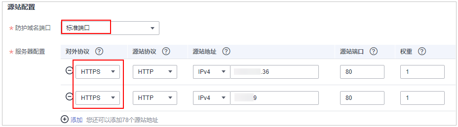
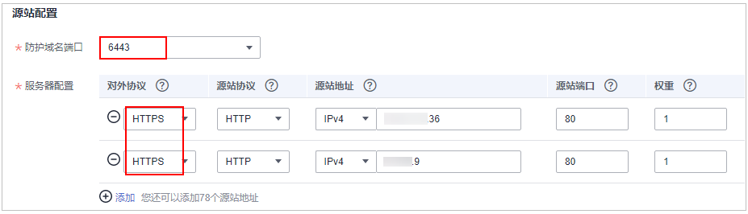
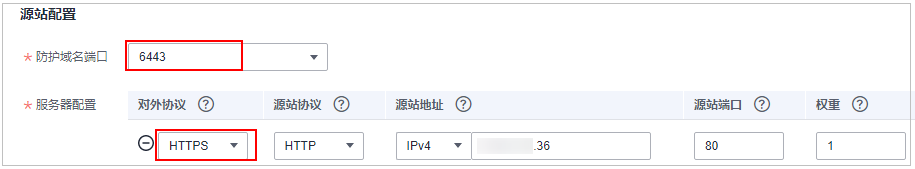
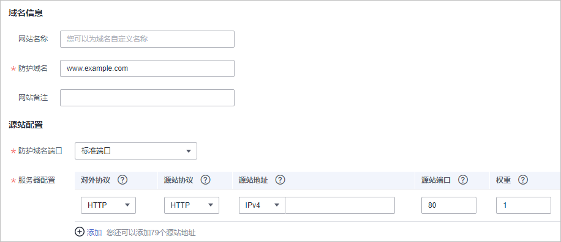
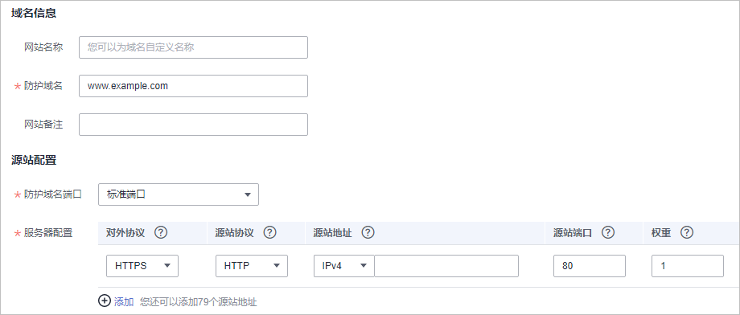

# 步骤一：添加防护域名（云模式）

该章节指导您将网站域名添加到Web应用防火墙，并完成域名接入，使网站流量切入WAF。域名接入WAF后，WAF作为一个反向代理存在于客户端和服务器之间，服务器的真实IP被隐藏起来，Web访问者只能看到WAF的IP地址。

> **说明：** 
>如果您已开通企业项目，您可以在“企业项目“下拉列表中选择您所在的企业项目，在该企业项目下添加防护域名。

## 前提条件

-   已购买WAF云模式。
-   防护域名未添加到WAF，且域名已备案。

## 规格限制

-   仅专业版（原企业版）和铂金版（原旗舰版）支持IPv6防护。

    当前仅“华东“和“华北“区域支持IPv4/6双栈和NAT64。

-   将网站接入WAF后，网站的文件上传请求限制为512MB。
-   检测版不支持泛域名。

## 约束条件

-   主帐号可以查看子帐号添加的域名，但子帐号不能查看主帐号添加的域名。
-   同一防护域名不能重复添加到WAF云模式。

    同一个域名对应不同端口视为不同的防护对象，例如www.example.com:8080和www.example.com:8081为两个不同的防护对象，且占用两个域名防护配额。如果您需要防护同一域名的多个端口，您需要将该域名和端口逐一添加到WAF。

-   WAF支持防护多级别单域名（例如，一级域名example.com，二级域名www.example.com等）和泛域名（例如，\*.example.com）。

    > **须知：** 
    >-   泛域名不支持下划线（\_）。
    >-   泛域名添加说明如下：
    >    -   如果各子域名对应的服务器IP地址相同：输入防护的泛域名。例如：子域名a.example.com，b.example.com和c.example.com对应的服务器IP地址相同，可以直接添加泛域名\*.example.com。
    >    -   如果各子域名对应的服务器IP地址不相同：请将子域名按“单域名“方式逐条添加。

-   WAF不支持自定义防护域名的HTTP Header消息头。
-   请确保域名经过ICP备案，WAF会检查域名备案情况，未备案域名将无法添加。
-   CNAME值是根据域名生成的，对于同一个域名，其CNAME值是一致的。
-   WAF当前仅支持PEM格式证书。
-   目前华为云SCM证书只能推送到“default“企业项目下。如果您使用其他企业项目，则不能选择使用SCM推送的SSL证书。
-   WAF支持Web Socket协议，且默认为开启状态。
    -   “对外协议“选择“HTTP“时，默认支持WebSocket
    -   “对外协议“选择“HTTPS“时，默认支持WebSockets

-   检测版、标准版（原专业版）“策略配置“只能选择“系统自动生成策略“。

## 系统影响

如果配置了非标准端口，访问网站时，需要在网址后面增加非标准端口进行访问，否则访问网站时会出现[404错误](https://support.huaweicloud.com/waf_faq/waf_01_0066.html#section0)。

## 收集防护域名的配置信息

在添加防护域名前，请获取防护域名如[表1](#table1252463519439)所示相关信息。

**表 1**  准备防护域名相关信息

<table><thead align="left"><tr id="row17524133512433"><th class="cellrowborder" valign="top" width="13.889999999999999%" id="mcps1.2.5.1.1">
获取信息

</th>
<th class="cellrowborder" valign="top" width="16.41%" id="mcps1.2.5.1.2">
参数

</th>
<th class="cellrowborder" valign="top" width="46.92%" id="mcps1.2.5.1.3">
说明

</th>
<th class="cellrowborder" valign="top" width="22.78%" id="mcps1.2.5.1.4">
示例

</th>
</tr>
</thead>
<tbody><tr id="row61481836145815"><td class="cellrowborder" valign="top" width="13.889999999999999%" headers="mcps1.2.5.1.1 ">
域名是否使用代理

</td>
<td class="cellrowborder" valign="top" width="16.41%" headers="mcps1.2.5.1.2 ">
-

</td>
<td class="cellrowborder" valign="top" width="46.92%" headers="mcps1.2.5.1.3 ">
域名在接入WAF前，是否已接入DDoS高防、CDN等服务。

</td>
<td class="cellrowborder" valign="top" width="22.78%" headers="mcps1.2.5.1.4 ">
-

</td>
</tr>
<tr id="row165241835174314"><td class="cellrowborder" rowspan="5" valign="top" width="13.889999999999999%" headers="mcps1.2.5.1.1 ">
配置参数

</td>
<td class="cellrowborder" valign="top" width="16.41%" headers="mcps1.2.5.1.2 ">
域名

</td>
<td class="cellrowborder" valign="top" width="46.92%" headers="mcps1.2.5.1.3 ">
由一串用点分隔的英文字母组成（以字符串的形式来表示服务器IP），用户通过域名来访问网站。

</td>
<td class="cellrowborder" valign="top" width="22.78%" headers="mcps1.2.5.1.4 ">
www.example.com

</td>
</tr>
<tr id="row93691515163314"><td class="cellrowborder" valign="top" headers="mcps1.2.5.1.1 ">
标准端口/非标准端口

</td>
<td class="cellrowborder" valign="top" headers="mcps1.2.5.1.2 ">
需要防护的域名对应的业务端口。

<ul id="ul214111516416"><li>标准端口<ul id="ul514195848"><li>80：HTTP对外协议默认使用端口</li><li>443：HTTPS对外协议默认使用端口</li></ul>
</li><li>非标准端口
80/443以外的端口

 须知： 

如果防护域名使用非标准端口，请查看<a href="https://support.huaweicloud.com/waf_faq/waf_01_0032.html" target="_blank" rel="noopener noreferrer">WAF支持哪些非标准端口？</a>，确保购买的WAF版本支持防护该非标准端口。

</li></ul>
</td>
<td class="cellrowborder" valign="top" headers="mcps1.2.5.1.3 ">
80

</td>
</tr>
<tr id="row125615132538"><td class="cellrowborder" valign="top" headers="mcps1.2.5.1.1 ">
对外协议

</td>
<td class="cellrowborder" valign="top" headers="mcps1.2.5.1.2 ">
客户端（例如浏览器）请求访问网站的协议类型。WAF支持“HTTP”、“HTTPS”两种协议类型。

</td>
<td class="cellrowborder" valign="top" headers="mcps1.2.5.1.3 ">
HTTP

</td>
</tr>
<tr id="row14992143017286"><td class="cellrowborder" valign="top" headers="mcps1.2.5.1.1 ">
源站协议

</td>
<td class="cellrowborder" valign="top" headers="mcps1.2.5.1.2 ">
WAF转发客户端（例如浏览器）请求的协议类型。包括“HTTP”、“HTTPS”两种协议类型。

</td>
<td class="cellrowborder" valign="top" headers="mcps1.2.5.1.3 ">
HTTP

</td>
</tr>
<tr id="row16870033165413"><td class="cellrowborder" valign="top" headers="mcps1.2.5.1.1 ">
源站地址

</td>
<td class="cellrowborder" valign="top" headers="mcps1.2.5.1.2 ">
客户端（例如浏览器）访问网站所在源站服务器的<strong id="b18143959413">公网IP地址</strong>（一般对应该域名在DNS服务商处配置的A记录）或者域名（一般对应该域名在DNS服务商处配置的CNAME）。

</td>
<td class="cellrowborder" valign="top" headers="mcps1.2.5.1.3 ">
XXX.XXX.1.1

</td>
</tr>
<tr id="row944519482236"><td class="cellrowborder" valign="top" width="13.889999999999999%" headers="mcps1.2.5.1.1 ">
（可选）证书

</td>
<td class="cellrowborder" valign="top" width="16.41%" headers="mcps1.2.5.1.2 ">
-

</td>
<td class="cellrowborder" valign="top" width="46.92%" headers="mcps1.2.5.1.3 ">
对外协议选择“HTTPS”时，需要在WAF上配置证书，将证书绑定到防护域名。

 须知： 

WAF当前仅支持PEM格式证书。如果证书为非PEM格式，请参考<a href="https://support.huaweicloud.com/waf_faq/waf_01_0313.html" target="_blank" rel="noopener noreferrer">如何将非PEM格式的证书转换为PEM格式？</a>转化证书格式。

</td>
<td class="cellrowborder" valign="top" width="22.78%" headers="mcps1.2.5.1.4 ">
-

</td>
</tr>
</tbody>
</table>

## 操作步骤

1.  [登录管理控制台](https://console.huaweicloud.com/?locale=zh-cn)。
2.  进入网站设置页面入口，如[图1](#fig172535820151)所示。

    **图 1**  网站设置入口  
    

3.  在网站列表左上角，单击“添加防护网站“。
4.  选择“云模式“后，在“防护域名“文本框中输入防护域名后，单击“确认“。

    **图 2**  添加防护域名  
    

    防护域名支持多级别单域名（例如，一级域名example.com，二级域名www.example.com等）和泛域名（例如，\*.example.com）。

    > **须知：** 
    >-   检测版不支持添加泛域名。
    >-   泛域名不支持下划线（\_）。
    >-   泛域名添加说明如下：
    >    -   如果各子域名对应的服务器IP地址相同：输入防护的泛域名。例如：子域名a.example.com，b.example.com和c.example.com对应的服务器IP地址相同，可以直接添加泛域名\*.example.com。
    >    -   如果各子域名对应的服务器IP地址不相同：请将子域名按“单域名“方式逐条添加。

    如果您的域名托管在华为云云解析服务上，您可以直接单击“快速添加“，在弹出的“选择域名“对话框中选择待防护的域名，单击“确定“，托管的域名信息将自动添加到防护域名配置框中。

5.  在“域名配置“页面配置域名基本信息，如[图3](#fig175731754141418)所示，相关参数说明如[表2](#table7692122554811)所示。

    **图 3**  配置基本信息  
    

    **表 2**  基本信息参数说明

    
    <table><thead align="left"><tr id="row1068752517484"><th class="cellrowborder" valign="top" width="15%" id="mcps1.2.4.1.1">
参数

    </th>
    <th class="cellrowborder" valign="top" width="64.21%" id="mcps1.2.4.1.2">
参数说明

    </th>
    <th class="cellrowborder" valign="top" width="20.79%" id="mcps1.2.4.1.3">
取值样例

    </th>
    </tr>
    </thead>
    <tbody><tr id="row1368718254486"><td class="cellrowborder" valign="top" width="15%" headers="mcps1.2.4.1.1 ">
防护域名

    </td>
    <td class="cellrowborder" valign="top" width="64.21%" headers="mcps1.2.4.1.2 ">
可防护的域名，支持单域名和泛域名。

    <ul id="ul9206119142513"><li>单域名：输入防护的单域名。</li><li>泛域名：输入防护的泛域名。泛域名不支持下划线（_）。</li></ul>
    
 说明： 
<ul id="ul776103520251"><li>检测版不支持添加泛域名。</li><li>如果各子域名对应的服务器IP地址相同：输入防护的泛域名。例如：子域名a.example.com，b.example.com和c.example.com对应的服务器IP地址相同，可以直接添加泛域名*.example.com。</li><li>如果各子域名对应的服务器IP地址不相同：请将子域名按“单域名”方式逐条添加。</li></ul>
    

    </td>
    <td class="cellrowborder" valign="top" width="20.79%" headers="mcps1.2.4.1.3 ">
单域名：www.example.com

    
一级域名：example.com

    
泛域名：*.example.com

    </td>
    </tr>
    <tr id="row116884252488"><td class="cellrowborder" valign="top" width="15%" headers="mcps1.2.4.1.1 ">
端口

    </td>
    <td class="cellrowborder" valign="top" width="64.21%" headers="mcps1.2.4.1.2 ">
可选参数，仅当用户勾选“非标准端口”时需要配置。端口的配置示例如<a href="#section04061341181016">配置示例一：防护同一端口的不同源站IP的标准端口业务</a>。

    <ul id="ul86882025104815"><li>“对外协议”选择“HTTP”时，WAF默认防护“80”标准端口的业务；“对外协议”选择“HTTPS”时，WAF默认防护“443”标准端口的业务。</li><li>如需配置除“80”/“443”以外的端口，勾选“非标准端口”，在“端口”下拉列表中选择非标准端口。
Web应用防火墙支持的非标准端口请参见<a href="https://support.huaweicloud.com/waf_faq/waf_01_0032.html" target="_blank" rel="noopener noreferrer">Web应用防火墙支持的非标准端口</a>。

    </li></ul>
    
 说明： 

如果配置了非标准端口，访问网站时，需要在网址后面增加非标准端口进行访问，否则访问网站时会出现<a href="https://support.huaweicloud.com/waf_faq/waf_01_0066.html#section0" target="_blank" rel="noopener noreferrer">404错误</a>。

    

    </td>
    <td class="cellrowborder" valign="top" width="20.79%" headers="mcps1.2.4.1.3 ">
81

    </td>
    </tr>
    <tr id="row5690192514820"><td class="cellrowborder" valign="top" width="15%" headers="mcps1.2.4.1.1 ">
服务器配置

    </td>
    <td class="cellrowborder" valign="top" width="64.21%" headers="mcps1.2.4.1.2 ">
网站服务器地址的配置。包括对外协议、源站协议、源站地址和源站端口。

    <ul id="ul16689625134815"><li>对外协议：客户端请求访问服务器的协议类型。包括“HTTP”、“HTTPS”两种协议类型。</li><li>源站协议：Web应用防火墙转发客户端请求的协议类型。包括“HTTP”、“HTTPS”两种协议类型。
 说明： 
<ul id="ul666091813589"><li>对外协议与源站协议的具体配置规则，请参见<a href="#section645014318511">对外协议与源站协议配置规则</a>。</li><li>WAF支持Web Socket协议，且默认为开启状态。</li></ul>
    

    </li><li>源站地址：客户端访问的网站服务器的公网IP地址（一般对应该域名在DNS服务商处配置的A记录）或者域名（一般对应该域名在DNS服务商处配置的CNAME）。支持以下两种IP格式：<ul id="ul1115165615391"><li>IPv4，例如：XXX.XXX.1.1</li><li>IPv6，例如：1050:0:0:0:5:600:300c:326b</li></ul>
    
 须知： 

仅专业版（原企业版）和铂金版（原旗舰版）支持IPv6防护，且当前仅“华东”和“华北”区域支持IPv4/6双栈和NAT64。

    

    </li><li>源站端口：WAF转发客户端请求到服务器的业务端口。</li></ul>
    </td>
    <td class="cellrowborder" valign="top" width="20.79%" headers="mcps1.2.4.1.3 ">
对外协议：HTTP

    
源站协议：HTTP

    
源站地址：IPv4 XXX .XXX.1.1

    
源站端口：80

    </td>
    </tr>
    <tr id="row76909251484"><td class="cellrowborder" valign="top" width="15%" headers="mcps1.2.4.1.1 ">
证书

    </td>
    <td class="cellrowborder" valign="top" width="64.21%" headers="mcps1.2.4.1.2 ">
“对外协议”设置为“HTTPS”时，需要选择证书。您可以选择已创建的证书或选择导入的新证书。导入新证书的操作请参见<a href="#li1098265701316">6</a>。

    
成功导入的新证书，将添加到“证书管理”页面的证书列表中。有关证书管理的操作，请参见<a href="上传证书.md">上传证书</a>。

    
您也可以在SCM管理控制台购买证书并推送到WAF。有关SCM证书推送到WAF的详细操作，请参见<a href="https://support.huaweicloud.com/usermanual-scm/scm_01_0030.html" target="_blank" rel="noopener noreferrer">推送证书到云产品</a>。

    
 须知： 
<ul id="waf_01_0262_ul796314498014"><li>WAF当前仅支持PEM格式证书。如果证书为非PEM格式，请参考<a href="#zh-cn_topic_0154713246_table1184924815910">表3</a>将证书转换为PEM格式，再上传。</li><li>目前华为云SCM证书只能推送到“default”企业项目下。如果您使用其他企业项目，则不能选择使用SCM推送的SSL证书。</li><li>如果您的证书即将到期，为了不影响网站的使用，建议您在到期前重新使用新的证书，并在WAF中同步更新网站绑定的证书。</li><li>域名和证书需要一一对应，泛域名只能使用泛域名证书。如果您没有泛域名证书，只有单域名对应的证书，则只能在WAF中按照单域名的方式逐条添加域名进行防护。</li></ul>
    

    </td>
    <td class="cellrowborder" valign="top" width="20.79%" headers="mcps1.2.4.1.3 ">
--

    </td>
    </tr>
    </tbody>
    </table>

6.  （可选）导入新证书。

    当“对外协议“设置为“HTTPS“时，可以导入新证书。

    1.  单击“导入新证书“，打开“导入新证书“对话框。然后输入“证书名称“，并将证书内容和私钥内容粘贴到对应的文本框中，如[图4](#fig7846148397)所示。

        **图 4**  导入新证书  
        

        > **说明：** 
        >Web应用防火墙将对私钥进行加密保存，保障证书私钥的安全性。

        WAF当前仅支持PEM格式证书。如果证书为非PEM格式，请参考[表3](#zh-cn_topic_0154713246_table1184924815910)在本地将证书转换为PEM格式，再上传。

        **表 3**  证书转换命令

        
        <table><thead align="left"><tr id="zh-cn_topic_0154713246_row2847448797"><th class="cellrowborder" valign="top" width="21.990000000000002%" id="mcps1.2.3.1.1">
格式类型

        </th>
        <th class="cellrowborder" valign="top" width="78.01%" id="mcps1.2.3.1.2">
转换方式

        </th>
        </tr>
        </thead>
        <tbody><tr id="zh-cn_topic_0154713246_row1784719481093"><td class="cellrowborder" valign="top" width="21.990000000000002%" headers="mcps1.2.3.1.1 ">
CER/CRT

        </td>
        <td class="cellrowborder" valign="top" width="78.01%" headers="mcps1.2.3.1.2 ">
将“cert.crt”证书文件直接重命名为“cert.pem”。

        </td>
        </tr>
        <tr id="zh-cn_topic_0154713246_row1484714481196"><td class="cellrowborder" valign="top" width="21.990000000000002%" headers="mcps1.2.3.1.1 ">
PFX

        </td>
        <td class="cellrowborder" valign="top" width="78.01%" headers="mcps1.2.3.1.2 "><ul id="ul3496153515520"><li>提取私钥命令，以“cert.pfx”转换为“key.pem”为例。
<strong id="b813310416431">openssl pkcs12 -in cert.pfx -nocerts -out key.pem -nodes</strong>

        </li><li>提取证书命令，以“cert.pfx”转换为“cert.pem”为例。
<strong id="b14387129568">openssl</strong> <strong id="b73871924562">pkcs12</strong> <strong id="b173871245618">-in</strong> <strong id="b18387152205613">cert.pfx</strong> <strong id="b83875219562">-nokeys</strong> <strong id="b17387029563">-out</strong> <strong id="b1038718215565">cert.pem</strong>

        </li></ul>
        </td>
        </tr>
        <tr id="zh-cn_topic_0154713246_row15847548495"><td class="cellrowborder" valign="top" width="21.990000000000002%" headers="mcps1.2.3.1.1 ">
P7B

        </td>
        <td class="cellrowborder" valign="top" width="78.01%" headers="mcps1.2.3.1.2 "><ol id="ol44712212610"><li>证书转换，以“cert.p7b”转换为“cert.cer”为例。
<strong id="b1757415260517">openssl</strong> <strong id="b24213295111">pkcs7</strong> <strong id="b13387737165115">-print_certs</strong> <strong id="b526034115514">-in</strong> <strong id="b3215646135110">cert.p7b</strong> <strong id="b15714195014512">-out</strong> <strong id="b17145610518">cert.cer</strong>

        </li><li>将“cert.cer”证书文件直接重命名为“cert.pem”。</li></ol>
        </td>
        </tr>
        <tr id="zh-cn_topic_0154713246_row12849154819915"><td class="cellrowborder" valign="top" width="21.990000000000002%" headers="mcps1.2.3.1.1 ">
DER

        </td>
        <td class="cellrowborder" valign="top" width="78.01%" headers="mcps1.2.3.1.2 "><ul id="ul1919945225610"><li>提取私钥命令，以“privatekey.der”转换为“privatekey.pem”为例。
<strong id="b118388511524">openssl</strong> <strong id="b230514121526">rsa</strong> <strong id="b8918101618522">-inform</strong> <strong id="b39092214525">DER</strong> <strong id="b71249294522">-outform</strong> <strong id="b1831923365219">PEM</strong> <strong id="b10511337145214">-in</strong> <strong id="b15578841115215">privatekey.der</strong> <strong id="b9264174610529">-out</strong> <strong id="b7957205113522">privatekey.pem</strong>

        </li><li>提取证书命令，以“cert.cer”转换为“cert.pem”为例。
<strong id="b6746102816599">openssl</strong> <strong id="b59891133175915">x509</strong> <strong id="b666054212595">-inform</strong> <strong id="b18740346165916">der</strong> <strong id="b6707111414173">-in</strong> <strong id="b1166222161712">cert.cer</strong> <strong id="b12373192781717">-out cert.pem</strong>

        </li></ul>
        </td>
        </tr>
        </tbody>
        </table>

        > **说明：** 
        >-   执行openssl命令前，请确保本地已安装[openssl](https://www.openssl.org/)。
        >-   如果本地为Windows操作系统，请进入“命令提示符“对话框后，再执行证书转换命令。

    2.  单击“确定“，上传证书。

7.  选择“是否已使用代理“。

    > **须知：** 
    >-   当在Web应用防火墙前使用代理时，不能切换为“Bypass“工作模式。如何切换工作模式请参考[切换工作模式](切换工作模式.md)。
    >-   如果网站未使用任何代理，而“是否已使用代理“选择了“是“，该配置仅会使WAF在获取真实源IP时信任HTTP请求头中的“X-Forwarded-For“字段，不影响用户业务。

    -   若接入Web应用防火墙的网站已使用高防、CDN（Content Delivery Network，内容分发网络）、云加速等代理，为了保证WAF的安全策略能够针对真实源IP生效，请务必选择“是“，如果选择“否“，则Web应用防火墙无法获取Web访问者请求的真实IP地址。
    -   若接入Web应用防火墙的网站未使用任何代理，请选择“否“。

8.  选择“策略配置“，默认为“系统自动生成策略“，您也可以选择自定义防护策略，系统自动生成的策略相关说明如[表4](#table1360919210123)所示。

    > **须知：** 
    >检测版、标准版（原专业版）只能选择“系统自动生成策略“。

    您也可以选择已创建的防护策略或在域名接入后根据防护需求配置防护规则。

    **表 4**  系统自动生成策略说明

    
    <table><thead align="left"><tr id="row66090216125"><th class="cellrowborder" valign="top" width="29.072907290729074%" id="mcps1.2.4.1.1">
版本

    </th>
    <th class="cellrowborder" valign="top" width="37.593759375937594%" id="mcps1.2.4.1.2">
防护策略

    </th>
    <th class="cellrowborder" valign="top" width="33.33333333333333%" id="mcps1.2.4.1.3">
策略说明

    </th>
    </tr>
    </thead>
    <tbody><tr id="row46099271214"><td class="cellrowborder" valign="top" width="29.072907290729074%" headers="mcps1.2.4.1.1 ">
检测版、标准版（原专业版）

    </td>
    <td class="cellrowborder" valign="top" width="37.593759375937594%" headers="mcps1.2.4.1.2 ">
Web基础防护（“仅记录”模式、常规检测）

    </td>
    <td class="cellrowborder" valign="top" width="33.33333333333333%" headers="mcps1.2.4.1.3 ">
仅记录SQL注入、XSS跨站脚本、远程溢出攻击、文件包含、Bash漏洞攻击、远程命令执行、目录遍历、敏感文件访问、命令/代码注入等攻击行为。

    </td>
    </tr>
    <tr id="row4610725128"><td class="cellrowborder" rowspan="2" valign="top" width="29.072907290729074%" headers="mcps1.2.4.1.1 ">
专业版（原企业版）、铂金版（原旗舰版）

    </td>
    <td class="cellrowborder" valign="top" width="37.593759375937594%" headers="mcps1.2.4.1.2 ">
Web基础防护（“仅记录”模式、常规检测）

    </td>
    <td class="cellrowborder" valign="top" width="33.33333333333333%" headers="mcps1.2.4.1.3 ">
仅记录SQL注入、XSS跨站脚本、远程溢出攻击、文件包含、Bash漏洞攻击、远程命令执行、目录遍历、敏感文件访问、命令/代码注入等攻击行为。

    </td>
    </tr>
    <tr id="row15660153513283"><td class="cellrowborder" valign="top" headers="mcps1.2.4.1.1 ">
网站反爬虫（“仅记录”模式、扫描器）

    </td>
    <td class="cellrowborder" valign="top" headers="mcps1.2.4.1.2 ">
仅记录漏洞扫描、病毒扫描等Web扫描任务，如OpenVAS、Nmap的爬虫行为。

    </td>
    </tr>
    </tbody>
    </table>

    > **说明：** 
    >“仅记录“模式：发现攻击行为后WAF只记录攻击事件不阻断攻击。

9.  单击“下一步“。

    建议您单击“下一步“后单击“完成“，跳过本步骤。后续参照[步骤二：本地验证](步骤二-本地验证.md)、[步骤三：域名接入配置](步骤三-域名接入配置.md)完成域名接入。

    CNAME值是根据域名生成的，对于同一个域名，其CNAME值是一致的。

10. 单击“下一步“后单击“完成“，防护域名添加成功。

    用户可在域名列表中查看已添加防护域名的“接入状态“和“工作模式“。

    **图 5**  域名配置完成  
    

    -   单击“配置策略“，您可以为防护网站配置防护策略。
    -   单击“继续添加域名“，您可以继续添加防护网站。
    -   关闭对话框，您可以在防护网站列表中查看已添加防护网站。

    > **说明：** 
    >-   若用户的服务器在使用其他网络防火墙，请将其关闭或者将WAF的IP网段添加到网络防火墙的IP白名单中，否则，其他防火墙容易将WAF的IP当成恶意IP。具体的操作请参见[如何放行WAF回源IP段？](https://support.huaweicloud.com/waf_faq/waf_01_0095.html)。
    >-   若用户的服务器上已安装个人版安全软件，建议将其更换为企业版安全软件，并将WAF的IP网段添加到该软件的IP白名单中。

## 生效条件

-   默认情况下，WAF每隔一小时就会自动检测每个防护域名的“接入状态“。
-   一般情况下，如果您确认已完成域名接入，“接入状态“为“已接入“，表示域名接入成功。

    如果防护域名已接入WAF，“接入状态“仍然为“未接入“，可单击，刷新状态，如果仍然为“未接入“，可参照[步骤三：域名接入配置](步骤三-域名接入配置.md)重新完成域名接入。

## 相关操作

-   [步骤二：本地验证](步骤二-本地验证.md)
-   [步骤三：域名接入配置](步骤三-域名接入配置.md)

## 配置示例一：防护同一端口的不同源站IP的标准端口业务

1.  配置时，不勾选非标准端口。
2.  “对外协议“统一选择“HTTP“或者“HTTPS“。HTTP标准端口防护配置如[图6](#fig15777310276)所示，HTTPS标准端口防护配置如[图7](#fig1830919526272)所示。

    **图 6**  80端口业务  
    

    **图 7**  443端口业务  
    

    > **说明：** 
    >“对外协议“选择“HTTPS“时，需要配置证书。

3.  访问网站时，域名后可以不加端口号进行访问。例如，在浏览器中直接输入“http://www.example.com“访问网站。

## 配置示例二：防护同一端口的不同源站IP的非标准端口业务

1.  配置时，勾选非标准端口，在“端口“下拉列表中选择需要防护的非标准端口，WAF支持的非标准端口请参考[Web应用防火墙支持哪些非标准端口？](https://support.huaweicloud.com/waf_faq/waf_01_0032.html)。
2.  “对外协议“全部选择“HTTP“或者“HTTPS“。HTTP协议的非标准端口的配置如[图8](#fig12630226124114)，HTTPS协议的非标准端口的配置如[图9](#fig10484211104214)。

    **图 8**  除80端口的其他HTTP协议端口的业务  
    

    **图 9**  除443端口的其他HTTPS协议端口的业务  
    

    > **说明：** 
    >“对外协议“选择“HTTPS“时，需要配置证书。

3.  访问网站时，域名后必须加上配置的非标准端口，否则会报404错误。假如配置的非标准端口为8080，则在浏览器中直接输入的地址为“http://www.example.com:8080“。

## 配置示例三：防护不同的业务端口

如果防护的业务端口不一样，则需要分别添加域名进行配置，如：域名www.example.com需要同时防护8080端口和6443端口，配置如[图10](#fig1492713211584)和[图11](#fig88015455919)所示。

**图 10**  8080端口  

**图 11**  6443端口  

## 对外协议与源站协议配置规则

根据您的业务场景的不同，WAF提供灵活的协议类型配置。假设您的网站为www.example.com，WAF可配置如下四种访问模式：

-   HTTP访问模式，如[图12](#fig53041342142615)所示。

    **图 12**  HTTP协议访问模式  
    

    > **须知：** 
    >此种配置表示用户只能通过http://www.example.com访问网站，如果用户通过https://www.example.com访问网站，会收到302跳转响应，浏览器跳转到http://www.example.com。

-   HTTPS访问模式，客户端协议全部配置为HTTPS时，当使用HTTP协议访问服务器时，会强制跳转为HTTPS协议，如[图13](#fig7444410153315)所示。

    **图 13**  HTTPS协议访问强制跳转模式  
    

    > **须知：** 
    >-   用户直接通过https://www.example.com访问网站，网站返回正常内容。
    >-   用户通过http://www.example.com访问网站，用户会收到302跳转响应，浏览器跳转到https://www.example.com。

-   HTTP/HTTPS分别转发模式，如[图14](#fig3389134713400)所示。

    **图 14**  HTTP/HTTPS分别转发模式  
    

    > **须知：** 
    >-   用户通过http://www.example.com访问网站，网站返回正常内容，没有跳转，网站内容不加密传输。
    >-   用户通过https://www.example.com访问网站，网站返回正常内容，没有跳转，网站内容加密传输。

-   使用WAF做HTTPS卸载模式，如[图15](#fig11273129104514)所示。

    **图 15**  使用WAF做HTTPS卸载模式  
    

    > **须知：** 
    >用户通过https://www.example.com访问网站，但是WAF到源站依然使用HTTP协议。

