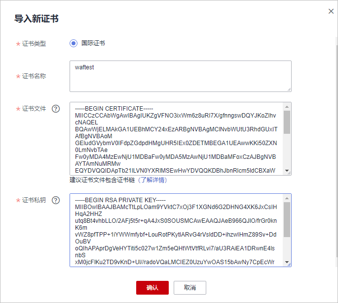

# 步骤一：添加防护网站（独享模式）

如果您的业务服务器部署在华为云，您可以通过WAF独享模式将您的网站域名或IP添加到WAF进行防护。

> **说明：** 
>如果您已开通企业项目，您可以在“企业项目“下拉列表中选择您所在的企业项目，在该企业项目下添加防护网站。

## 前提条件

已购买WAF独享引擎实例。

## 约束条件

-   接入Web应用防火墙的网站已使用公网ELB（Elastic Load Balance）代理用作负载均衡。
-   为了保证WAF的安全策略能够针对真实源IP生效，成功获取Web访问者请求的真实IP地址，如果WAF前没有使用CDN、云加速等七层代理服务器，且ELB使用的是四层负载均衡（NAT等方式），“是否已使用代理“务必选择“否“，其他情况，“是否已使用代理“选择“是“。
-   证书限制：
    -   WAF当前仅支持PEM格式证书。
    -   目前华为云SCM证书只能推送到“default”企业项目下。如果您使用其他企业项目，则不能选择使用SCM推送的SSL证书。
    -   拥有“SCM Administrator“和“SCM FullAccess“权限的账号才能选择SCM证书。

## 操作步骤

1.  [登录管理控制台](https://console.huaweicloud.com/?locale=zh-cn)。
2.  单击管理控制台左上角的，选择区域或项目。
3.  单击页面左上方的，选择“安全与合规  \>  Web应用防火墙 WAF“。

1.  在左侧导航树中，选择“网站设置“，进入“网站设置“页面。
2.  在网站列表左上角，单击“添加防护网站“。
3.  选择“独享模式“并单击“确定“。
4.  配置“域名信息“，如[图1](#fig1625231071718)所示。

    -   “网站名称“：可选参数，自定义网站名称。
    -   “防护对象“：防护的域名或IP，域名支持单域名和泛域名。

        > **说明：** 
        >-   WAF不支持添加带有下划线（\_）的泛域名。
        >-   如果各子域名对应的服务器IP地址相同：输入防护的泛域名。例如：子域名a.example.com，b.example.com和c.example.com对应的服务器IP地址相同，可以直接添加泛域名\*.example.com。
        >-   如果各子域名对应的服务器IP地址不相同：请将子域名按“单域名“方式逐条添加。

    -   “网站备注“：可选参数，网站的备注信息。

    **图 1**  配置域名信息  
    

5.  源站配置，如[图2](#fig185369267307)所示，参数说明如[表1](#table077263255719)所示。

    **图 2**  源站配置  
    

    **表 1**  基本信息参数说明

    
    <table><thead align="left"><tr id="row977318320574"><th class="cellrowborder" valign="top" width="15%" id="mcps1.2.4.1.1">
参数

    </th>
    <th class="cellrowborder" valign="top" width="64.21%" id="mcps1.2.4.1.2">
参数说明

    </th>
    <th class="cellrowborder" valign="top" width="20.79%" id="mcps1.2.4.1.3">
取值样例

    </th>
    </tr>
    </thead>
    <tbody><tr id="row677318325573"><td class="cellrowborder" valign="top" width="15%" headers="mcps1.2.4.1.1 ">
防护对象端口

    </td>
    <td class="cellrowborder" valign="top" width="64.21%" headers="mcps1.2.4.1.2 ">
在下拉框中选择面要防护的端口。

    
配置80/443端口，在下拉框中选择“标准端口”。

    
Web应用防火墙支持的端口请参见<a href="WAF支持的端口范围.md">WAF支持的端口范围</a>

    
 说明： 

如果配置了除80/443以外的其他端口，访问网站时，需要在网址后面增加非标准端口进行访问，否则访问网站时会出现<a href="https://support.huaweicloud.com/waf_faq/waf_01_0066.html#section0" target="_blank" rel="noopener noreferrer">404错误</a>。

    

    </td>
    <td class="cellrowborder" valign="top" width="20.79%" headers="mcps1.2.4.1.3 ">
81

    </td>
    </tr>
    <tr id="row57741832135716"><td class="cellrowborder" valign="top" width="15%" headers="mcps1.2.4.1.1 ">
服务器配置

    </td>
    <td class="cellrowborder" valign="top" width="64.21%" headers="mcps1.2.4.1.2 ">
网站服务器地址的配置。包括对外协议、源站协议、VPC、源站地址和源站端口。

    <ul id="ul2774123211573"><li>对外协议：客户端请求访问服务器的协议类型。包括“HTTP”、“HTTPS”两种协议类型。</li><li>源站协议：Web应用防火墙转发客户端请求的协议类型。包括“HTTP”、“HTTPS”两种协议类型。
 说明： 
<ul id="ul47751832105710"><li>对外协议与源站协议的具体配置规则，请参见<a href="配置示例-添加防护域名.md#section1420718546612">不同访问模式的协议配置规则</a>。</li><li>WAF支持WebSocket/WebSockets协议，且默认为开启状态。</li></ul>
    

    </li><li>VPC：选择独享引擎实例所在的VPC。
 说明： 

为了实现业务双活，避免业务单点故障，建议在同一VPC下购买两个WAF实例。

    

    </li><li>源站地址：客户端（例如浏览器）访问的网站服务器的私网/内网IP地址。
 说明： 

源站地址不能与防护对象一致。

    

    
支持以下两种IP格式：<ul id="ul1091931915252"><li>IPv4，例如：XXX.XXX.1.1</li><li>IPv6，例如：fe80:0000:0000:0000:0000:0000:0000:0000</li></ul>
    

    </li><li>源站端口：WAF独享引擎转发客户端请求到服务器的业务端口。</li></ul>
    </td>
    <td class="cellrowborder" valign="top" width="20.79%" headers="mcps1.2.4.1.3 ">
对外协议：HTTP

    
源站协议：HTTP

    
源站地址：IPv4 XXX .XXX.1.1

    
源站端口：80

    </td>
    </tr>
    <tr id="row187761932195715"><td class="cellrowborder" valign="top" width="15%" headers="mcps1.2.4.1.1 ">
证书名称

    </td>
    <td class="cellrowborder" valign="top" width="64.21%" headers="mcps1.2.4.1.2 ">
“对外协议”设置为“HTTPS”时，需要选择证书。您可以选择已创建的证书或选择导入的新证书。导入新证书的操作请参见<a href="#section36817893018">导入新证书</a>。

    
成功导入的新证书，将添加到“证书管理”页面的证书列表中。有关证书管理的操作，请参见<a href="上传证书.md">上传证书</a>。

    
您也可以在CCM管理控制台购买证书并推送到WAF。有关CCM证书推送到WAF的详细操作，请参见<a href="https://support.huaweicloud.com/usermanual-ccm/ccm_01_0141.html" target="_blank" rel="noopener noreferrer">推送证书到云产品</a>。

    
 须知： 
<ul id="ul1277693285715"><li>WAF当前仅支持PEM格式证书。如果证书为非PEM格式，请参考<a href="#section36817893018">导入新证书</a>将证书转换为PEM格式，再上传。</li><li>目前华为云SCM证书只能推送到“default”企业项目下。如果您使用其他企业项目，则不能选择使用SCM推送的SSL证书。</li><li>如果您的证书即将到期，为了不影响网站的使用，建议您在到期前重新使用新的证书，并在WAF中同步更新网站绑定的证书。</li><li>域名和证书需要一一对应，泛域名只能使用泛域名证书。如果您没有泛域名证书，只有单域名对应的证书，则只能在WAF中按照单域名的方式逐条添加域名进行防护。</li></ul>
    

    </td>
    <td class="cellrowborder" valign="top" width="20.79%" headers="mcps1.2.4.1.3 ">
--

    </td>
    </tr>
    </tbody>
    </table>

6.  高级配置。

    **图 3**  高级配置  
    

    -   “是否已使用代理“：为了保证WAF的安全策略能够针对真实源IP生效，成功获取Web访问者请求的真实IP地址，如果WAF前已使用如CDN、云加速等提供七层Web代理的产品，请务必选择“是“。另外，由于真实源IP字段中可能有多个IP，为确保WAF准确获取Web访问者请求的真实IP地址，建议添加防护网站的的IP标记流量标识（例如，CDN代理添加IP标记“CDN-Src-IP“）。有关添加IP标记的详细操作，请参见[配置攻击惩罚的流量标识](配置攻击惩罚的流量标识.md)。
    -   选择“策略配置“：默认为“系统自动生成策略“，您也可以选择已创建的防护策略或在域名接入后根据防护需求配置防护规则。

        系统自动生成的策略说明如下：

        -   Web基础防护（“仅记录“模式、常规检测）

            仅记录SQL注入、XSS跨站脚本、远程溢出攻击、文件包含、Bash漏洞攻击、远程命令执行、目录遍历、敏感文件访问、命令/代码注入等攻击行为。

        -   网站反爬虫（“仅记录“模式、扫描器）

            仅记录漏洞扫描、病毒扫描等Web扫描任务，如OpenVAS、Nmap的爬虫行为。

        > **说明：** 
        >“仅记录“模式：发现攻击行为后WAF只记录攻击事件不阻断攻击。

7.  单击“确认“，添加域名完成。

    可根据界面提示，完成配置负载均衡、为弹性负载均衡绑定弹性公网IP和放行独享引擎回源IP的操作，建议单击“稍后“。后续参照[步骤二：配置负载均衡](步骤二-配置负载均衡.md)、[步骤三：为弹性负载均衡绑定弹性公网IP](步骤三-为弹性负载均衡绑定弹性公网IP.md)和[步骤四：放行独享引擎回源IP](步骤四-放行独享引擎回源IP.md)完成相关操作。

    **图 4**  添加域名完成  
    

## 生效条件

防护网站的初始“接入状态“为“未接入“，配置完负载均衡以及为弹性负载均衡绑定弹性IP后，当访问请求到达该网站的WAF独享引擎时，该防护网站的接入状态将自动切换为“已接入“。

## 导入新证书

当“对外协议“设置为“HTTPS“时，可以导入新证书。

1.  单击“导入新证书“，打开“导入新证书“对话框。然后输入“证书名称“，并将证书内容和私钥内容粘贴到对应的文本框中。

    **图 5**  导入新证书  
    

    > **说明：** 
    >Web应用防火墙将对私钥进行加密保存，保障证书私钥的安全性。

    WAF当前仅支持PEM格式证书。如果证书为非PEM格式，请参考[表2](#waf_01_0002_table1292125414516)在本地将证书转换为PEM格式，再上传。

    **表 2**  证书转换命令

    
    <table><thead align="left"><tr id="waf_01_0002_row1029335416459"><th class="cellrowborder" valign="top" width="21.990000000000002%" id="mcps1.2.3.1.1">
格式类型

    </th>
    <th class="cellrowborder" valign="top" width="78.01%" id="mcps1.2.3.1.2">
转换方式

    </th>
    </tr>
    </thead>
    <tbody><tr id="waf_01_0002_row229345416453"><td class="cellrowborder" valign="top" width="21.990000000000002%" headers="mcps1.2.3.1.1 ">
CER/CRT

    </td>
    <td class="cellrowborder" valign="top" width="78.01%" headers="mcps1.2.3.1.2 ">
将“cert.crt”证书文件直接重命名为“cert.pem”。

    </td>
    </tr>
    <tr id="waf_01_0002_row19294654194516"><td class="cellrowborder" valign="top" width="21.990000000000002%" headers="mcps1.2.3.1.1 ">
PFX

    </td>
    <td class="cellrowborder" valign="top" width="78.01%" headers="mcps1.2.3.1.2 "><ul id="waf_01_0002_ul122945545457"><li>提取私钥命令，以“cert.pfx”转换为“key.pem”为例。
<strong id="waf_01_0002_b1294125484517">openssl pkcs12 -in cert.pfx -nocerts -out key.pem -nodes</strong>

    </li><li>提取证书命令，以“cert.pfx”转换为“cert.pem”为例。
<strong id="waf_01_0002_b1629465420458">openssl</strong> <strong id="waf_01_0002_b1529417548459">pkcs12</strong> <strong id="waf_01_0002_b10294145414520">-in</strong> <strong id="waf_01_0002_b20294105444511">cert.pfx</strong> <strong id="waf_01_0002_b1294205444519">-nokeys</strong> <strong id="waf_01_0002_b9294185410455">-out</strong> <strong id="waf_01_0002_b729425411459">cert.pem</strong>

    </li></ul>
    </td>
    </tr>
    <tr id="waf_01_0002_row1529419542456"><td class="cellrowborder" valign="top" width="21.990000000000002%" headers="mcps1.2.3.1.1 ">
P7B

    </td>
    <td class="cellrowborder" valign="top" width="78.01%" headers="mcps1.2.3.1.2 "><ol id="waf_01_0002_ol1729475464511"><li>证书转换，以“cert.p7b”转换为“cert.cer”为例。
<strong id="waf_01_0002_b1629510544452">openssl</strong> <strong id="waf_01_0002_b16295105404518">pkcs7</strong> <strong id="waf_01_0002_b729555444513">-print_certs</strong> <strong id="waf_01_0002_b20295145464510">-in</strong> <strong id="waf_01_0002_b17295145454517">cert.p7b</strong> <strong id="waf_01_0002_b629595411457">-out</strong> <strong id="waf_01_0002_b13295125494519">cert.cer</strong>

    </li><li>将“cert.cer”证书文件直接重命名为“cert.pem”。</li></ol>
    </td>
    </tr>
    <tr id="waf_01_0002_row8295195414451"><td class="cellrowborder" valign="top" width="21.990000000000002%" headers="mcps1.2.3.1.1 ">
DER

    </td>
    <td class="cellrowborder" valign="top" width="78.01%" headers="mcps1.2.3.1.2 "><ul id="waf_01_0002_ul162956542452"><li>提取私钥命令，以“privatekey.der”转换为“privatekey.pem”为例。
<strong id="waf_01_0002_b12295165414514">openssl</strong> <strong id="waf_01_0002_b429514549453">rsa</strong> <strong id="waf_01_0002_b19295165474516">-inform</strong> <strong id="waf_01_0002_b42951954164520">DER</strong> <strong id="waf_01_0002_b529525444512">-outform</strong> <strong id="waf_01_0002_b429525484510">PEM</strong> <strong id="waf_01_0002_b142955543457">-in</strong> <strong id="waf_01_0002_b1029535454514">privatekey.der</strong> <strong id="waf_01_0002_b829675424513">-out</strong> <strong id="waf_01_0002_b1296115410454">privatekey.pem</strong>

    </li><li>提取证书命令，以“cert.cer”转换为“cert.pem”为例。
<strong id="waf_01_0002_b729675419451">openssl</strong> <strong id="waf_01_0002_b19296175424511">x509</strong> <strong id="waf_01_0002_b3296954134515">-inform</strong> <strong id="waf_01_0002_b3296754204513">der</strong> <strong id="waf_01_0002_b17296254134510">-in</strong> <strong id="waf_01_0002_b829645412454">cert.cer</strong> <strong id="waf_01_0002_b929625474518">-out cert.pem</strong>

    </li></ul>
    </td>
    </tr>
    </tbody>
    </table>

    > **说明：** 
    >-   执行openssl命令前，请确保本地已安装[openssl](https://www.openssl.org/)。
    >-   如果本地为Windows操作系统，请进入“命令提示符“对话框后，再执行证书转换命令。

2.  单击“确认“，上传证书。

