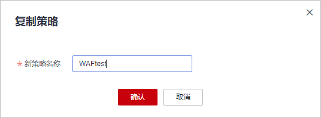

# 步骤一：（可选）新增防护策略

防护策略是多种防护规则的合集，用于配置和管理Web基础防护、黑白名单、精准访问防护等防护规则，一条防护策略可以适用于多个防护域名，但一个防护域名只能绑定一个防护策略。该任务指导您通过Web应用防火墙添加防护策略。

> **说明：** 
>如果您已开通企业项目，您可以在“企业项目“下拉列表中选择您所在的企业项目，为该企业项目添加防护策略。

## 前提条件

已添加防护网站。

## 约束条件

-   入门版和标准版不支持该功能。
-   一个防护域名只能绑定一条防护策略。
-   同一项目下支持复制策略。

## 添加防护策略

1.  [登录管理控制台](https://console.huaweicloud.com/?locale=zh-cn)。
2.  单击管理控制台左上角的，选择区域或项目。
3.  单击页面左上方的，选择“安全与合规  \>  Web应用防火墙 WAF“。
4.  在左侧导航树中，选择“防护策略“，进入“防护策略“页面。
5.  在列表的左上角，单击“添加防护策略“。
6.  在弹出的对话框中，输入策略名称，单击“确认“，添加的策略会展示在策略列表中。
7.  在目标策略所在行，单击策略名称，进入防护规则配置页面，参见[配置防护规则](步骤二-为策略配置防护规则.md)为策略添加防护规则。

## 复制防护策略

> **说明：** 
>若本策略的防护规则配置了攻击惩罚，策略复制后，新策略中的相应防护规则的攻击惩罚会被重置为无攻击惩罚，您需重新对该防护规则配置攻击惩罚。

1.  [登录管理控制台](https://console.huaweicloud.com/?locale=zh-cn)。
2.  单击管理控制台左上角的，选择区域或项目。
3.  单击页面左上方的，选择“安全与合规  \>  Web应用防火墙 WAF“。
4.  在左侧导航树中，选择“防护策略“，进入“防护策略“页面。
5.  在目标策略所在行的“操作“列，单击“更多  \>  复制“。

    **图 1**  复制策略  
    

6.  在弹出的对话框中，输入新策略名称，并单击“确认“。

## 相关操作

-   若想修改策略名称，单击目标策略名称后的，在弹出的对话框中，重新输入新的策略名称即可。
-   若想删除添加的防护策略，在目标策略所在行的“操作“列，单击“更多  \>  删除“。

