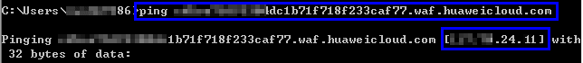
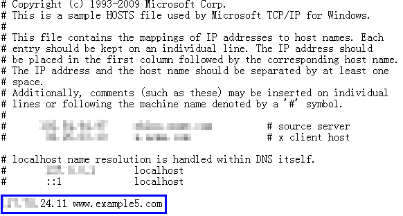
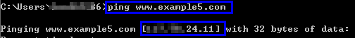
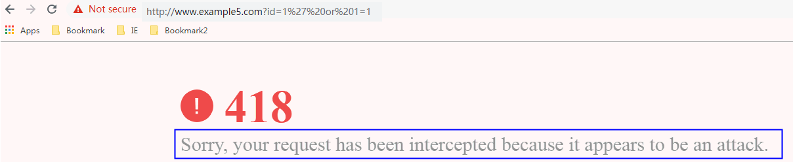

# 步骤三：本地验证

添加防护域名后，为了确保WAF转发正常， 建议您先通过本地验证确保防护域名一切配置正常。

进行此操作前，确保添加的防护域名（例如：www.example5.com）的源站服务器协议、地址、端口配置正确，如果“对外协议“选择了“HTTPS“，也必须确保上传的证书和私钥正确。

## 背景信息

通过修改本地计算机的hosts文件，可以设置本地计算机的域名寻址映射，即仅对本地计算机生效的DNS解析记录。本地验证需要您在本地计算机上将网站域名的解析指向WAF的IP地址。这样就可以通过本地计算机访问被防护的域名，验证WAF中添加的域名接入设置是否正确有效，避免域名接入配置异常导致网站访问异常。

## 前提条件

已[添加防护域名](步骤一-添加防护域名（云模式）.md)，且域名参数配置正确。

## 约束条件

CNAME值是根据域名生成的，对于同一个域名，其CNAME值是一致的。

## 本地接入WAF

1.  获取CNAME值。
    1.  单击管理控制台左上角的，选择区域或项目。
    2.  单击页面左上方的，选择“安全与合规  \>  Web应用防火墙 WAF“。
    3.  在左侧导航树中，选择“网站设置“，进入“网站设置“页面。
    4.  在目标域名所在行中，单击目标域名名称，进入域名基本信息页面。

        **图 1**  查看基本信息  
        

    5.  在“CNAME“信息行，单击，复制“CNAME“值。

2.  ping“CNAME“值并记录“CNAME“对应的IP地址。

    以域名www.example5.com为例，该域名已添加到WAF的网站配置中，且WAF为其分配了以下CNAME值：xxxxxxxdc1b71f718f233caf77.waf.huaweicloud.com。

    在Windows中打开cmd命令行工具，运行ping xxxxxxxdc1b71f718f233caf77.waf.huaweicloud.com获取WAF的回源IP。如[图2](#fig3609445192)所示，在响应结果中可以看到用来防护您的域名的WAF回源IP。

    **图 2**  ping cname  
    

3.  在本地修改hosts文件，将域名及“CNAME“对应的WAF回源IP添加到“hosts“文件。
    1.  用文本编辑器打开hosts文件，hosts文件一般位于“C:\\Windows\\System32\\drivers\\etc\\“路径下。
    2.  在hosts文件添加如[图3 追加记录](#fig386011112317)内容，前面的IP地址即在[步骤2](#li132916207364)中获取的WAF回源IP地址，后面的域名即被防护的域名。

        **图 3**  追加记录  
        

    3.  修改hosts文件后保存，然后本地ping一下被防护的域名。

        **图 4**  ping域名  
        

        预期此时解析到的IP地址应该是[2](#li4860411142315)中绑定的WAF回源IP地址。如果依然是源站地址，可尝试刷新本地的DNS缓存（Windows的cmd下可以使用**ipconfig/flushdns**命令）。

## 验证WAF转发正常

1.  清理浏览器缓存，在浏览器中输入防护域名，测试网站域名是否能正常访问。

    如果hosts绑定已经生效（域名已经本地解析为WAF回源IP）且WAF的配置正确，访问该域名，预期网站能够正常打开。

2.  手动模拟简单的Web攻击命令，测试Web攻击请求。
    1.  将Web基础防护的状态设置为“拦截“模式，具体方法请参见[配置Web基础防护规则](配置Web基础防护规则防御常见Web攻击.md)。
    2.  清理浏览器缓存，在浏览器中输入模拟SQL注入攻击的测试域名，测试WAF是否拦截了此条攻击，如[图5](#fig1471040175918)所示。

        **图 5**  访问被拦截  
        

    3.  在左侧导航树中，选择“防护事件“，进入“防护事件“页面，查看防护域名测试的各项数据。

