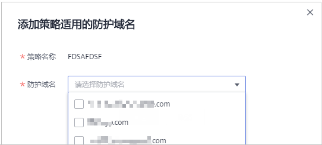

# 步骤三：添加策略适用的防护域名

您可以通过Web应用防火墙服务添加策略适用的防护域名。

> **说明：** 
>如果您已开通企业项目，您需要在“企业项目“下拉列表中选择您所在的企业项目并确保已开通操作权限，才能为该企业项目批量添加防护规则。

## 前提条件

已添加防护网站。

## 约束条件

入门版和标准版不支持该功能。

## 操作步骤

1.  [登录管理控制台](https://console.huaweicloud.com/?locale=zh-cn)。
2.  单击管理控制台左上角的，选择区域或项目。
3.  单击页面左上方的，选择“安全与合规  \>  Web应用防火墙 WAF“。
4.  在左侧导航树中，选择“防护策略“，进入“防护策略“页面。
5.  在目标策略名称所在行的“操作“列，单击“添加防护域名“。
6.  在“防护域名“下拉框中选择适用于该策略的防护域名。

    > **须知：** 
    >-   一个防护域名有且只能配置一条防护策略。
    >-   一条防护策略可以适用于多个防护域名。
    >-   若想删除已绑定域名的防护策略，请先将此防护策略绑定的所有域名添加到其它防护策略，再在目标策略名称所在行的“操作“列中，单击“删除“。

    **图 1**  添加策略适用的防护域名  
    

7.  单击“确认“。

