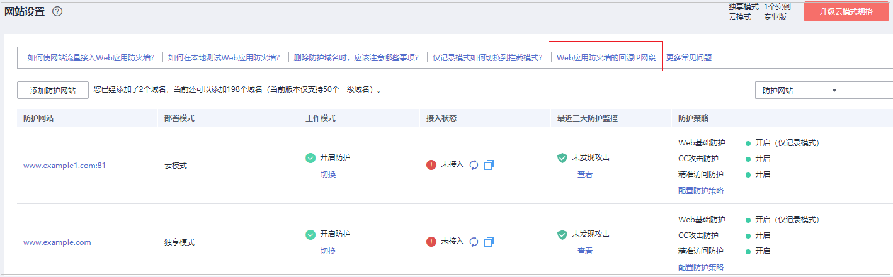

# 步骤二：放行WAF回源IP

网站以“云模式“成功接入WAF后，建议您在源站服务器上配置只放行WAF回源IP的访问控制策略，防止黑客获取源站IP后绕过WAF直接攻击源站，以确保源站安全、稳定、可用。

> **须知：** 
>网站以“云模式“成功接入WAF后，如果访问网站频繁出现502/504错误，建议您检查并确保源站服务器已配置了放行WAF回源IP的访问控制策略。

## 什么是回源IP？

回源IP是WAF用来代理客户端请求服务器时用的源IP，在服务器看来，接入WAF后所有源IP都会变成WAF的回源IP，而真实的客户端地址会被加在HTTP头部的XFF字段中。

> **说明：** 
>-   WAF的回源IP会因为扩容/新建集群而增加，对于一个客户的存量域名，一般回源IP会固定在2\~4个集群的几个C类IP地址（192.0.0.0\~223.255.255.255）上。
>-   一般情况下，在没有灾备切换或其他调度切换集群的场景下，回源IP不会变。且WAF后台做集群切换时，会探测源站安全组配置，确保不会因为安全组配置导致业务整体故障。

**图 1**  回源IP  

## 回源IP检测机制

回源IP（该IP在回源IP段中）是随机分配的。回源时WAF会监控回源IP的状态，如果该IP异常，WAF将剔除该异常IP并随机分配正常的回源IP接收/转发访问请求。

## 为什么需要放行回源IP段？

WAF实例的IP数量有限，且源站服务器收到的所有请求都来自这些IP。在源站服务器上的安全软件很容易认为这些IP是恶意IP，有可能触发屏蔽WAF回源IP的操作。一旦WAF的回源IP被屏蔽，WAF的请求将无法得到源站的正常响应，因此，在接入WAF防护后，您需要在源站服务器的安全软件上设置放行所有WAF回源IP，不然可能会出现网站打不开或打开极其缓慢等情况。

> **说明：** 
>网站接入WAF后，建议您卸载源站服务器上的其他安全软件，或者配置只允许来自WAF的访问请求访问您的源站，这样既可保证访问不受影响，又能防止源站IP暴露后被黑客直接攻击。

## 操作步骤

1.  [登录管理控制台](https://console.huaweicloud.com/?locale=zh-cn)。
2.  单击管理控制台左上角的，选择区域或项目。
3.  单击页面左上方的，选择“安全与合规  \>  Web应用防火墙 WAF“。
4.  在左侧导航树中，选择“网站设置“，进入“网站设置“页面。
5.  在网站列表上方，单击“Web应用防火墙回源IP网段“，查看Web应用防火墙所有回源IP段。

    **图 2**  回源IP网段  
    

6.  在“Web应用防火墙的回源IP网段“对话框，单击“复制IP段“，复制所有回源IP。

    **图 3**  Web应用防火墙的回源IP网段  
    

7.  打开源站服务器上的安全软件，将复制的IP段添加到白名单。
    -   源站服务器部署在华为云ECS上，请参考[源站服务器部署在华为云ECS上，放行WAF回源IP](#zh-cn_topic_0167535083_section4367162523419)进行操作。
    -   源站服务器部署在华为云ELB上，请参考[源站服务器部署在华为云ELB上，放行WAF回源IP](#zh-cn_topic_0167535083_section829813242372)进行操作。
    -   如果您同时使用了华为云云防护墙（CFW）的旁路版，请参考[添加防护规则](https://support.huaweicloud.com/usermanual-cfw/cfw_01_0030.html)放行WAF的回源IP。
    -   如果后端资源在其他云厂商，请在对应安全组、访问控制等中添加信任WAF的回源IP。
    -   如果源站服务器只安装了个人版杀毒软件，通常这些软件没有配置加白IP的界面。如果是对外提供Web业务的服务器，建议您安装服务器版本的企业安全软件，或华为云主机安全服务产品，这些产品会识别一些请求量较大的IP的socket，并偶发断开连接，一般情况下不会拦截WAF的回源IP。

## 源站服务器部署在华为云ECS上，放行WAF回源IP

如果您的源站服务器直接部署在华为云ECS上，请参考以下操作步骤设置安全组规则，只放行WAF回源IP段。

1.  [登录管理控制台](https://console.huaweicloud.com/?locale=zh-cn)。
2.  单击管理控制台左上角的，选择区域或项目。
3.  单击页面左上方的，选择“计算  \>  弹性云服务器 ECS“。
4.  在目标ECS所在行的“名称/ID“列中，单击目标ECS实例名称，进入ECS实例的详情页面。
5.  选择“安全组“页签，单击“更改安全组“。
6.  单击安全组名称，进入安全组基本信息页面。
7.  选择“入方向规则“页签，单击“添加规则“，进入“添加入方向规则“页面，如[图4](#zh-cn_topic_0167535083_zh-cn_topic_0165951354_fig1015552115210)所示，参数配置说明如[表1](#zh-cn_topic_0167535083_zh-cn_topic_0165951354_table4746426132417)所示。

    **图 4**  添加入方向规则  
    

    **表 1**  入方向规则参数配置说明

    
    <table><thead align="left"><tr id="zh-cn_topic_0167535083_zh-cn_topic_0165951354_row1974719269244"><th class="cellrowborder" valign="top" width="26.16%" id="mcps1.2.3.1.1">
参数

    </th>
    <th class="cellrowborder" valign="top" width="73.83999999999999%" id="mcps1.2.3.1.2">
配置说明

    </th>
    </tr>
    </thead>
    <tbody><tr id="zh-cn_topic_0167535083_zh-cn_topic_0165951354_row14747152611244"><td class="cellrowborder" valign="top" width="26.16%" headers="mcps1.2.3.1.1 ">
协议端口

    </td>
    <td class="cellrowborder" valign="top" width="73.83999999999999%" headers="mcps1.2.3.1.2 ">
安全组规则作用的协议和端口。选择“自定义TCP”后，在TCP框下方输入源站的端口。

    </td>
    </tr>
    <tr id="zh-cn_topic_0167535083_zh-cn_topic_0165951354_row12747152682419"><td class="cellrowborder" valign="top" width="26.16%" headers="mcps1.2.3.1.1 ">
源地址

    </td>
    <td class="cellrowborder" valign="top" width="73.83999999999999%" headers="mcps1.2.3.1.2 ">
逐一添加<a href="#zh-cn_topic_0167535083_li081419351620">6</a>中复制的所有WAF回源IP段。

    
 说明： 

一条规则配置一个IP。单击“增加1条规则”，可配置多条规则，最多支持添加10条规则。

    

    </td>
    </tr>
    </tbody>
    </table>

8.  单击“确定“，安全组规则添加完成。

    成功添加安全组规则后，安全组规则将允许WAF回源IP段的所有入方向流量。

## 源站服务器部署在华为云ELB上，放行WAF回源IP

如果您的源站服务器直接部署在华为云ELB上，请参考以下操作步骤设置访问控制（白名单）策略，只放行WAF回源IP段。

1.  [登录管理控制台](https://console.huaweicloud.com/?locale=zh-cn)。
2.  单击管理控制台左上角的，选择区域或项目。
3.  单击页面左上方的，选择“网络  \>  弹性负载均衡 ELB“。
4.  在目标ELB所在行的“监听器“列中，单击监听器名称，进入监听器的详情页面。
5.  在目标监听器所在行的“访问控制“列，单击“设置“。

    **图 5**  监听器列表  
    

6.  在弹出的对话框中，“访问控制“选择“白名单“。

    1.  单击“创建IP地址组“，将[6](#zh-cn_topic_0167535083_li081419351620)中独享引擎实例的回源IP地址添加到“IP地址组“。
    2.  在“IP地址组“的下拉框中选择[6.a](#zh-cn_topic_0167535083_li971616743419)中创建的IP地址组。

    **图 6**  访问控制页面  
    

7.  单击“确定“，白名单访问控制策略添加完成。

