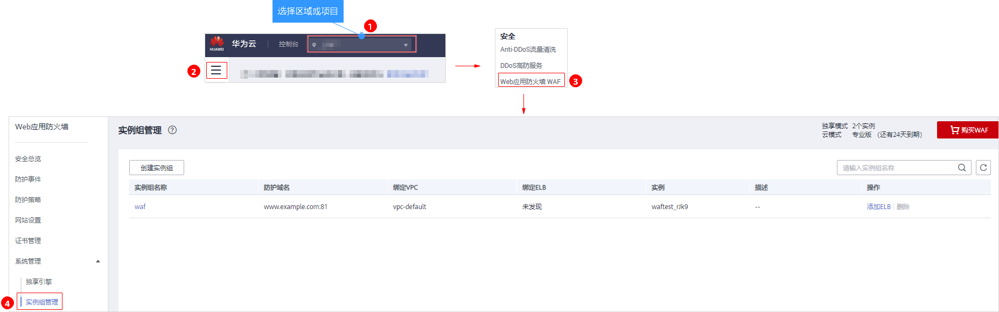

# 步骤二：绑定独享型ELB

添加防护网站后，您需要为防护网站所在的实例组绑定ELB，使请求流量通过ELB发送给WAF进行检测，然后转发到源站，从而确保源站安全、稳定、可靠。

## 前提条件

-   已购买ELB模式实例。
-   已购买华为云“独享型“ELB，且该ELB必须与购买的ELB模式实例在同一个VPC内。

> **须知：** 
>华为云ELB按流量单独计费。有关ELB的计费详情，请参见[ELB价格详情](https://www.huaweicloud.com/pricing.html#/elb)。

## 规则限制

一个ELB最多可绑定5个实例组。

## 操作步骤

1.  [登录管理控制台](https://console.huaweicloud.com/?locale=zh-cn)。
2.  进入实例组管理页面，如[图1](#fig7658182717546)所示。

    **图 1**  进入实例组管理页面  
    

3.  在防护网站绑定的实例组所在行的“操作“列，单击“添加ELB“。
4.  在弹出的对话框中，选择绑定的ELB（该ELB必须为独享型，且与ELB模式实例在同一个VPC内），如[图2](#fig1457810193720)所示。

    **图 2**  添加ELB  
    

5.  单击“确定“。

