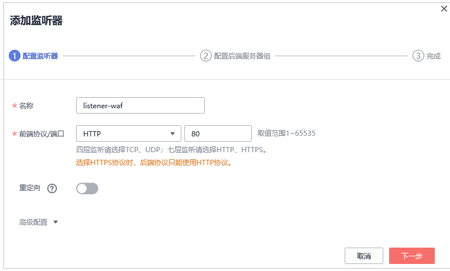
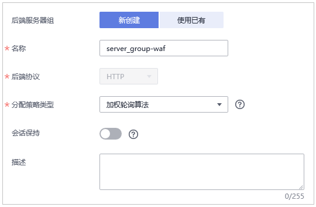
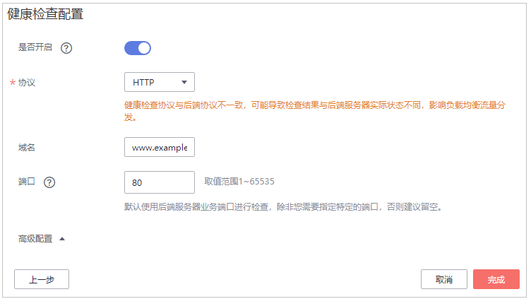
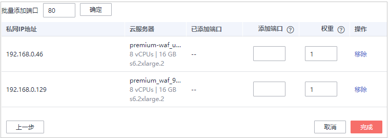
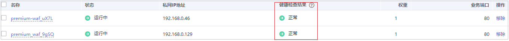

# 步骤二：配置负载均衡

添加防护网站后，您需要使用华为云弹性负载均衡（Elastic Load Balance，简称ELB）为WAF独享引擎实例配置负载均衡和健康检查，以确保WAF的可靠性和稳定性。

> **须知：** 
>华为云ELB按流量单独计费。有关ELB的计费详情，请参见[ELB价格详情](https://www.huaweicloud.com/pricing.html#/elb)。

## 前提条件

-   已添加独享模式防护网站。
-   已根据应用场景和功能需求购买合适的负载均衡器类型。有关ELB类型的详细介绍，请参见[共享型弹性负载均衡与独享型负载均衡的功能区别](https://support.huaweicloud.com/productdesc-elb/elb_pro_0004.html)。

## 约束条件

独享引擎监听端口需要与[步骤一：添加防护网站（独享模式）](步骤一-添加防护网站（独享模式）.md)时设置的端口保持一致。

## 系统影响

“分配策略类型“选择“加权轮询算法“时，请关闭“会话保持“，如果开启会话保持，相同的请求会转发到相同的WAF独享引擎实例上，当WAF独享引擎实例出现故障时，再次到达该引擎的请求将会出错。

## 操作步骤

1.  [登录管理控制台](https://console.huaweicloud.com/?locale=zh-cn)。
2.  单击管理控制台左上角的，选择区域或项目。
3.  单击页面左上方的，选择“网络  \>  弹性负载均衡“，进入“负载均衡器“页面。
4.  在负载均衡器所在行的“名称“列，单击目标负载均衡器名称，进入ELB“基本信息“页面。
5.  选择“监听器“页签后，单击“添加监听器“，配置监听器信息，如[图1](#fig1213093341614)所示。

    **图 1**  配置监听器信息  
    

6.  单击“下一步“，配置后端服务器组和健康检查，如[图2](#fig2374182114179)和[图3](#fig16401199218)所示。

    **图 2**  配置后端服务器组  
    

    > **须知：** 
    >-   “分配策略类型“选择“加权轮询算法“时，请关闭“会话保持“，如果开启会话保持，相同的请求会转发到相同的WAF独享引擎实例上，当WAF独享引擎实例出现故障时，再次到达该引擎的请求将会出错。
    >-   有关ELB流量分配策略的详细介绍，请参见[流量分配策略](https://support.huaweicloud.com/usermanual-elb/elb_ug_jt_0003.html)。

    **图 3**  配置健康检查  
    

    > **须知：** 
    >-   “端口“需要配置为WAF独享引擎实例实际监听的业务端口，即[步骤一：添加防护网站（独享模式）](步骤一-添加防护网站（独享模式）.md)时配置网站的端口。
    >-   有关配置健康检查的详细操作，请参见[配置健康检查](https://support.huaweicloud.com/usermanual-elb/zh-cn_topic_0162227063.html)。

7.  单击“完成“后，监听器添加成功后，单击“确定“。
8.  在添加的监听器页面，选择“后端服务器组“页签后，单击“添加“。
9.  在弹出的“添加后端服务器“对话框中，选择[购买WAF独享模式](购买WAF独享模式.md)中已创建的WAF独享引擎实例，如[图4](#fig1848165241812)所示。

    **图 4**  选择已创建的WAF独享引擎实例  
    

10. 单击“下一步“，为独享引擎配置端口，如[图5](#fig207213128248)所示。

    > **须知：** 
    >独享引擎监听端口需要与[步骤一：添加防护网站（独享模式）](步骤一-添加防护网站（独享模式）.md)时设置的端口保持一致。如果防护网站配置的是标准端口，则HTTP协议监听端口配置为“80“，HTTPS协议监听端口配置为“443“。

    **图 5**  为独享引擎配置端口  
    

11. 单击“完成“，配置完成。

## 生效条件

当WAF独享引擎实例的“健康检查结果“为“正常“时，说明弹性负载均衡配置成功。

**图 6**  弹性负载均衡配置完成  

