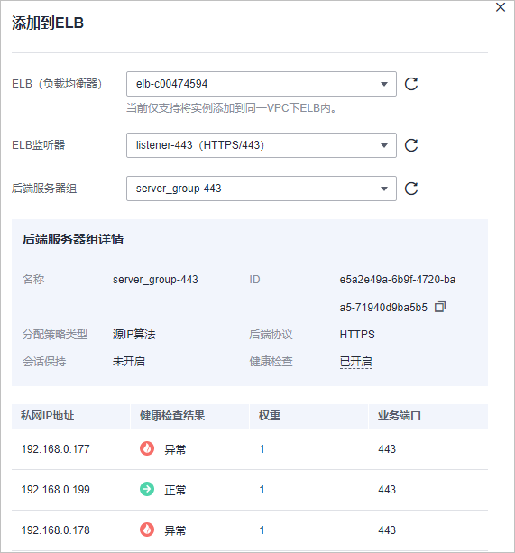

# 步骤二：配置负载均衡

添加防护网站后，您需要使用华为云弹性负载均衡（Elastic Load Balance，简称ELB）为WAF独享引擎实例配置负载均衡和健康检查，以确保WAF的可靠性和稳定性。

> **须知：** 
>华为云ELB按流量单独计费。有关ELB的计费详情，请参见[ELB价格详情](https://www.huaweicloud.com/pricing.html#/elb)。

## 前提条件

-   已添加独享模式防护网站。
-   已购买独享型负载均衡。有关ELB类型的详细介绍，请参见[共享型弹性负载均衡与独享型负载均衡的功能区别](https://support.huaweicloud.com/productdesc-elb/elb_pro_0004.html)。

    > **说明：** 
    >2023年4月之前的独享引擎版本，不支持与独享ELB网络型配合使用。因此，如果您使用了独享ELB网络型（TCP/UDP）负载均衡，请确认独享WAF实例已升级到最新版本（2023年4月及之后的版本），独享引擎版本详情请参见[独享引擎版本迭代](管理独享引擎.md#section7942164410131)。

-   在该独享引擎实例所在安全组中已放开了相关端口。

    安全组建议配置以下访问规则：

    -   入方向规则

        根据业务需求添加指定端口入方向规则，放通指定端口入方向网络流量。例如，需要放通“80“端口时，您可以添加“策略“为“允许“的“TCP“、“80“协议端口规则。

    -   出方向规则

        默认。放通全部出方向网络流量。

    有关添加安全组规则的详细操作，请参见[添加安全组规则](https://support.huaweicloud.com/usermanual-vpc/zh-cn_topic_0030969470.html)。

## 约束条件

-   配置健康检查后，独享引擎实例的“健康检查结果“的“状态“必须为“正常“，否则会导致网站不能正常接入WAF。健康检查异常的排查思路请参见[健康检查异常](https://support.huaweicloud.com/elb_faq/zh-cn_topic_0018127975.html#section2)。
-   监听器的“后端端口“需要与WAF独享引擎实例实际监听的业务端口一致，即与[步骤一：添加防护网站（独享模式）](步骤一-添加防护网站（独享模式）.md)时设置的“防护对象端口“保持一致。
-   由于WAF是七层代理产品，配置监听器时，“前端协议“只能选择HTTP或HTTPS协议。

## 系统影响

“分配策略类型“选择“加权轮询算法“时，请关闭“会话保持“，如果开启会话保持，相同的请求会转发到相同的WAF独享引擎实例上，当WAF独享引擎实例出现故障时，再次到达该引擎的请求将会出错。

## 添加监听器

配置健康检查后，独享引擎实例的“健康检查结果“的“状态“必须为“正常“，否则会导致网站不能正常接入WAF。

1.  [登录管理控制台](https://console.huaweicloud.com/?locale=zh-cn)。
2.  单击管理控制台左上角的，选择区域或项目。
3.  单击页面左上方的，选择“网络  \>  弹性负载均衡“，进入“负载均衡器“页面。
4.  在负载均衡器所在行的“名称“列，单击目标负载均衡器名称，进入ELB“监听器“页面。
5.  单击“添加监听器“，配置监听器信息，如[图1](#fig12561416749)所示。

    -   “前端端口“：配置为WAF中配置的源站端口。
    -   “前端协议“：只能选择HTTP或HTTPS协议 。

    **图 1**  配置监听信息  
    

6.  单击“下一步：配置后端分配策略“，配置后端服务器组，如[图2](#fig86114755315)所示。

    **图 2**  配置后端服务器组  
    

    > **须知：** 
    >-   “分配策略类型“选择“加权轮询算法“时，请关闭“会话保持“，如果开启会话保持，相同的请求会转发到相同的WAF独享引擎实例上，当WAF独享引擎实例出现故障时，再次到达该引擎的请求将会出错。
    >-   有关ELB流量分配策略的详细介绍，请参见[流量分配策略](https://support.huaweicloud.com/usermanual-elb/elb_ug_jt_0003.html)。

7.  单击“下一步：添加后端服务器“，配置健康检查。

    > **须知：** 
    >配置健康检查后，“健康检查结果“的“状态“必须为“正常“，否则会导致网站不能正常接入WAF。有关配置健康检查的详细操作，请参见[配置健康检查](https://support.huaweicloud.com/usermanual-elb/elb_ug_hc_0001.html)。

8.  单击“下一步：确认配置“。
9.  单击“提交“，监听器添加成功。

## 将WAF实例添加到ELB

1.  [登录管理控制台](https://console.huaweicloud.com/?locale=zh-cn)。
2.  单击管理控制台左上角的，选择区域或项目。
3.  单击页面左上方的，选择“安全与合规  \>  Web应用防火墙“，进入“安全总览“页面。
4.  在左侧导航树中，选择“系统管理  \>  独享引擎“，进入“独享引擎“页面。

    **图 3**  独享引擎列表  
    

5.  在目标实例所在行的“操作“列，单击“更多  \>  添加到ELB“。
6.  在“添加到ELB“页面中，选择[添加监听器](#section15547769474)中配置的“ELB（负载均衡器）“、“ELB监听器“和“后端服务器组“。

    **图 4**  添加到ELB  
    

    > **须知：** 
    >“健康检查结果“的“状态“必须为“正常“，否则会导致网站不能正常接入WAF。健康检查异常的排查思路请参见[健康检查异常](https://support.huaweicloud.com/elb_faq/zh-cn_topic_0018127975.html#section2)。

7.  单击“确认“，为WAF实例配置业务端口，“业务端口“需要配置为WAF独享引擎实例实际监听的业务端口，即[步骤一：添加防护网站（独享模式）](步骤一-添加防护网站（独享模式）.md)中配置的“防护对象端口“。

    **图 5**  配置业务端口  
    

## 生效条件

当WAF独享引擎实例的“健康检查结果“为“正常“时，说明弹性负载均衡配置成功。

