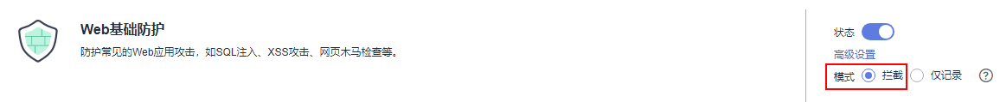

# 步骤五：独享引擎本地验证<a name="waf_01_1346"></a>

添加防护网站后，为了确保WAF转发正常， 建议您先通过本地验证确保防护网站一切配置正常。

## 前提条件<a name="section0441101394218"></a>

已完成[步骤一：添加防护网站（独享模式）](步骤一-添加防护网站（独享模式）.md)\~[步骤四：放行独享引擎回源IP](步骤四-放行独享引擎回源IP.md)的操作。

## （可选）单独验证独享WAF是否正常工作<a name="section1954132414318"></a>

1.  <a name="li147271915114514"></a>创建一台与独享WAF实例在同一VPC下的ECS用于发送请求。
2.  通过[1](#li147271915114514)中创建的ECS向独享WAF发送请求。
    -   转发测试

        ```
        curl -kv -H "Host: {添加到WAF的防护对象}" {服务器配置中的对外协议}://{独享WAF的IP}:{防护对象端口}
        ```

        例如：

        ```
        curl -kv -H "Host: a.example.com" http://192.168.0.1
        ```

        返回码为 200 则说明转发成功。如果转发未成功，请参见[如何排查404/502/504错误？](https://support.huaweicloud.com/waf_faq/waf_01_0066.html)进行排查。

    -   攻击拦截测试。
        1.  确保网站对应策略已开启基础防护的拦截模式。

            

        2.  执行以下命令：

            ```
            curl -kv -H "Host: {添加到WAF的防护对象}" {服务器配置中的对外协议}://{独享WAF的IP}:{防护对象端口} --data “id=1 and 1=’1”
            ```

            例如:

            ```
            curl -kv -H “Host: a.example.com” http:// 192.168.X.X --data “id=1 and 1=’1”
            ```

            返回码为 418 则说明拦截成功，独享WAF工作正常。

## 验证独享WAF和ELB是否都正常工作<a name="section1949918391213"></a>

-   转发测试

    ```
    curl -kv -H "Host: {添加到WAF的防护对象}" {ELB对外协议}://{ELB私网的IP}:{ELB监听端口}
    ```

    **如果 ELB 添加了 EIP，可以使用任意公网机器直接进行测试**。

    ```
    curl -kv -H “Host: {添加到WAF的防护对象}” {ELB对外协议}://{ELB公网的IP}:{ELB监听端口}
    ```

    例如:

    ```
    curl -kv -H “Host: a.example.com” http://192.168.X.Y
    curl -kv -H “Host: a.example.com” http://100.10.X.X
    ```

    返回码为200则说明转发成功。

    在确保独享引擎工作正常的情况下，如果转发失败，则优先检查ELB配置是否有误（如果ELB健康检查异常可先关闭ELB健康检查再重新执行以上的操作）。

-   攻击拦截测试
    1.  确保网站对应策略已开启基础防护的拦截模式。

        

    2.  执行以下命令：

        ```
        curl -kv -H "Host: {添加到WAF的防护对象}" {ELB对外协议}://{ELB私网的IP}:{ELB监听端口} --data “id=1 and 1=’1”
        ```

        **如果ELB添加了EIP ，可以使用任意公网机器直接进行测试**。

        ```
        curl -kv -H "Host: {添加到WAF的防护对象}" {ELB对外协议}://{ELB公网的IP}:{ELB监听端口} --data “id=1 and 1=’1”
        ```

        例如:

        ```
        curl -kv -H “Host: a.example.com” http:// 192.168.0.2 --data “id=1 and 1=’1”
        curl -kv -H “Host: a.example.com” http:// 100.10.X.X --data “id=1 and 1=’1”
        ```

        返回码为418则说明拦截成功，独享WAF、ELB均工作正常。

