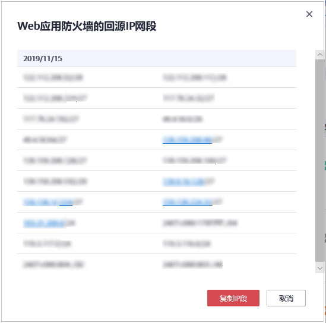

# 步骤四：放行WAF回源IP

网站以“云模式“成功接入WAF后，建议您在源站服务器上配置只放行WAF回源IP的访问控制策略，防止黑客获取源站IP后绕过WAF直接攻击源站，以确保源站安全、稳定、可用。

> **须知：** 
>网站以“云模式“成功接入WAF后，如果访问网站频繁出现502/504错误，建议您检查并确保源站服务器已配置了放行WAF回源IP的访问控制策略。

## 什么是回源IP？

回源IP是WAF用来代理客户端请求服务器时用的源IP，在服务器看来，接入WAF后所有源IP都会变成WAF的回源IP，而真实的客户端地址会被加在HTTP头部的XFF字段中。

**图 1**  回源IP  

## 回源IP检测机制

回源IP（该IP在回源IP段中）是随机分配的。回源时WAF会监控回源IP的状态，如果该IP异常，WAF将剔除该异常IP并随机分配正常的回源IP接收/转发访问请求。

> **说明：** 
>Web应用防火墙的回源IP网段会定期更新，请及时将更新后的回源IP网段添加至相应的安全组规则中，避免出现误拦截。

## 为什么需要放行回源IP段？

WAF实例的IP数量有限，且源站服务器收到的所有请求都来自这些IP。在源站服务器上的安全软件很容易认为这些IP是恶意IP，有可能触发屏蔽WAF回源IP的操作。一旦WAF的回源IP被屏蔽，WAF的请求将无法得到源站的正常响应，因此，在接入WAF防护后，您需要在源站服务器的安全软件上设置放行所有WAF回源IP，不然可能会出现网站打不开或打开极其缓慢等情况。

> **说明：** 
>网站接入WAF后，建议您卸载源站服务器上的其他安全软件，或者配置只允许来自WAF的访问请求访问您的源站，这样既可保证访问不受影响，又能防止源站IP暴露后被黑客直接攻击。

## 操作步骤

1.  [登录管理控制台](https://console.huaweicloud.com/?locale=zh-cn)。
2.  单击管理控制台左上角的，选择区域或项目。
3.  单击页面左上方的，选择“安全与合规  \>  Web应用防火墙 WAF“。
4.  在左侧导航树中，选择“网站设置“，进入“网站设置“页面。
5.  在网站列表右侧，单击“Web应用防火墙回源IP网段“，查看Web应用防火墙所有回源IP段。

    **图 2**  回源IP网段  
    

6.  在“Web应用防火墙的回源IP网段“对话框，单击“复制IP段“，复制所有回源IP。

    **图 3**  Web应用防火墙的回源IP网段  
    

7.  打开源站服务器上的安全软件，将复制的IP段添加到白名单。

    如果您的源站服务器部署在华为云ECS或华为云ELB上，请参考[通过配置源站服务器访问控制策略保护源站安全](https://support.huaweicloud.com/bestpractice-waf/waf_06_0013.html)放行WAF所有回源IP。

