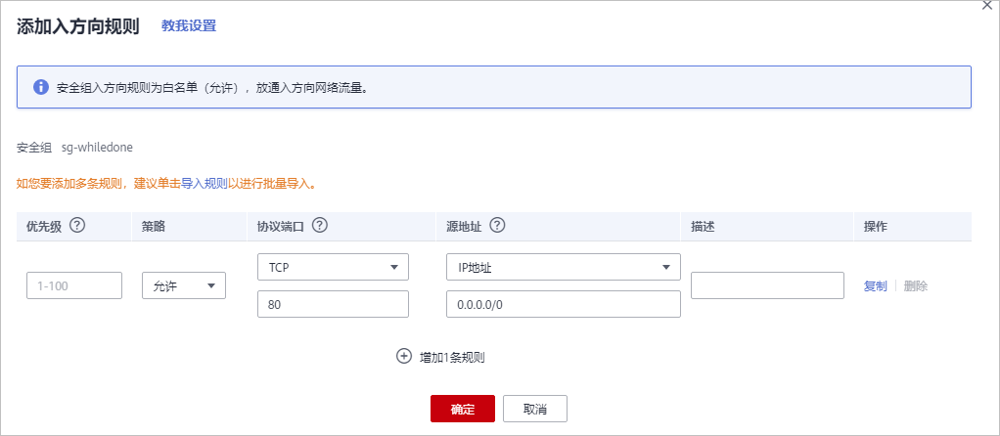
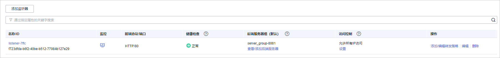
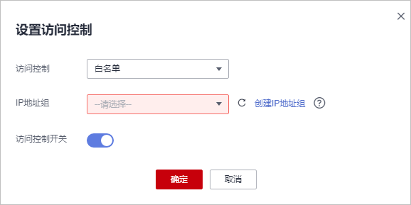

# 步骤四：放行独享引擎回源IP

网站以“独享模式“成功接入WAF后，建议您在源站服务器上配置只放行独享引擎回源IP的访问控制策略，防止黑客获取源站IP后绕过WAF直接攻击源站，以确保源站安全、稳定、可用。

> **须知：** 
>网站以“独享模式“成功接入WAF后，如果访问网站频繁出现502/504错误，建议您检查并确保源站服务器已配置了放行独享引擎回源IP的访问控制策略。

## 为什么需要放行回源IP

网站以“独享模式“成功接入WAF后，所有网站访问请求将先经过独享引擎配置的ELB然后流转到独享引擎实例进行监控，经独享引擎实例过滤后再返回到源站服务器，流量经独享引擎实例返回源站的过程称为回源。在服务器看来，接入WAF后所有源IP都会变成独享引擎实例的回源IP（即独享引擎实例对应的子网IP），以防止源站IP暴露后被黑客直接攻击。

源站服务器上的安全软件很容易认为独享引擎的回源IP是恶意IP，有可能触发屏蔽WAF回源IP的操作。一旦WAF的回源IP被屏蔽，WAF的请求将无法得到源站的正常响应，因此，网站以“独享模式“接入WAF防护后，您需要在源站服务器上设置放行创建的独享引擎实例对应的子网IP，不然可能会出现网站打不开或打开极其缓慢等情况。

## 前提条件

网站以“独享模式“成功接入WAF。

> **说明：** 
>如果您已开通企业项目，您可以在“企业项目“下拉列表中选择您所在的企业项目，在该企业项目下放行独享引擎回源IP。

## 回源到ECS

如果您的源站服务器直接部署在华为云ECS上，请参考以下操作步骤设置安全组规则，放行独享模式回源IP。

1.  [登录管理控制台](https://console.huaweicloud.com/?locale=zh-cn)。
2.  单击管理控制台左上角的，选择区域或项目。
3.  单击页面左上方的，选择“安全与合规  \>  Web应用防火墙“，进入“安全总览“页面。
4.  在左侧导航树中，选择“系统管理  \>  独享引擎“，进入“独享引擎“页面。

    **图 1**  独享引擎列表  
    

5.  在独享引擎列表的“IP地址“栏，获取所有创建的独享引擎对应的子网IP地址。
6.  单击页面左上方的，选择“计算  \>  弹性云服务器 ECS“。
7.  在目标ECS所在行的“名称/ID“列中，单击目标ECS实例名称，进入ECS实例的详情页面。
8.  选择“安全组“页签，单击“更改安全组“。
9.  在“更改安全组“对话框中，选择目标安全组或新建安全组并单击“确定“。
10. 单击安全组ID，进入安全组基本信息页面。
11. 选择“入方向规则“页签，单击“添加规则“，进入“添加入方向规则“页面，参数配置说明如[表1](#table4746426132417)所示。

    **图 2**  添加入方向规则  
    

    **表 1**  入方向规则参数配置说明

    
    <table><thead align="left"><tr id="row1974719269244"><th class="cellrowborder" valign="top" width="26.16%" id="mcps1.2.3.1.1">
参数

    </th>
    <th class="cellrowborder" valign="top" width="73.83999999999999%" id="mcps1.2.3.1.2">
配置说明

    </th>
    </tr>
    </thead>
    <tbody><tr id="row14747152611244"><td class="cellrowborder" valign="top" width="26.16%" headers="mcps1.2.3.1.1 ">
协议端口

    </td>
    <td class="cellrowborder" valign="top" width="73.83999999999999%" headers="mcps1.2.3.1.2 ">
安全组规则作用的协议和端口。选择“自定义TCP”后，在TCP框下方输入源站的端口。

    </td>
    </tr>
    <tr id="row12747152682419"><td class="cellrowborder" valign="top" width="26.16%" headers="mcps1.2.3.1.1 ">
源地址

    </td>
    <td class="cellrowborder" valign="top" width="73.83999999999999%" headers="mcps1.2.3.1.2 ">
逐一添加<a href="#li6801172213128">5</a>中获取的所有独享引擎实例的子网IP地址。

    
 说明： 

一条规则配置一个IP。单击“增加1条规则”，可配置多条规则，最多支持添加10条规则。

    

    </td>
    </tr>
    </tbody>
    </table>

12. 单击“确定“，安全组规则添加完成。

    成功添加安全组规则后，安全组规则将允许独享引擎回源IP地址的所有入方向流量。

    您可以使用Telnet工具测试已接入WAF防护的源站IP对应的业务端口是否能成功建立连接验证配置是否生效。

    例如，执行以下命令，测试已接入WAF防护的源站IP对外开放的443端口是否能成功建立连接。如果显示端口无法直接连通，但网站业务仍可正常访问，则表示安全组规则配置成功。

    **Telnet  _源站IP_  443**

## 回源到ELB

如果您的源站服务器使用华为云ELB进行流量分发，请参考以下操作步骤设置访问控制（白名单）策略，只放行独享模式回源IP。

1.  [登录管理控制台](https://console.huaweicloud.com/?locale=zh-cn)。
2.  单击页面左上方的，选择“安全与合规  \>  Web应用防火墙“，进入“安全总览“页面。
3.  在左侧导航树中，选择“系统管理  \>  独享引擎“，进入“独享引擎“页面。

    **图 3**  独享引擎列表  
    

4.  在独享引擎列表的“IP地址“栏，获取所有创建的独享引擎对应的子网IP地址。
5.  单击页面左上方的，选择“网络  \>  弹性负载均衡“。
6.  在独享引擎绑定的ELB所在行的“名称“列中，单击ELB名称，进入ELB的详情页面。
7.  在目标监听器所在行的“访问控制“列，单击“设置“。

    **图 4**  监听器列表  
    

8.  在弹出的对话框中，“访问控制“选择“白名单“。

    1.  单击“创建IP地址组“，将[4](#li638113913204)中独享引擎实例的回源IP地址添加到“IP地址组“。
    2.  在“IP地址组“的下拉框中选择[8.a](#li971616743419)中创建的IP地址组。

    **图 5**  访问控制页面  
    

9.  单击“确定“，白名单访问控制策略添加完成。

    成功配置访问控制策略后，访问控制策略将允许独享引擎回源IP地址的所有入方向流量。

    您可以使用Telnet工具测试已接入WAF防护的源站IP对应的业务端口是否能成功建立连接验证配置是否生效。

    例如，执行以下命令，测试已接入WAF防护的源站IP对外开放的443端口是否能成功建立连接。如果显示端口无法直接连通，但网站业务仍可正常访问，则表示安全组规则配置成功。

    **Telnet  _源站IP_  443**

