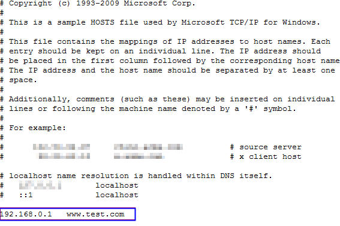
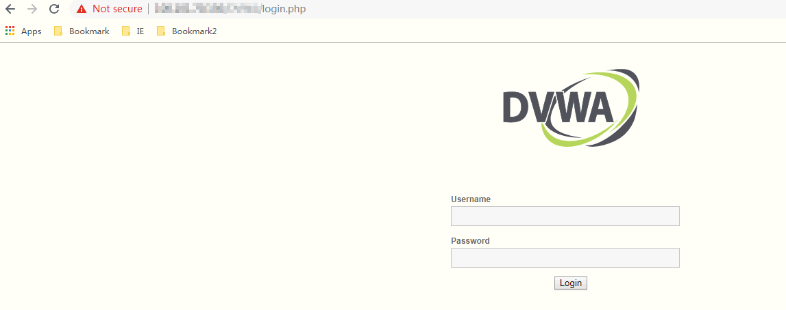

# 测试WAF

添加防护域名并完成域名接入后，用户可以在本地测试Web应用防火墙。

通过设置WAF基础防护为拦截模式，在本地模拟攻击，检验WAF是否成功拦截。

## 前提条件

-   已获取管理控制台的帐号和密码。
-   已添加防护域名并已完成域名接入。

## 操作步骤

1.  检查防护域名（例如：www.test.com）的源站服务器协议、地址、端口配置是否正确，如果“对外协议“类型选择了“HTTPS“，检查上传的证书和私钥是否正确。
2.  选择“安全  \>  Web应用防火墙“，单击“域名配置“，进入“域名配置“页面，如[图1](#zh-cn_topic_0110861350_fig6137154116346)所示。

    **图 1**  复制CNAME值  
    

3.  在目标域名所在行的“DNS解析状态“列中，单击，复制“CNAME“值。
4.  ping“CNAME“值并记录“CNAME“对应的IP地址（例如：192.168.0.1）。
5.  在本地修改hosts文件，以Windows系统为例，进入“C:\\Windows\\System32\\drivers\\etc“，打开“hosts“文件，将添加的域名及“CNAME“对应的IP地址添加到“hosts“文件（例如：192.168.0.1，www.test.com），如[图2](#zh-cn_topic_0110861350_fig143741511216)所示。

    **图 2**  追加记录  
    

6.  将Web基础防护的状态设置为“拦截“模式，具体方法请参见[配置Web基础防护规则](配置Web基础防护规则.md)。
7.  清理浏览器缓存，在浏览器中输入防护域名，测试网站域名是否能正常访问。

    **图 3**  正常访问的网页  
    

8.  清理浏览器缓存，在浏览器中输入“http://www.test.com?id=1%20or%201%20=1“模拟SQL注入攻击，测试WAF是否拦截了此条攻击，如[图4](#zh-cn_topic_0110861350_fig173001574235)所示。

    **图 4**  访问被拦截  
    

9.  可通过“安全  \>  Web应用防火墙“ ，单击“防护事件“，进入“防护事件“页面，查看防护域名测试的各项数据，如[图5](#zh-cn_topic_0110861350_fig8955697102)所示。

    **图 5**  查看测试数据  
    

