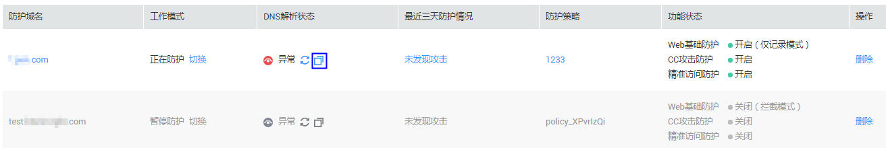

# 测试WAF

该任务指导用户如何在本地测试Web应用防火墙。

## 前提条件

-   已获取管理控制台的帐号和密码。
-   已添加防护域名。

## 操作步骤

1.  [添加防护域名](添加防护域名.md)。
2.  检查防护域名（例如：www.test.com）的源站服务器协议、地址、端口配置正确，如果“对外协议“类型选择了“HTTPS“，检查上传的证书和私钥是否正确。
3.  选择“安全  \>  Web应用防火墙  \>  域名配置“，进入“域名配置“页面，如[图1](#zh-cn_topic_0110861350_fig6137154116346)所示。

    **图 1**  复制CNAME值  
    

4.  在目标域名所在行的“DNS解析状态“列中，单击，复制“CNAME“值。

1.  ping“CNAME“值并记录“CNAME“对应的IP地址（例如：192.168.0.1）。
2.  在本地修改hosts文件，以Windows系统为例，进入“C:\\Windows\\System32\\drivers\\etc“，打开“hosts“文件，追加一条记录，如下图所示：

    

1.  清理浏览器缓存，在浏览器中输入防护的域名即可进行各种测试。可通过“安全  \>  Web应用防火墙“ ，进入“安全总览“页面，查看防护域名的测试的各项数据。

