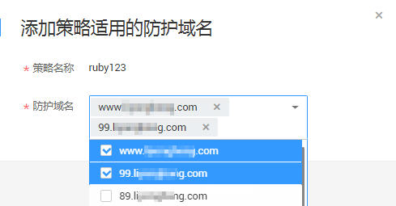

# 添加策略适用的防护域名

该任务指导用户通过Web应用防火墙服务添加策略适用的防护域名。

## 前提条件

-   已获取管理控制台的帐号和密码。
-   已添加防护域名。

## 操作步骤

1.  登录管理控制台（https://console.huaweicloud.com/）。
2.  单击管理控制台左上角的，选择区域或项目。
3.  单击页面上方的“服务列表“，选择“安全  \>  Web应用防火墙“，在左侧导航树中选择“防护策略“，进入“防护策略“页面。
4.  在目标策略名称所在行的“操作“列，单击“添加防护域名“，如[图1](#fig169858225460)所示。

    **图 1**  添加防护域名  
    

5.  在“防护域名“下拉框中选择适用于该策略的防护域名，如[图2](#fig8829399338)所示。

    > **注意：**   
    >-   一个防护域名有且只能配置一条防护策略。  
    >-   一条防护策略可以适用于多个防护域名。  
    >-   若想删除已绑定域名的防护策略，请先将此防护策略绑定的所有域名添加到其它防护策略，再在目标策略名称所在行的“操作“列中，单击“删除“。  

    **图 2**  添加策略适用的防护域名  
    

6.  单击“确定“，在页面右上角弹出“添加成功“，则说明添加策略适用的防护域名成功。

