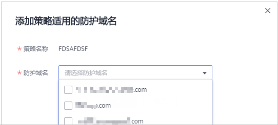

# 添加策略适用的防护域名

您可以通过Web应用防火墙服务添加策略适用的防护域名。

> **说明：** 
>如果您已开通企业项目，您可以在“企业项目“下拉列表中选择您所在的企业项目，为该企业项目批量添加防护规则。

## 前提条件

防护网站的部署模式为“云模式“或“独享模式“。

## 规格限制

检测版和专业版不支持该功能。

## 操作步骤

1.  [登录管理控制台](https://console.huaweicloud.com/?locale=zh-cn)。
2.  进入防护策略入口，如[图1](#waf_01_0074_fig4185340104311)所示。

    **图 1**  防护策略入口  
    

3.  在目标策略名称所在行的“操作“列，单击“添加防护域名“。
4.  在“防护域名“下拉框中选择适用于该策略的防护域名，如[图2](#fig8829399338)所示。

    > **须知：** 
    >-   一个防护域名有且只能配置一条防护策略。
    >-   一条防护策略可以适用于多个防护域名。
    >-   若想删除已绑定域名的防护策略，请先将此防护策略绑定的所有域名添加到其它防护策略，再在目标策略名称所在行的“操作“列中，单击“删除“。

    **图 2**  添加策略适用的防护域名  
    

5.  单击“确定“，在页面右上角弹出“添加成功“，则说明添加策略适用的防护域名成功。

