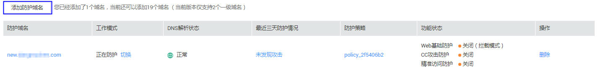

# 添加防护域名

该任务指导用户在Web应用防火墙添加并接入域名。域名接入WAF后，WAF作为一个反向代理存在于客户端和服务器之间，服务器的真实IP被隐藏起来，Web访问者只能看到WAF的IP地址。

## 前提条件

已获取管理控制台的帐号和密码。

## 配置防护域名原理图

-   若在客户端和Web应用防火墙之间使用了代理，可参照[图1](#fig030435404518)配置。

    **图 1**  使用代理配置原理图  
    

-   若在客户端和Web应用防火墙之间未使用代理，可参照[图2](#fig1624119317528)配置。

    **图 2**  未使用代理配置原理图  
    

## 操作步骤

1.  登录管理控制台（https://console.huaweicloud.com/）。
2.  单击页面上方的“服务列表“，选择“安全  \>  Web应用防火墙“。
3.  在左侧导航树中选择“域名配置“，进入“域名配置“页面，如[图3](#fig15593418182219)所示。

    **图 3**  添加防护域名  
    

4.  在域名列表左上角，单击“添加防护域名“。
5.  在“添加防护域名“页面配置域名基本信息。如[图4](#fig175731754141418)所示，相关参数说明如[表1](#table7692122554811)所示。

    **图 4**  配置基本信息  
    

    **表 1**  基本信息参数说明

    
    <table><thead align="left"><tr id="row1068752517484"><th class="cellrowborder" valign="top" width="15%" id="mcps1.2.4.1.1">
参数

    </th>
    <th class="cellrowborder" valign="top" width="63%" id="mcps1.2.4.1.2">
参数说明

    </th>
    <th class="cellrowborder" valign="top" width="22%" id="mcps1.2.4.1.3">
取值样例

    </th>
    </tr>
    </thead>
    <tbody><tr id="row1368718254486"><td class="cellrowborder" valign="top" width="15%" headers="mcps1.2.4.1.1 ">
防护域名

    </td>
    <td class="cellrowborder" valign="top" width="63%" headers="mcps1.2.4.1.2 ">
可防护的域名，支持单域名和泛域名。

    
 说明： 
<ul id="ul2687625154816"><li>若将“防护域名”配置为泛域名，则泛域名下每个子域名对应的服务器IP地址必须相同。</li><li>若子域名对应的服务器IP地址不同，请逐条添加单域名防护。</li></ul>
    

    </td>
    <td class="cellrowborder" valign="top" width="22%" headers="mcps1.2.4.1.3 ">
单域名：www.domain.com

    
泛域名：*.domain.com

    </td>
    </tr>
    <tr id="row116884252488"><td class="cellrowborder" valign="top" width="15%" headers="mcps1.2.4.1.1 ">
端口

    </td>
    <td class="cellrowborder" valign="top" width="63%" headers="mcps1.2.4.1.2 ">
可选参数，仅当用户勾选“非标准端口”时需要配置。

    <ul id="ul86882025104815"><li>“对外协议”选择“HTTP”时，WAF默认防护“80”标准端口的业务，如需配置除“80”以外的端口，勾选“非标准端口”，在“端口”下拉列表中选择非标准端口。</li><li>“对外协议”选择“HTTPS”时，WAF默认防护“443”标准端口的业务，如需配置除“443”以外的端口，勾选“非标准端口”，在“端口”下拉列表中选择非标准端口。</li></ul>
    
Web应用防火墙可支持非标准端口165个（HTTP业务端口145个，HTTPS业务端口20个）。

    </td>
    <td class="cellrowborder" valign="top" width="22%" headers="mcps1.2.4.1.3 ">
4443

    </td>
    </tr>
    <tr id="row5690192514820"><td class="cellrowborder" valign="top" width="15%" headers="mcps1.2.4.1.1 ">
服务器配置

    </td>
    <td class="cellrowborder" valign="top" width="63%" headers="mcps1.2.4.1.2 ">
网站服务器地址的配置。包括对外协议、源站协议、源站地址和源站端口。

    <ul id="ul16689625134815"><li>对外协议：客户端协议类型。包括“HTTP”、“HTTPS”两种协议类型。</li><li>源站协议：服务器协议类型，WAF转发客户端请求的协议。包括“HTTP”、“HTTPS”两种协议类型。</li><li>源站地址：客户端访问的网站服务器的IP地址（一般对应该域名接入WAF之前的A记录）或者域名（一般对应该域名接入前的Cname）。</li><li>源站端口：客户端访问的网站服务器的端口号。</li></ul>
    </td>
    <td class="cellrowborder" valign="top" width="22%" headers="mcps1.2.4.1.3 ">
对外协议：HTTPS

    
源站协议：HTTPS

    
源站地址：192.168.1.1

    
源站端口：4443

    </td>
    </tr>
    <tr id="row76909251484"><td class="cellrowborder" valign="top" width="15%" headers="mcps1.2.4.1.1 ">
证书

    </td>
    <td class="cellrowborder" valign="top" width="63%" headers="mcps1.2.4.1.2 ">
“对外协议”设置为“HTTPS”，需要选择已有证书或导入新证书。导入新证书的操作参见<a href="导入新证书.md">导入新证书</a>。

    </td>
    <td class="cellrowborder" valign="top" width="22%" headers="mcps1.2.4.1.3 ">
--

    </td>
    </tr>
    <tr id="row1969222517483"><td class="cellrowborder" valign="top" width="15%" headers="mcps1.2.4.1.1 ">
是否已使用代理

    </td>
    <td class="cellrowborder" valign="top" width="63%" headers="mcps1.2.4.1.2 ">
选择是否已使用代理。默认为“否”。

    <ul id="ul126921725154816"><li>若接入Web应用防火墙的网站已使用高防、CDN（Content Delivery Network，内容分发网络）、云加速等代理，为了保证WAF的安全策略能够针对真实源IP生效，请务必选择“是”，如果选择“否”，则Web应用防火墙无法获取Web访问者请求的真实IP地址。</li><li>若接入Web应用防火墙的网站未使用任何代理，请选择“否”。
 注意： 

当在Web应用防火墙前使用代理时，不能切换为“Bypass”工作模式。

    

    </li></ul>
    </td>
    <td class="cellrowborder" valign="top" width="22%" headers="mcps1.2.4.1.3 ">
是

    </td>
    </tr>
    </tbody>
    </table>

6.  单击“下一步“，进入“域名接入“页面。

    关于域名接入的详细操作请参见[域名接入](域名接入.md)。

7.  域名接入完成后，单击“下一步“。
8.  单击“完成“，页面右上角弹出“防护域名添加成功“，则说明防护域名添加成功。

    用户可在域名列表中查看已添加防护域名的“DNS解析状态“和“工作模式“。

    > **说明：**   
    >-   若用户的服务器在使用其他防火墙，请关闭或者将Web应用防火墙的IP段加为白名单。  
    >-   若防护域名已接入WAF，“DNS解析状态“仍然为“异常“，可单击，刷新状态，一旦域名接入成功，Web应用防火墙自动开启防护。  

