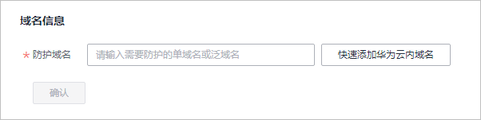

# 添加防护域名

该任务指导用户在Web应用防火墙添加并接入域名。域名接入WAF后，WAF作为一个反向代理存在于客户端和服务器之间，服务器的真实IP被隐藏起来，Web访问者只能看到WAF的IP地址。

## 前提条件

已获取管理控制台的帐号和密码。

## 配置防护域名原理图

-   若在客户端和Web应用防火墙之间使用了代理，可参照[图1](#fig030435404518)配置。

    **图 1**  使用代理配置原理图  
    

-   若在客户端和Web应用防火墙之间未使用代理，可参照[图2](#fig1624119317528)配置。

    **图 2**  未使用代理配置原理图  
    

## 操作步骤

1.  登录管理控制台（https://console.huaweicloud.com/）。
2.  单击管理控制台左上角的，选择区域或项目。
3.  单击页面上方的“服务列表“，选择“安全  \>  Web应用防火墙“。
4.  在左侧导航树中选择“域名配置“，进入“域名配置“页面，如[图3](#fig15593418182219)所示。

    **图 3**  添加防护域名  
    

5.  在域名列表左上角，单击“添加防护域名“。
6.  在“添加防护域名“页面配置域名基本信息。如[图4](#fig175731754141418)所示，相关参数说明如[表1](#table7692122554811)所示。

    **图 4**  配置基本信息  
    

    **表 1**  基本信息参数说明

    
    <table><thead align="left"><tr id="row1068752517484"><th class="cellrowborder" valign="top" width="15%" id="mcps1.2.4.1.1">
参数

    </th>
    <th class="cellrowborder" valign="top" width="60.5%" id="mcps1.2.4.1.2">
参数说明

    </th>
    <th class="cellrowborder" valign="top" width="24.5%" id="mcps1.2.4.1.3">
取值样例

    </th>
    </tr>
    </thead>
    <tbody><tr id="row1368718254486"><td class="cellrowborder" valign="top" width="15%" headers="mcps1.2.4.1.1 ">
防护域名

    </td>
    <td class="cellrowborder" valign="top" width="60.5%" headers="mcps1.2.4.1.2 ">
可防护的域名，支持单域名和泛域名。

    <ul id="ul9206119142513"><li>单域名：输入防护的单域名。例如：www.example.com。</li><li>泛域名<ul id="ul776103520251"><li>如果各子域名对应的服务器IP地址相同：输入防护的泛域名。例如：*.example.com。</li><li>如果各子域名对应的服务器IP地址不相同：请将子域名按“单域名”方式逐条添加。</li></ul>
    </li></ul>
    </td>
    <td class="cellrowborder" valign="top" width="24.5%" headers="mcps1.2.4.1.3 ">
单域名：www.example.com

    
泛域名：*.example.com

    </td>
    </tr>
    <tr id="row116884252488"><td class="cellrowborder" valign="top" width="15%" headers="mcps1.2.4.1.1 ">
端口

    </td>
    <td class="cellrowborder" valign="top" width="60.5%" headers="mcps1.2.4.1.2 ">
可选参数，仅当用户勾选“非标准端口”时需要配置。

    <ul id="ul86882025104815"><li>“对外协议”选择“HTTP”时，WAF默认防护“80”标准端口的业务，如需配置除“80”以外的端口，勾选“非标准端口”，在“端口”下拉列表中选择非标准端口。</li><li>“对外协议”选择“HTTPS”时，WAF默认防护“443”标准端口的业务，如需配置除“443”以外的端口，勾选“非标准端口”，在“端口”下拉列表中选择非标准端口。</li></ul>
    
Web应用防火墙可支持非标准端口169个（HTTP业务端口146个，HTTPS业务端口23个）。

    </td>
    <td class="cellrowborder" valign="top" width="24.5%" headers="mcps1.2.4.1.3 ">
81

    </td>
    </tr>
    <tr id="row5690192514820"><td class="cellrowborder" valign="top" width="15%" headers="mcps1.2.4.1.1 ">
服务器配置

    </td>
    <td class="cellrowborder" valign="top" width="60.5%" headers="mcps1.2.4.1.2 ">
网站服务器地址的配置。包括对外协议、源站协议、源站地址和源站端口。

    <ul id="ul16689625134815"><li>对外协议：客户端协议类型。包括“HTTP”、“HTTPS”两种协议类型。</li><li>源站协议：服务器协议类型，WAF转发客户端请求的协议。包括“HTTP”、“HTTPS”两种协议类型。
 说明： 

对外协议与源站协议的具体配置规则，请参见<a href="#section645014318511">对外协议与源站协议配置规则</a>。

    

    </li><li>源站地址：客户端访问的网站服务器的IP地址（一般对应该域名接入WAF之前的A记录）或者域名（一般对应该域名接入前的CNAME）。</li><li>源站端口：客户端访问的网站服务器的端口号。</li></ul>
    </td>
    <td class="cellrowborder" valign="top" width="24.5%" headers="mcps1.2.4.1.3 ">
对外协议：HTTPS

    
源站协议：HTTPS

    
源站地址：192.168.1.1

    
源站端口：443

    </td>
    </tr>
    <tr id="row76909251484"><td class="cellrowborder" valign="top" width="15%" headers="mcps1.2.4.1.1 ">
证书

    </td>
    <td class="cellrowborder" valign="top" width="60.5%" headers="mcps1.2.4.1.2 ">
“对外协议”设置为“HTTPS”时，需要选择已有证书或导入新证书，导入新证书的操作请参见<a href="#li1098265701316">7</a>。

    </td>
    <td class="cellrowborder" valign="top" width="24.5%" headers="mcps1.2.4.1.3 ">
--

    </td>
    </tr>
    </tbody>
    </table>

7.  （可选）导入新证书。

    当“对外协议“设置为“HTTPS“时，可以导入新证书。

    1.  单击“导入新证书“，打开“导入新证书“对话框。然后输入“证书名称“，并将证书内容和私钥内容粘贴到对应的文本框中，如[图5](#fig7846148397)所示。

        **图 5**  导入新证书  
        

        > **说明：**   
        >Web应用防火墙将对私钥进行加密保存，保障证书私钥的安全性。  

        WAF当前仅支持PEM格式证书。如果证书为非PEM格式，请参考[表2](#table1184924815910)将证书转换为PEM格式，再粘贴到“证书内容“和“私钥内容“文本框中。 

        **表 2**  证书转换命令

        
        <table><thead align="left"><tr id="row2847448797"><th class="cellrowborder" valign="top" width="21.990000000000002%" id="mcps1.2.3.1.1">
格式类型

        </th>
        <th class="cellrowborder" valign="top" width="78.01%" id="mcps1.2.3.1.2">
转换方式（Linux系统中操作）

        </th>
        </tr>
        </thead>
        <tbody><tr id="row1784719481093"><td class="cellrowborder" valign="top" width="21.990000000000002%" headers="mcps1.2.3.1.1 ">
CER/CRT

        </td>
        <td class="cellrowborder" valign="top" width="78.01%" headers="mcps1.2.3.1.2 ">
将“cert.crt”证书文件直接重命名为“cert.pem”。

        </td>
        </tr>
        <tr id="row1484714481196"><td class="cellrowborder" valign="top" width="21.990000000000002%" headers="mcps1.2.3.1.1 ">
PFX

        </td>
        <td class="cellrowborder" valign="top" width="78.01%" headers="mcps1.2.3.1.2 "><ol id="ol178472048299"><li>提取私钥命令，以“cert.pfx”转换为“cert.key”为例。
<strong id="b78471748295">openssl pkcs12 -in cert.pfx -nocerts -out cert.key -nodes</strong>

        </li><li>提取证书命令（示例：“cert.pfx”转“cert.pem”）：
<strong id="b10847164818913">openssl pkcs12 -in cert.pfx -nokeys -out cert.pem</strong>

        </li></ol>
        </td>
        </tr>
        <tr id="row15847548495"><td class="cellrowborder" valign="top" width="21.990000000000002%" headers="mcps1.2.3.1.1 ">
P7B

        </td>
        <td class="cellrowborder" valign="top" width="78.01%" headers="mcps1.2.3.1.2 ">
证书转换，以“cert.p7b”转换为“cert.pem”为例。

        
<strong id="b884754812912">openssl pkcs7 -print_certs -in cert.p7b -out cert.pem</strong>

        </td>
        </tr>
        <tr id="row12849154819915"><td class="cellrowborder" valign="top" width="21.990000000000002%" headers="mcps1.2.3.1.1 ">
DER

        </td>
        <td class="cellrowborder" valign="top" width="78.01%" headers="mcps1.2.3.1.2 ">
提取证书命令，以“privatekey.der”转换为“cert.key”为例。

        
<strong id="b118494481997">openssl rsa -inform DER -outform PEM -in privatekey.der -out cert.key</strong>

        </td>
        </tr>
        </tbody>
        </table>

    2.  单击“上传“，上传证书。

8.  选择“是否已使用代理“，默认为“否“。

    > **注意：**   
    >当在Web应用防火墙前使用代理时，不能切换为“Bypassed“工作模式。  

    -   若接入Web应用防火墙的网站已使用高防、CDN（Content Delivery Network，内容分发网络）、云加速等代理，为了保证WAF的安全策略能够针对真实源IP生效，请务必选择“是“，如果选择“否“，则Web应用防火墙无法获取Web访问者请求的真实IP地址。
    -   若接入Web应用防火墙的网站未使用任何代理，请选择“否“。

9.  单击“下一步“，进入“域名接入“页面，同时在页面的右上角，会弹出“域名添加成功“。

    > **说明：**   
    >-   如果暂时不接入域名，可跳过本步骤，直接单击“下一步“后单击“完成“。后续再参照[域名接入](域名接入.md)章节完成域名接入。  
    >-   未接入域名或域名接入失败，“DNS解析状态“显示“异常“。  

    -   若使用了CDN或高防等代理类服务，需要配置回源地址、子域名和TXT记录。如[图6](#zh-cn_topic_0110861266_fig450482413592)所示。

        **图 6**  域名接入  
        

        1.  配置网站使用代理的“回源地址“。

            根据[图6](#zh-cn_topic_0110861266_fig450482413592)提示，将CDN或高防等代理中的回源地址修改为WAF生成的回源地址。

        2.  配置“子域名“和“TXT记录“。

            根据[图6](#zh-cn_topic_0110861266_fig450482413592)提示，前往您的DNS服务商处，添加一个“子域名“，并为该子域名添加一条“TXT记录“。

    -   未使用代理，需要配置CNAME记录。如[图7](#zh-cn_topic_0110861266_fig84741317702)所示。

        **图 7**  接入域名（CNAME记录）  
        

        1.  到该域名的DNS服务商处，配置防护域名的别名解析，具体操作请咨询您的域名服务提供商。

            以下为当前主流的域名服务商的CNAME绑定方法，仅供参考。如与实际配置不符，请以各自域名服务商的信息为准。

            1.  登录域名服务提供商（如：万网、DNSPod、新网）的管理控制台。
            2.  进入域名解析记录页。
            3.  设置CNAME解析记录。
                -   “记录类型“选择为“CNAME“。
                -   “主机记录“一般填写域名前缀，例如：防护域名为 “admin.demo.com“，“主机记录“填写为“admin“。
                -   “记录值“填写为WAF生成的CNAME，例如： “xxxxxxx.waf.huaweicloud.com“。
                -   “解析线路“，“TTL“  保持默认值即可。

            4.  填写完成后，单击“保存“，完成解析设置。

            > **注意：**   
            >以上解析方法为第三方解析方法。本文档不对任何第三方内容进行控制或负责，包括但不限于其准确性、兼容性、可靠性、可用性、合法性、适当性、性能、不侵权、更新状态等。  

        2.  验证域名的CNAME是否配置成功。
            1.  在Windows操作系统中，选择“开始  \>  运行“，在弹出框中输入“cmd“，按“Enter“。
            2.  执行以下命令，查询CNAME。如果回显的域名是配置的CNAME，则表示配置成功，示例如[图8](#zh-cn_topic_0110861266_waf_01_0079_fig04371756152219)所示。

                **nslookup www.**_domain_**.com**

                **图 8**  查询CNAME  
                

10. 域名接入完成后，单击“下一步“。
11. 单击“完成“，防护域名添加成功。

    用户可在域名列表中查看已添加防护域名的“DNS解析状态“和“工作模式“。

    > **说明：**   
    >-   若用户的服务器在使用其他网络防火墙，请将其关闭或者将WAF的IP网段添加到网络防火墙的IP白名单中。  
    >-   若用户的服务器上已安装个人版安全软件，建议将其更换为企业版安全软件，并将WAF的IP网段添加到该软件的IP白名单中。  
    >-   若防护域名已接入WAF，“DNS解析状态“仍然为“异常“，可单击，刷新状态。  

## 对外协议与源站协议配置规则

根据您的业务场景的不同，WAF提供灵活的协议类型配置。假设您的网站为www.example.com，WAF可配置如下四种访问模式：

-   HTTP访问模式。如[图9](#fig53041342142615)所示。

    **图 9**  HTTP协议访问模式  
    

    > **注意：**   
    >此种配置表示用户只能通过http://www.example.com访问网站，如果用户通过https://www.example.com访问网站，用户会收到302跳转响应，浏览器跳转到http://www.example.com  

-   HTTPS访问模式，客户端协议全部配置为HTTPS时，当使用HTTP协议访问服务器时，会强制跳转为HTTPS协议，如[图10](#fig7444410153315)所示。

    **图 10**  HTTPS协议访问强制跳转模式  
    

    > **注意：**   
    >-   用户直接通过https://www.example.com访问网站，网站返回正常内容。  
    >-   用户通过http://www.example.com访问网站，用户会收到302跳转响应，浏览器跳转到https://www.example.com。  

-   HTTP/HTTPS分别转发模式。如[图11](#fig3389134713400)所示。

    **图 11**  HTTP/HTTPS分别转发模式  
    

    > **注意：**   
    >-   用户通过http://www.example.com访问网站，网站返回正常内容，没有跳转，网站内容不加密传输。  
    >-   用户通过https://www.example.com访问网站，网站返回正常内容，没有跳转，网站内容加密传输。  

-   使用WAF做HTTPS卸载模式。如[图12](#fig11273129104514)所示。

    **图 12**  使用WAF做HTTPS卸载模式  
    

    > **注意：**   
    >用户通过https://www.example.com访问网站，但是WAF到源站依然使用HTTP协议。  

