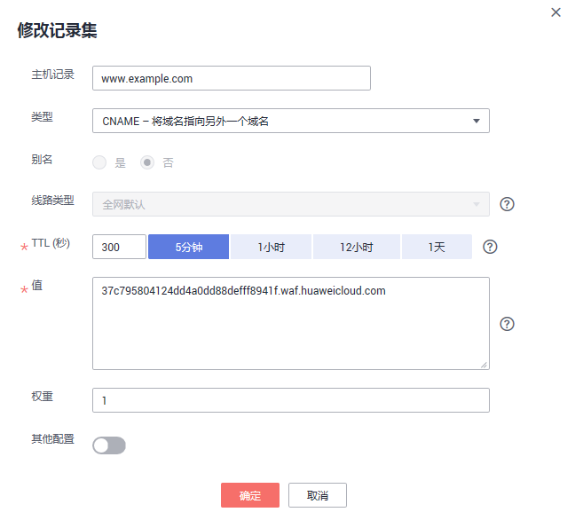
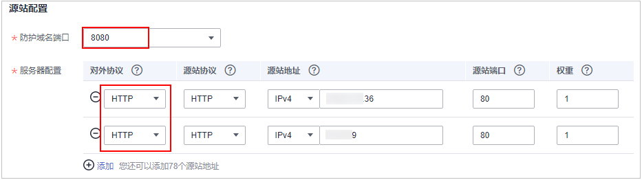

# 添加防护域名<a name="waf_01_0002"></a>

该章节指导您将网站域名添加到Web应用防火墙，并完成域名接入，使网站流量切入WAF。域名接入WAF后，WAF作为一个反向代理存在于客户端和服务器之间，服务器的真实IP被隐藏起来，Web访问者只能看到WAF的IP地址。

> **说明：** 
>如果您已开通企业项目，您可以在“企业项目“下拉列表中选择您所在的企业项目，在该企业项目下添加防护域名。

## 前提条件<a name="section2256777914731"></a>

已购买WAF云模式。

## 规格限制<a name="section618164113379"></a>

当前仅“华东“区域支持IPv6防护，且仅企业版和旗舰版支持IPv6。

将网站接入WAF后，网站的文件上传请求限制为512MB。

## 约束条件<a name="section8698135116389"></a>

-   主帐号可以查看子帐号添加的域名，但子帐号不能查看主帐号添加的域名。
-   WAF不支持自定义防护域名的HTTP Header消息头。
-   请确保域名经过ICP备案，未备案域名将无法正常使用WAF。
-   CNAME值是根据域名生成的，对于同一个域名，其CNAME值是一致的。
-   WAF支持Web Socket协议，且默认为开启状态。

## 系统影响<a name="section62961010174019"></a>

如果配置了非标准端口，访问网站时，需要在网址后面增加非标准端口进行访问，否则访问网站时会出现[404错误](https://support.huaweicloud.com/waf_faq/waf_01_0066.html#section0)。

## 使用代理原理图<a name="section155061806348"></a>

若在客户端和Web应用防火墙之间使用了代理，可参照[图1](#fig030435404518)配置。

**图 1**  使用代理配置原理图<a name="fig030435404518"></a>  


-   当网站没有接入到WAF前，DNS解析到代理，流量先经过代理，代理再将流量直接转到源站。
-   网站接入WAF后，需要将域名解析到WAF，这样流量才会被代理转发到WAF，WAF再将流量转到源站，实现网站流量检测和攻击拦截。
    1.  将代理回源地址修改为WAF的“CNAME“。
    2.  （可选）在DNS服务商处添加一条WAF的子域名和TXT记录。


## 未使用代理原理图<a name="section6553154917111"></a>

若在客户端和Web应用防火墙之间未使用代理，可参照[图2](#fig1624119317528)配置。

**图 2**  未使用代理配置原理图<a name="fig1624119317528"></a>  


-   当网站没有接入到WAF前，DNS直接解析到源站的IP，用户直接访问服务器。
-   当网站接入WAF后，需要把DNS解析到WAF的CNAME，这样流量才会先经过WAF，WAF再将流量转到源站，实现网站流量检测和攻击拦截。

## 操作步骤<a name="section18585791172619"></a>

1.  [登录管理控制台](https://console.huaweicloud.com/?locale=zh-cn)。
2.  进入网站设置页面入口，如[图3](#fig172535820151)所示。

    **图 3**  网站设置入口<a name="fig172535820151"></a>  
    

3.  在网站列表左上角，单击“添加防护网站“。
4.  选择“云模式“后，在“域名配置“页面配置域名基本信息，如[图4](#fig175731754141418)所示，相关参数说明如[表1](#table7692122554811)所示。

    **图 4**  配置基本信息<a name="fig175731754141418"></a>  
    

    **表 1**  基本信息参数说明

    <a name="table7692122554811"></a>
    <table><thead align="left"><tr id="row1068752517484"><th class="cellrowborder" valign="top" width="15%" id="mcps1.2.4.1.1"><p id="p768742524817"><a name="p768742524817"></a><a name="p768742524817"></a>参数</p>
    </th>
    <th class="cellrowborder" valign="top" width="64.21%" id="mcps1.2.4.1.2"><p id="p1168782534812"><a name="p1168782534812"></a><a name="p1168782534812"></a>参数说明</p>
    </th>
    <th class="cellrowborder" valign="top" width="20.79%" id="mcps1.2.4.1.3"><p id="p12687162544815"><a name="p12687162544815"></a><a name="p12687162544815"></a>取值样例</p>
    </th>
    </tr>
    </thead>
    <tbody><tr id="row1368718254486"><td class="cellrowborder" valign="top" width="15%" headers="mcps1.2.4.1.1 "><p id="p368762516486"><a name="p368762516486"></a><a name="p368762516486"></a>防护域名</p>
    </td>
    <td class="cellrowborder" valign="top" width="64.21%" headers="mcps1.2.4.1.2 "><p id="p168710252489"><a name="p168710252489"></a><a name="p168710252489"></a>可防护的域名，支持单域名和泛域名。</p>
    <a name="ul9206119142513"></a><a name="ul9206119142513"></a><ul id="ul9206119142513"><li>单域名：输入防护的单域名。例如：www.example.com。</li><li>泛域名<div class="note" id="note149522717141"><a name="note149522717141"></a><a name="note149522717141"></a><span class="notetitle"> 说明： </span><div class="notebody"><p id="p949632718144"><a name="p949632718144"></a><a name="p949632718144"></a>泛域名不支持下划线（_）。</p>
    </div></div>
    <a name="ul776103520251"></a><a name="ul776103520251"></a><ul id="ul776103520251"><li>如果各子域名对应的服务器IP地址相同：输入防护的泛域名。例如：子域名a.example.com，b.example.com和c.example.com对应的服务器IP地址相同，可以直接添加泛域名*.example.com。</li><li>如果各子域名对应的服务器IP地址不相同：请将子域名按<span class="parmname" id="parmname13761925124915"><a name="parmname13761925124915"></a><a name="parmname13761925124915"></a>“单域名”</span>方式逐条添加。</li></ul>
    </li></ul>
    </td>
    <td class="cellrowborder" valign="top" width="20.79%" headers="mcps1.2.4.1.3 "><p id="p1268714259482"><a name="p1268714259482"></a><a name="p1268714259482"></a>单域名：www.example.com</p>
    <p id="p176877251487"><a name="p176877251487"></a><a name="p176877251487"></a>泛域名：*.example.com</p>
    </td>
    </tr>
    <tr id="row116884252488"><td class="cellrowborder" valign="top" width="15%" headers="mcps1.2.4.1.1 "><p id="p468762516482"><a name="p468762516482"></a><a name="p468762516482"></a>端口</p>
    </td>
    <td class="cellrowborder" valign="top" width="64.21%" headers="mcps1.2.4.1.2 "><p id="p8687182544810"><a name="p8687182544810"></a><a name="p8687182544810"></a>可选参数，仅当用户勾选<span class="parmname" id="parmname15687162544812"><a name="parmname15687162544812"></a><a name="parmname15687162544812"></a>“非标准端口”</span>时需要配置。端口的配置示例如<a href="#section04061341181016">配置示例一：防护同一端口的不同源站IP的标准端口业务</a>。</p>
    <a name="ul86882025104815"></a><a name="ul86882025104815"></a><ul id="ul86882025104815"><li><span class="parmname" id="parmname132831726191713"><a name="parmname132831726191713"></a><a name="parmname132831726191713"></a>“对外协议”</span>选择<span class="parmvalue" id="parmvalue3283152610175"><a name="parmvalue3283152610175"></a><a name="parmvalue3283152610175"></a>“HTTP”</span>时，WAF默认防护<span class="parmvalue" id="parmvalue2284202612172"><a name="parmvalue2284202612172"></a><a name="parmvalue2284202612172"></a>“80”</span>标准端口的业务；<span class="parmname" id="parmname4988204414173"><a name="parmname4988204414173"></a><a name="parmname4988204414173"></a>“对外协议”</span>选择<span class="parmvalue" id="parmvalue19885443170"><a name="parmvalue19885443170"></a><a name="parmvalue19885443170"></a>“HTTPS”</span>时，WAF默认防护<span class="parmvalue" id="parmvalue1598874481710"><a name="parmvalue1598874481710"></a><a name="parmvalue1598874481710"></a>“443”</span>标准端口的业务。</li><li>如需配置除<span class="parmvalue" id="parmvalue268714258481"><a name="parmvalue268714258481"></a><a name="parmvalue268714258481"></a>“80”</span>/<span class="parmvalue" id="parmvalue18646112219183"><a name="parmvalue18646112219183"></a><a name="parmvalue18646112219183"></a>“443”</span>以外的端口，勾选<span class="parmname" id="parmname96871825134813"><a name="parmname96871825134813"></a><a name="parmname96871825134813"></a>“非标准端口”</span>，在<span class="parmname" id="parmname156881251484"><a name="parmname156881251484"></a><a name="parmname156881251484"></a>“端口”</span>下拉列表中选择非标准端口。<p id="p7534181712207"><a name="p7534181712207"></a><a name="p7534181712207"></a>Web应用防火墙支持的非标准端口请参见<a href="https://support.huaweicloud.com/waf_faq/waf_01_0032.html" target="_blank" rel="noopener noreferrer">Web应用防火墙支持的非标准端口</a>。</p>
    </li></ul>
    <div class="note" id="note10406184721615"><a name="note10406184721615"></a><a name="note10406184721615"></a><span class="notetitle"> 说明： </span><div class="notebody"><p id="p162413442720"><a name="p162413442720"></a><a name="p162413442720"></a>如果配置了非标准端口，访问网站时，需要在网址后面增加非标准端口进行访问，否则访问网站时会出现<a href="https://support.huaweicloud.com/waf_faq/waf_01_0066.html#section0" target="_blank" rel="noopener noreferrer">404错误</a>。</p>
    </div></div>
    </td>
    <td class="cellrowborder" valign="top" width="20.79%" headers="mcps1.2.4.1.3 "><p id="p86881725164816"><a name="p86881725164816"></a><a name="p86881725164816"></a>81</p>
    </td>
    </tr>
    <tr id="row5690192514820"><td class="cellrowborder" valign="top" width="15%" headers="mcps1.2.4.1.1 "><p id="p116898254489"><a name="p116898254489"></a><a name="p116898254489"></a>服务器配置</p>
    </td>
    <td class="cellrowborder" valign="top" width="64.21%" headers="mcps1.2.4.1.2 "><p id="p568972554814"><a name="p568972554814"></a><a name="p568972554814"></a>网站服务器地址的配置。包括对外协议、源站协议、源站地址和源站端口。</p>
    <a name="ul16689625134815"></a><a name="ul16689625134815"></a><ul id="ul16689625134815"><li>对外协议：客户端请求访问服务器的协议类型。包括<span class="parmvalue" id="parmvalue468962564815"><a name="parmvalue468962564815"></a><a name="parmvalue468962564815"></a>“HTTP”</span>、<span class="parmvalue" id="parmvalue1068932514812"><a name="parmvalue1068932514812"></a><a name="parmvalue1068932514812"></a>“HTTPS”</span>两种协议类型。</li><li>源站协议：Web应用防火墙转发客户端请求的协议类型。包括<span class="parmvalue" id="parmvalue66891325124819"><a name="parmvalue66891325124819"></a><a name="parmvalue66891325124819"></a>“HTTP”</span>、<span class="parmvalue" id="parmvalue1968972511483"><a name="parmvalue1968972511483"></a><a name="parmvalue1968972511483"></a>“HTTPS”</span>两种协议类型。<div class="note" id="note031411715256"><a name="note031411715256"></a><a name="note031411715256"></a><span class="notetitle"> 说明： </span><div class="notebody"><a name="ul666091813589"></a><a name="ul666091813589"></a><ul id="ul666091813589"><li>对外协议与源站协议的具体配置规则，请参见<a href="#section645014318511">对外协议与源站协议配置规则</a>。</li><li><span>WAF支持Web Socket协议，且默认为开启状态。</span></li></ul>
    </div></div>
    </li><li>源站地址：客户端访问的网站服务器的公网IP地址（一般对应该域名在DNS服务商处配置的A记录）或者域名（一般对应该域名在DNS服务商处配置的CNAME）。支持以下两种IP格式：<a name="ul1115165615391"></a><a name="ul1115165615391"></a><ul id="ul1115165615391"><li>IPv4，例如：192.168.1.1</li><li>IPv6，例如：1050:0:0:0:5:600:300c:326b</li></ul>
    <div class="notice" id="note12994653101212"><a name="note12994653101212"></a><a name="note12994653101212"></a><span class="noticetitle"> 须知： </span><div class="noticebody"><p id="p9994853161215"><a name="p9994853161215"></a><a name="p9994853161215"></a>当前仅<span class="parmname" id="parmname139304481307"><a name="parmname139304481307"></a><a name="parmname139304481307"></a>“华东”</span>区域支持IPv6防护，且仅企业版和旗舰版支持IPv6。</p>
    </div></div>
    </li><li>源站端口：WAF转发客户端请求到服务器的业务端口。</li></ul>
    </td>
    <td class="cellrowborder" valign="top" width="20.79%" headers="mcps1.2.4.1.3 "><p id="p20689192524820"><a name="p20689192524820"></a><a name="p20689192524820"></a>对外协议：HTTP</p>
    <p id="p568922544813"><a name="p568922544813"></a><a name="p568922544813"></a>源站协议：HTTP</p>
    <p id="p1368915251486"><a name="p1368915251486"></a><a name="p1368915251486"></a>源站地址：IPv4 XX.XX.1.1</p>
    <p id="p13689162510483"><a name="p13689162510483"></a><a name="p13689162510483"></a>源站端口：80</p>
    </td>
    </tr>
    <tr id="row76909251484"><td class="cellrowborder" valign="top" width="15%" headers="mcps1.2.4.1.1 "><p id="p169072504811"><a name="p169072504811"></a><a name="p169072504811"></a>证书</p>
    </td>
    <td class="cellrowborder" valign="top" width="64.21%" headers="mcps1.2.4.1.2 "><p id="p82531059153419"><a name="p82531059153419"></a><a name="p82531059153419"></a><span class="parmname" id="parmname625245914342"><a name="parmname625245914342"></a><a name="parmname625245914342"></a>“对外协议”</span>设置为<span class="parmvalue" id="parmvalue12253185919343"><a name="parmvalue12253185919343"></a><a name="parmvalue12253185919343"></a>“HTTPS”</span>时，需要选择证书。您可以选择已创建的证书或选择导入的新证书。导入新证书的操作请参见<a href="#li1098265701316">5</a>。</p>
    <p id="p3102925173713"><a name="p3102925173713"></a><a name="p3102925173713"></a>成功导入的新证书，将添加到<span class="wintitle" id="wintitle106164576614"><a name="wintitle106164576614"></a><a name="wintitle106164576614"></a>“证书管理”</span>页面的证书列表中。有关证书管理的操作，请参见<a href="zh-cn_topic_0269054717.md">创建证书</a>。</p>
    <p id="p13896121913619"><a name="p13896121913619"></a><a name="p13896121913619"></a>您也可以在SCM管理控制台购买证书并推送到WAF。有关SCM证书推送到WAF的详细操作，请参见<a href="https://support.huaweicloud.com/usermanual-scm/scm_01_0030.html" target="_blank" rel="noopener noreferrer">推送证书到云产品</a>。</p>
    <div class="notice" id="note11454155319244"><a name="note11454155319244"></a><a name="note11454155319244"></a><span class="noticetitle"> 须知： </span><div class="noticebody"><a name="zh-cn_topic_0125242652_ul796314498014"></a><a name="zh-cn_topic_0125242652_ul796314498014"></a><ul id="zh-cn_topic_0125242652_ul796314498014"><li>WAF当前仅支持PEM格式证书。如果证书为非PEM格式，请参考<a href="#zh-cn_topic_0154713246_table1184924815910">表2</a>将<span class="keyword" id="keyword1527722818553"><a name="keyword1527722818553"></a><a name="keyword1527722818553"></a>证书转换</span>为PEM格式，再上传。</li><li>域名和证书需要一一对应，泛域名只能使用泛域名证书。如果您没有泛域名证书，只有单域名对应的证书，则只能在WAF中按照单域名的方式逐条添加域名进行防护。</li><li>域名和证书需要一一对应，泛域名只能使用泛域名证书。如果您没有泛域名证书，只有单域名对应的证书，则只能在WAF中按照单域名的方式逐条添加域名进行防护。</li></ul>
    </div></div>
    </td>
    <td class="cellrowborder" valign="top" width="20.79%" headers="mcps1.2.4.1.3 "><p id="p86901825134813"><a name="p86901825134813"></a><a name="p86901825134813"></a>--</p>
    </td>
    </tr>
    </tbody>
    </table>

5.  <a name="li1098265701316"></a>（可选）导入新证书。

    当“对外协议“设置为“HTTPS“时，可以导入新证书。

    1.  单击“导入新证书“，打开“导入新证书“对话框。然后输入“证书名称“，并将证书内容和私钥内容粘贴到对应的文本框中，如[图5](#fig7846148397)所示。

        **图 5**  导入新证书<a name="fig7846148397"></a>  
        

        > **说明：** 
        >Web应用防火墙将对私钥进行加密保存，保障证书私钥的安全性。

        WAF当前仅支持PEM格式证书。如果证书为非PEM格式，请参考[表2](#zh-cn_topic_0154713246_table1184924815910)将证书转换为PEM格式，再上传。

        **表 2**  证书转换命令

        <a name="zh-cn_topic_0154713246_table1184924815910"></a>
        <table><thead align="left"><tr id="zh-cn_topic_0154713246_row2847448797"><th class="cellrowborder" valign="top" width="21.990000000000002%" id="mcps1.2.3.1.1"><p id="zh-cn_topic_0154713246_p98475489920"><a name="zh-cn_topic_0154713246_p98475489920"></a><a name="zh-cn_topic_0154713246_p98475489920"></a>格式类型</p>
        </th>
        <th class="cellrowborder" valign="top" width="78.01%" id="mcps1.2.3.1.2"><p id="zh-cn_topic_0154713246_p18847164813920"><a name="zh-cn_topic_0154713246_p18847164813920"></a><a name="zh-cn_topic_0154713246_p18847164813920"></a>转换方式（<span>通过</span><a href="https://www.openssl.org/" target="_blank" rel="noopener noreferrer">openssl</a><span>工具进行转换</span>）</p>
        </th>
        </tr>
        </thead>
        <tbody><tr id="zh-cn_topic_0154713246_row1784719481093"><td class="cellrowborder" valign="top" width="21.990000000000002%" headers="mcps1.2.3.1.1 "><p id="zh-cn_topic_0154713246_p68471489919"><a name="zh-cn_topic_0154713246_p68471489919"></a><a name="zh-cn_topic_0154713246_p68471489919"></a>CER/CRT</p>
        </td>
        <td class="cellrowborder" valign="top" width="78.01%" headers="mcps1.2.3.1.2 "><p id="zh-cn_topic_0154713246_p88479481916"><a name="zh-cn_topic_0154713246_p88479481916"></a><a name="zh-cn_topic_0154713246_p88479481916"></a>将<span class="filepath" id="zh-cn_topic_0154713246_filepath78476481915"><a name="zh-cn_topic_0154713246_filepath78476481915"></a><a name="zh-cn_topic_0154713246_filepath78476481915"></a>“cert.crt”</span>证书文件直接重命名为<span class="filepath" id="zh-cn_topic_0154713246_filepath98475485919"><a name="zh-cn_topic_0154713246_filepath98475485919"></a><a name="zh-cn_topic_0154713246_filepath98475485919"></a>“cert.pem”</span>。</p>
        </td>
        </tr>
        <tr id="zh-cn_topic_0154713246_row1484714481196"><td class="cellrowborder" valign="top" width="21.990000000000002%" headers="mcps1.2.3.1.1 "><p id="zh-cn_topic_0154713246_p14847164816915"><a name="zh-cn_topic_0154713246_p14847164816915"></a><a name="zh-cn_topic_0154713246_p14847164816915"></a>PFX</p>
        </td>
        <td class="cellrowborder" valign="top" width="78.01%" headers="mcps1.2.3.1.2 "><a name="ul3496153515520"></a><a name="ul3496153515520"></a><ul id="ul3496153515520"><li>提取私钥命令，以<span class="filepath" id="zh-cn_topic_0154713246_filepath1584712483914"><a name="zh-cn_topic_0154713246_filepath1584712483914"></a><a name="zh-cn_topic_0154713246_filepath1584712483914"></a>“cert.pfx”</span>转换为<span class="filepath" id="zh-cn_topic_0154713246_filepath17847184810916"><a name="zh-cn_topic_0154713246_filepath17847184810916"></a><a name="zh-cn_topic_0154713246_filepath17847184810916"></a>“key.pem”</span>为例。<p id="p15883394553"><a name="p15883394553"></a><a name="p15883394553"></a><strong id="b11888204916494"><a name="b11888204916494"></a><a name="b11888204916494"></a>openssl</strong> <strong id="b9417135615497"><a name="b9417135615497"></a><a name="b9417135615497"></a>pkcs12</strong> <strong id="b113841017509"><a name="b113841017509"></a><a name="b113841017509"></a>-in</strong> <strong id="b13236615504"><a name="b13236615504"></a><a name="b13236615504"></a>cert.pfx</strong> <strong id="b02951111205015"><a name="b02951111205015"></a><a name="b02951111205015"></a>-nocerts</strong> <strong id="b15636191518504"><a name="b15636191518504"></a><a name="b15636191518504"></a>-out</strong> <strong id="b2231162113502"><a name="b2231162113502"></a><a name="b2231162113502"></a>key.pem</strong></p>
        </li><li>提取证书命令，以<span class="filepath" id="zh-cn_topic_0154713246_filepath148471048490"><a name="zh-cn_topic_0154713246_filepath148471048490"></a><a name="zh-cn_topic_0154713246_filepath148471048490"></a>“cert.pfx”</span>转换位<span class="filepath" id="zh-cn_topic_0154713246_filepath68471648499"><a name="zh-cn_topic_0154713246_filepath68471648499"></a><a name="zh-cn_topic_0154713246_filepath68471648499"></a>“cert.pem”</span>为例。<p id="p1038613218565"><a name="p1038613218565"></a><a name="p1038613218565"></a><strong id="b14387129568"><a name="b14387129568"></a><a name="b14387129568"></a>openssl</strong> <strong id="b73871924562"><a name="b73871924562"></a><a name="b73871924562"></a>pkcs12</strong> <strong id="b173871245618"><a name="b173871245618"></a><a name="b173871245618"></a>-in</strong> <strong id="b18387152205613"><a name="b18387152205613"></a><a name="b18387152205613"></a>cert.pfx</strong> <strong id="b83875219562"><a name="b83875219562"></a><a name="b83875219562"></a>-nokeys</strong> <strong id="b17387029563"><a name="b17387029563"></a><a name="b17387029563"></a>-out</strong> <strong id="b1038718215565"><a name="b1038718215565"></a><a name="b1038718215565"></a>cert.pem</strong></p>
        </li></ul>
        </td>
        </tr>
        <tr id="zh-cn_topic_0154713246_row15847548495"><td class="cellrowborder" valign="top" width="21.990000000000002%" headers="mcps1.2.3.1.1 "><p id="zh-cn_topic_0154713246_p12847448399"><a name="zh-cn_topic_0154713246_p12847448399"></a><a name="zh-cn_topic_0154713246_p12847448399"></a>P7B</p>
        </td>
        <td class="cellrowborder" valign="top" width="78.01%" headers="mcps1.2.3.1.2 "><a name="ol44712212610"></a><a name="ol44712212610"></a><ol id="ol44712212610"><li>证书转换，以<span class="filepath" id="zh-cn_topic_0154713246_filepath3847154818919"><a name="zh-cn_topic_0154713246_filepath3847154818919"></a><a name="zh-cn_topic_0154713246_filepath3847154818919"></a>“cert.p7b”</span>转换为<span class="filepath" id="zh-cn_topic_0154713246_filepath784716482919"><a name="zh-cn_topic_0154713246_filepath784716482919"></a><a name="zh-cn_topic_0154713246_filepath784716482919"></a>“cert.cer”</span>为例。<p id="p1898128379"><a name="p1898128379"></a><a name="p1898128379"></a><strong id="b1757415260517"><a name="b1757415260517"></a><a name="b1757415260517"></a>openssl</strong> <strong id="b24213295111"><a name="b24213295111"></a><a name="b24213295111"></a>pkcs7</strong> <strong id="b13387737165115"><a name="b13387737165115"></a><a name="b13387737165115"></a>-print_certs</strong> <strong id="b526034115514"><a name="b526034115514"></a><a name="b526034115514"></a>-in</strong> <strong id="b3215646135110"><a name="b3215646135110"></a><a name="b3215646135110"></a>cert.p7b</strong> <strong id="b15714195014512"><a name="b15714195014512"></a><a name="b15714195014512"></a>-out</strong> <strong id="b17145610518"><a name="b17145610518"></a><a name="b17145610518"></a>cert.<span>cer</span></strong></p>
        </li><li>将<span class="filepath" id="filepath5313140571"><a name="filepath5313140571"></a><a name="filepath5313140571"></a>“cert.cer”</span>证书文件直接重命名为<span class="filepath" id="filepath14551655465"><a name="filepath14551655465"></a><a name="filepath14551655465"></a>“cert.pem”</span>。</li></ol>
        </td>
        </tr>
        <tr id="zh-cn_topic_0154713246_row12849154819915"><td class="cellrowborder" valign="top" width="21.990000000000002%" headers="mcps1.2.3.1.1 "><p id="zh-cn_topic_0154713246_p1984713481495"><a name="zh-cn_topic_0154713246_p1984713481495"></a><a name="zh-cn_topic_0154713246_p1984713481495"></a>DER</p>
        </td>
        <td class="cellrowborder" valign="top" width="78.01%" headers="mcps1.2.3.1.2 "><a name="ul1919945225610"></a><a name="ul1919945225610"></a><ul id="ul1919945225610"><li>提取私钥命令，以<span class="filepath" id="filepath205005545164"><a name="filepath205005545164"></a><a name="filepath205005545164"></a>“privatekey.der”</span>转换为<span class="filepath" id="filepath1343055920166"><a name="filepath1343055920166"></a><a name="filepath1343055920166"></a>“privatekey.pem”</span>为例。<p id="p780972551416"><a name="p780972551416"></a><a name="p780972551416"></a><strong id="b118388511524"><a name="b118388511524"></a><a name="b118388511524"></a>openssl</strong> <strong id="b230514121526"><a name="b230514121526"></a><a name="b230514121526"></a>rsa</strong> <strong id="b8918101618522"><a name="b8918101618522"></a><a name="b8918101618522"></a>-inform</strong> <strong id="b39092214525"><a name="b39092214525"></a><a name="b39092214525"></a>DER</strong> <strong id="b71249294522"><a name="b71249294522"></a><a name="b71249294522"></a>-outform</strong> <strong id="b1831923365219"><a name="b1831923365219"></a><a name="b1831923365219"></a>PEM</strong> <strong id="b10511337145214"><a name="b10511337145214"></a><a name="b10511337145214"></a>-in</strong> <strong id="b15578841115215"><a name="b15578841115215"></a><a name="b15578841115215"></a>privatekey.der</strong> <strong id="b9264174610529"><a name="b9264174610529"></a><a name="b9264174610529"></a>-out</strong> <strong id="b7957205113522"><a name="b7957205113522"></a><a name="b7957205113522"></a>privatekey.pem</strong></p>
        </li><li>提取证书命令，以<span class="filepath" id="filepath2250175075814"><a name="filepath2250175075814"></a><a name="filepath2250175075814"></a>“cert.cer”</span>转换为<span class="filepath" id="filepath825095025810"><a name="filepath825095025810"></a><a name="filepath825095025810"></a>“cert.pem”</span>为例。<p id="p5151115235815"><a name="p5151115235815"></a><a name="p5151115235815"></a><strong id="b6746102816599"><a name="b6746102816599"></a><a name="b6746102816599"></a>openssl</strong> <strong id="b59891133175915"><a name="b59891133175915"></a><a name="b59891133175915"></a>x509</strong> <strong id="b666054212595"><a name="b666054212595"></a><a name="b666054212595"></a>-inform</strong> <strong id="b18740346165916"><a name="b18740346165916"></a><a name="b18740346165916"></a>der</strong> <strong id="b6707111414173"><a name="b6707111414173"></a><a name="b6707111414173"></a>-in</strong> <strong id="b1166222161712"><a name="b1166222161712"></a><a name="b1166222161712"></a>cert.cer</strong> <strong id="b12373192781717"><a name="b12373192781717"></a><a name="b12373192781717"></a>-out cert.pem</strong></p>
        </li></ul>
        </td>
        </tr>
        </tbody>
        </table>

    2.  单击“确定“，上传证书。

6.  选择“是否已使用代理“。

    > **须知：** 
    >-   当在Web应用防火墙前使用代理时，不能切换为“Bypass“工作模式。如何切换工作模式请参考[切换工作模式](zh-cn_topic_0110861288.md)。
    >-   如果网站未使用任何代理，而“是否已使用代理“选择了“是“，该配置仅会使WAF在获取真实源IP时信任HTTP请求头中的“X-Forwarded-For“字段，不影响用户业务。

    -   若接入Web应用防火墙的网站已使用高防、CDN（Content Delivery Network，内容分发网络）、云加速等代理，为了保证WAF的安全策略能够针对真实源IP生效，请务必选择“是“，如果选择“否“，则Web应用防火墙无法获取Web访问者请求的真实IP地址。
    -   若接入Web应用防火墙的网站未使用任何代理，请选择“否“。

7.  单击“下一步“。

    如果您暂时不接入域名，可跳过本步骤，直接单击“下一步“后单击“完成“。后续再参照[域名接入](zh-cn_topic_0125242653.md)章节完成域名接入。

    CNAME值是根据域名生成的，对于同一个域名，其CNAME值是一致的。

    -   如果您使用了CDN或高防等代理类服务，页面如[图6](#fig32845361455)所示。

        请前往您使用的代理处，将该代理的回源地址修改为WAF提供的CNAME地址。

        > **说明：** 
        >-   为了确保WAF转发正常，在修改DNS解析配置前，建议您参照[本地验证](zh-cn_topic_0119703271.md)进行本地验证确保一切配置正常。
        >-   为了防止其他用户提前将您的域名配置到Web应用防火墙上，从而对您的域名防护造成干扰，建议您到DNS服务商处添加“子域名“，并为它配置“TXT记录“。WAF会据此判断域名的所有权真正属于哪个用户。具体的配置方法请参见[未配置子域名和TXT记录的影响](https://support.huaweicloud.com/waf_faq/waf_01_0056.html)。

        **图 6**  域名接入（使用代理）<a name="fig32845361455"></a>  
        

    -   未使用代理，页面如[图7](#fig1579204673016)所示。

        您需要到该域名的DNS服务商处，配置防护域名的别名解析，具体操作请咨询您的域名服务提供商。

        > **说明：** 
        >为了确保WAF转发正常，在修改DNS解析配置前，建议您参照[本地验证](zh-cn_topic_0119703271.md)进行本地验证确保一切配置正常。

        **图 7**  域名接入（未使用代理）<a name="fig1579204673016"></a>  
        

        以下为华为云DNS的CNAME绑定方法，仅供参考。如与实际配置不符，请以各自域名服务商的信息为准。

        1.  进入云解析页面的入口，如[图8](#zh-cn_topic_0171278289_zh-cn_topic_0183018871_fig165861648185013)所示。

            **图 8**  云解析页面入口<a name="zh-cn_topic_0171278289_zh-cn_topic_0183018871_fig165861648185013"></a>  
            

        2.  在目标域名所在行的“操作“列，单击“修改“，进入“修改记录集“页面。
        3.  在弹出的“修改记录集“对话框中修改记录值，如[图9](#zh-cn_topic_0171278289_fig161041532185410)所示。

            -   “主机记录“：在WAF中配置的域名。
            -   “类型“：选择“CNAME-将域名指向另外一个域名“。
            -   “线路类型“：全网默认。
            -   “TTL\(秒\)“：一般建议设置为5分钟，TTL值越大，则DNS记录的同步和更新越慢。
            -   “值“：修改为已复制的WAF CNAME地址。
            -   其他的设置保持不变。

            > **说明：** 
            >关于修改解析记录：
            >-   对于同一个主机记录，CNAME解析记录不能重复，您需要将已存在的解析记录的CNAME修改为WAF CNAME地址。
            >-   同一解析记录下，不同DNS解析记录类型间可能存在冲突。例如，对于同一个主机记录，CNAME记录与A记录、MX记录、TXT记录等其他记录互相冲突。在无法直接修改记录类型的情况下，您可以先删除存在冲突的其他记录，再添加一条新的CNAME记录。删除其他解析记录并新增CNAME解析记录的过程应尽可能在短时间内完成。如果删除A记录后没有添加CNAME解析记录，可能导致域名无法正常解析。
            >域名解析类型的限制规则请参见[为什么会提示解析记录集已经存在？](https://support.huaweicloud.com/dns_faq/dns_faq_016.html)。

            **图 9**  修改记录集<a name="zh-cn_topic_0171278289_fig161041532185410"></a>  
            

        4.  单击“确定“，完成DNS配置，等待DNS解析记录生效。


8.  （可选）验证域名的CNAME是否配置成功。
    1.  在Windows操作系统中，选择“开始  \>  运行“，在弹出框中输入“cmd“，按“Enter“。
    2.  执行**nslookup**命令，查询CNAME。

        如果回显的域名是配置的CNAME，则表示配置成功，示例如[图10](#zh-cn_topic_0125242653_fig1190717481633)所示。

        以域名www.example.com为例。

        ```
        nslookup www.example.com
        ```

        **图 10**  查询CNAME<a name="zh-cn_topic_0125242653_fig1190717481633"></a>  
        


9.  单击“下一步“后单击“完成“，防护域名添加成功。

    用户可在域名列表中查看已添加防护域名的“接入状态“和“工作模式“。

    **图 11**  域名配置完成<a name="fig7926111714296"></a>  
    

    -   单击“配置策略“，您可以为防护网站配置防护策略。
    -   单击“继续添加域名“，您可以继续添加防护网站。
    -   关闭对话框，您可以在防护网站列表中查看已添加防护网站。

    > **说明：** 
    >-   若用户的服务器在使用其他网络防火墙，请将其关闭或者将WAF的IP网段添加到网络防火墙的IP白名单中，否则，其他防火墙容易将WAF的IP当成恶意IP。具体的操作请参见[如何放行WAF回源IP段？](https://support.huaweicloud.com/waf_faq/waf_01_0095.html)。
    >-   若用户的服务器上已安装个人版安全软件，建议将其更换为企业版安全软件，并将WAF的IP网段添加到该软件的IP白名单中。


## 生效条件<a name="section578414517462"></a>

-   默认情况下，WAF每隔一小时就会自动检测每个防护域名的“接入状态“。
-   一般情况下，如果您确认已完成域名接入，“接入状态“为“已接入“，表示域名接入成功。

    如果防护域名已接入WAF，“接入状态“仍然为“未接入“，可单击，刷新状态，如果仍然为“未接入“，可参照[域名接入WAF](zh-cn_topic_0125242653.md)重新完成域名接入。


## 相关操作<a name="section910873395519"></a>

-   [本地验证](zh-cn_topic_0119703271.md)
-   [域名接入WAF](zh-cn_topic_0125242653.md)

## 配置示例一：防护同一端口的不同源站IP的标准端口业务<a name="section04061341181016"></a>

1.  配置时，不勾选非标准端口。
2.  “对外协议“统一选择“HTTP“或者“HTTPS“。HTTP标准端口防护配置如[图12](#fig15777310276)所示，HTTPS标准端口防护配置如[图13](#fig1830919526272)所示。

    **图 12**  80端口业务<a name="fig15777310276"></a>  
    

    **图 13**  443端口业务<a name="fig1830919526272"></a>  
    

    > **说明：** 
    >“对外协议“选择“HTTPS“时，需要配置证书。

3.  访问网站时，域名后可以不加端口号进行访问。例如，在浏览器中直接输入“http://www.example.com“访问网站。

## 配置示例二：防护同一端口的不同源站IP的非标准端口业务<a name="section10344135023117"></a>

1.  配置时，勾选非标准端口，在“端口“下拉列表中选择需要防护的非标准端口，WAF支持的非标准端口请参考[Web应用防火墙支持哪些非标准端口？](https://support.huaweicloud.com/waf_faq/waf_01_0032.html)。
2.  “对外协议“全部选择“HTTP“或者“HTTPS“。HTTP协议的非标准端口的配置如[图14](#fig12630226124114)，HTTPS协议的非标准端口的配置如[图15](#fig10484211104214)。

    **图 14**  除80端口的其他HTTP协议端口的业务<a name="fig12630226124114"></a>  
    

    **图 15**  除443端口的其他HTTPS协议端口的业务<a name="fig10484211104214"></a>  
    

    > **说明：** 
    >“对外协议“选择“HTTPS“时，需要配置证书。

3.  访问网站时，域名后必须加上配置的非标准端口，否则会报404错误。假如配置的非标准端口为8080，则在浏览器中直接输入的地址为“http://www.example.com:8080“。

## 配置示例三：防护不同的业务端口<a name="section19760113374711"></a>

如果防护的业务端口不一样，则需要分别添加域名进行配置，如：域名www.example.com需要同时防护8080端口和6443端口，配置如[图16](#fig1492713211584)和[图17](#fig88015455919)所示。

**图 16**  8080端口<a name="fig1492713211584"></a>  


**图 17**  6443端口<a name="fig88015455919"></a>  


## 对外协议与源站协议配置规则<a name="section645014318511"></a>

根据您的业务场景的不同，WAF提供灵活的协议类型配置。假设您的网站为www.example.com，WAF可配置如下四种访问模式：

-   HTTP访问模式，如[图18](#fig53041342142615)所示。

    **图 18**  HTTP协议访问模式<a name="fig53041342142615"></a>  
    

    > **须知：** 
    >此种配置表示用户只能通过http://www.example.com访问网站，如果用户通过https://www.example.com访问网站，会收到302跳转响应，浏览器跳转到http://www.example.com。

-   HTTPS访问模式，客户端协议全部配置为HTTPS时，当使用HTTP协议访问服务器时，会强制跳转为HTTPS协议，如[图19](#fig7444410153315)所示。

    **图 19**  HTTPS协议访问强制跳转模式<a name="fig7444410153315"></a>  
    

    > **须知：** 
    >-   用户直接通过https://www.example.com访问网站，网站返回正常内容。
    >-   用户通过http://www.example.com访问网站，用户会收到302跳转响应，浏览器跳转到https://www.example.com。

-   HTTP/HTTPS分别转发模式，如[图20](#fig3389134713400)所示。

    **图 20**  HTTP/HTTPS分别转发模式<a name="fig3389134713400"></a>  
    

    > **须知：** 
    >-   用户通过http://www.example.com访问网站，网站返回正常内容，没有跳转，网站内容不加密传输。
    >-   用户通过https://www.example.com访问网站，网站返回正常内容，没有跳转，网站内容加密传输。

-   使用WAF做HTTPS卸载模式，如[图21](#fig11273129104514)所示。

    **图 21**  使用WAF做HTTPS卸载模式<a name="fig11273129104514"></a>  
    

    > **须知：** 
    >用户通过https://www.example.com访问网站，但是WAF到源站依然使用HTTP协议。


