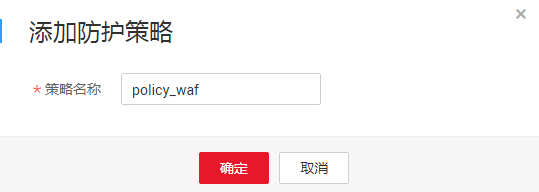

# 添加防护策略

防护策略是多种防护规则的合集，用于配置和管理Web基础防护、黑白名单、精准访问防护等防护规则，一条防护策略可以适用于多个防护域名。该任务指导您通过Web应用防火墙添加防护策略。

## 前提条件

已获取管理控制台的帐号和密码。

## 操作步骤

1.  登录管理控制台（https://console.huaweicloud.com/）。
2.  单击管理控制台左上角的，选择区域或项目。
3.  单击页面上方的“服务列表“，选择“安全  \>  Web应用防火墙“，在左侧导航树中选择“防护策略“，进入“防护策略“页面。

1.  在列表的左上角，单击“添加防护策略“，如[图1](#fig1769985133814)所示。

    **图 1**  添加防护策略  
    

2.  在弹出的对话框中，输入策略名称，单击“确定“，在页面右上角弹出“添加成功“，则说明防护策略创建成功，如[图2](#fig0843200133618)所示。

    **图 2**  策略名称  
    

3.  在目标策略所在行，单击策略名称，进入防护规则配置页面，参见[配置防护规则](zh-cn_topic_0110861289.md)为策略添加防护规则。

    **图 3**  防护策略  
    

    > **说明：**   
    >若想修改策略名称，单击目标策略名称后的，在弹出的对话框中，重新输入新的策略名称即可。  

