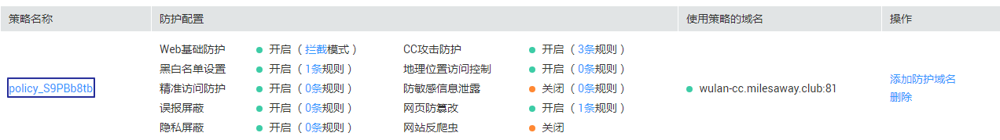

# 添加防护策略

防护策略是多种防护规则的合集，用于配置和管理Web基础防护、黑白名单、精准访问防护等防护规则，一条防护策略可以适用于多个防护域名，但一个防护域名只能绑定一个防护策略。该任务指导您通过Web应用防火墙添加防护策略。

> **说明：**   
>仅企业版和旗舰版才能使用该功能。  

## 前提条件

已获取管理控制台的账号和密码。

## 操作步骤

1.  [登录管理控制台](https://console.huaweicloud.com/?locale=zh-cn)。
2.  进入防护策略入口，如[图1](#fig4185340104311)所示。

    **图 1**  防护策略入口  
    

3.  在列表的左上角，单击“添加防护策略“。
4.  在弹出的对话框中，输入策略名称，单击“确定“，在页面右上角弹出“添加成功“，则说明防护策略创建成功。
5.  在目标策略所在行，单击策略名称，进入防护规则配置页面，参见[配置防护规则](zh-cn_topic_0110861289.md)为策略添加防护规则。

    **图 2**  防护策略  
    

    > **说明：**   
    >-   若想修改策略名称，单击目标策略名称后的，在弹出的对话框中，重新输入新的策略名称即可。  
    >-   若想删除添加的防护策略，在目标策略所在行的“操作“列，单击“删除“。  

