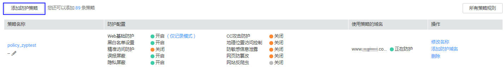
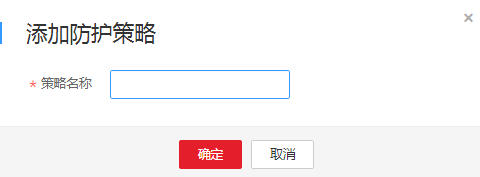

# 添加防护策略

该任务指导用户通过Web应用防火墙添加防护策略。

## 前提条件

-   已获取管理控制台的帐号和密码。
-   已添加防护域名。

## 操作步骤

1.  登录管理控制台（https://console.huaweicloud.com/）。
2.  单击页面上方的“服务列表“，选择“安全  \>  Web应用防火墙“，在左侧导航树中选择“防护策略“，进入“防护策略“页面。

1.  在列表的左上角，单击“添加防护策略“，如[图1](#fig1769985133814)所示。

    **图 1**  添加防护策略  
    

2.  在弹出的对话框中，输入策略名称，单击“确定“，在页面右上角弹出“添加成功“，则说明防护策略创建成功，如[图2](#fig0843200133618)所示。

    **图 2**  策略名称  
    

