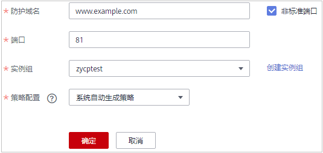

# 添加防护网站（ELB模式）

如果您的业务服务器部署在华为云上，您可以将网站的域名或IP添加到WAF，使网站流量切入WAF。

> **须知：** 
>当前仅“华北-北京二“区域支持ELB模式。

> **说明：** 
>如果您已开通企业项目，您可以在“企业项目“下拉列表中选择您所在的企业项目，在该企业项目下添加防护网站。

## 前提条件

已购买ELB模式实例。

## 操作步骤

1.  [登录管理控制台](https://console.huaweicloud.com/?locale=zh-cn)。
2.  进入网站设置页面入口，如[图1](#waf_01_0002_fig172535820151)所示。

    **图 1**  网站设置入口  
    

3.  在网站列表左上角，单击“添加防护网站“。
4.  选择“ELB模式“后，在页面配置域名基本信息，如[图2](#fig175731754141418)所示，相关参数说明如[表1](#table7692122554811)所示。

    **图 2**  配置防护网站基本信息  
    

    **表 1**  基本信息参数说明

    
    <table><thead align="left"><tr id="row1068752517484"><th class="cellrowborder" valign="top" width="15%" id="mcps1.2.4.1.1">
参数

    </th>
    <th class="cellrowborder" valign="top" width="64.21%" id="mcps1.2.4.1.2">
参数说明

    </th>
    <th class="cellrowborder" valign="top" width="20.79%" id="mcps1.2.4.1.3">
取值样例

    </th>
    </tr>
    </thead>
    <tbody><tr id="row1368718254486"><td class="cellrowborder" valign="top" width="15%" headers="mcps1.2.4.1.1 ">
防护域名

    </td>
    <td class="cellrowborder" valign="top" width="64.21%" headers="mcps1.2.4.1.2 ">
防护的域名或IP，域名支持单域名和泛域名。

    <ul id="ul9206119142513"><li>单域名：输入防护的单域名。例如：www.example.com。</li><li>泛域名
 说明： 

泛域名不支持下划线（_）。

    

    <ul id="waf_01_0250_ul776103520251"><li>如果各子域名对应的服务器IP地址相同：输入防护的泛域名。例如：子域名a.example.com，b.example.com和c.example.com对应的服务器IP地址相同，可以直接添加泛域名*.example.com。</li><li>如果各子域名对应的服务器IP地址不相同：请将子域名按“单域名”方式逐条添加。</li></ul>
    </li></ul>
    </td>
    <td class="cellrowborder" valign="top" width="20.79%" headers="mcps1.2.4.1.3 ">
单域名：www.example.com

    
泛域名：*.example.com

    
IP：

    
XXX.XXX.1.1

    </td>
    </tr>
    <tr id="row116884252488"><td class="cellrowborder" valign="top" width="15%" headers="mcps1.2.4.1.1 ">
端口

    </td>
    <td class="cellrowborder" valign="top" width="64.21%" headers="mcps1.2.4.1.2 ">
可选参数。必须与 ELB 上配置的监听器端口保持一致。

    
当您需要配置除“80”/“443”标准端口以外的端口时，勾选“非标准端口”进行配置。取值范围为1~65535。

    
 说明： 

如果配置了非标准端口，访问网站时，需要在网址后面增加非标准端口进行访问，否则访问网站时会出现<a href="https://support.huaweicloud.com/waf_faq/waf_01_0066.html#section0" target="_blank" rel="noopener noreferrer">404错误</a>。

    

    </td>
    <td class="cellrowborder" valign="top" width="20.79%" headers="mcps1.2.4.1.3 ">
81

    </td>
    </tr>
    <tr id="row1192175711538"><td class="cellrowborder" valign="top" width="15%" headers="mcps1.2.4.1.1 ">
实例组

    </td>
    <td class="cellrowborder" valign="top" width="64.21%" headers="mcps1.2.4.1.2 ">
选择防护网站绑定的实例组。您可以单击创建实例组，新建新的实例组，有关创建实例组的详细操作，请参见<a href="创建实例组.md">创建实例组</a>。

    </td>
    <td class="cellrowborder" valign="top" width="20.79%" headers="mcps1.2.4.1.3 ">
waf

    </td>
    </tr>
    </tbody>
    </table>

5.  单击“确定“，防护网站添加成功。

    您可在防护网站列表中查看已添加防护网站。

## 生效条件

防护网站的初始“接入状态“为“未接入“，当访问请求到达该网站的WAF时，该防护网站的接入状态将自动切换为“已接入“。

