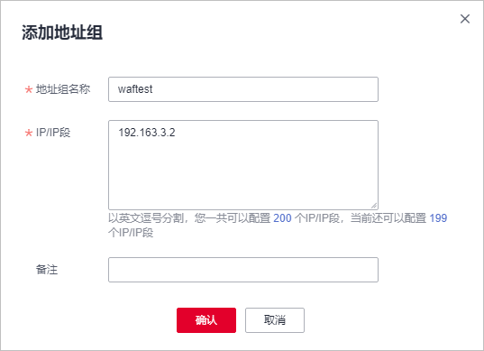

# 添加黑白名单IP地址组

IP地址组集中管理IP地址或网段，被黑白名单规则引用时可以批量设置IP/IP地址段。

> **说明：** 
>如果您已开通企业项目，您可以在“企业项目“下拉列表中选择您所在的企业项目，为该企业项目添加IP/IP段地址组。

## 前提条件

已成功购买WAF。

## 约束条件

-   添加IP地址组时，请确保IP/IP地址段未添加到其他IP地址组，重复添加同一IP/IP地址段会导致添加IP地址组失败。
-   云模式的专业版和铂金版支持IPv6地址/IPv6地址段。
-   如果独享模式所在的ELB支持IPv6，独享模式也支持IPv6地址/IPv6地址段。

## 规格限制

-   每个用户可以拥有50个地址组。1个地址组可以添加多个IP地址/IP地址段，具体请以控制台显示数据为准。多个IP地址/IP地址段英文逗号分隔，不能换行。
-   添加地址组前，请确保当前版本有剩余的IP黑白名单规则配额。

    > **说明：** 
    >-   您可以参见[配置IP黑白名单规则拦截/放行指定IP](配置IP黑白名单规则拦截-放行指定IP.md)，查看当前IP黑白名单规则配额。
    >    有关各版本规格的详细介绍，请参见[服务版本差异](https://support.huaweicloud.com/productdesc-waf/waf_01_0106.html)。
    >-   如果您购买了云模式，当前版本的IP黑白名单防护规则条数不能满足要求时，您可以通过购买规则扩展包或升级云模式版本增加IP黑白名单防护规则条数，以满足的防护配置需求。一个规则扩展包包含10条IP黑白名单防护规则。
    >    有关升级规则的详细操作，请参见[升级WAF云模式版本和规格](https://support.huaweicloud.com/usermanual-waf/waf_01_0114.html)。

## 操作步骤

1.  [登录管理控制台](https://console.huaweicloud.com/?locale=zh-cn)。
2.  单击页面左上方的，选择“安全与合规  \>  Web应用防火墙 WAF“。
3.  在左侧导航树中，选择“对象管理  \>  地址组管理“，进入“地址组管理“页面。
4.  选择“我的地址组“页签，进入地址组页面。
5.  在我的地址组列表左上方，单击“添加地址组“。
6.  在弹出的“添加地址组“对话框中，输入“地址组名称“和“IP/IP段“。

    **图 1**  添加地址组  
    

7.  单击“确认“， 地址组创建成功。

