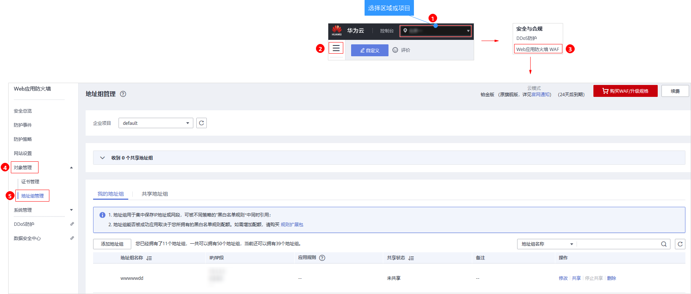
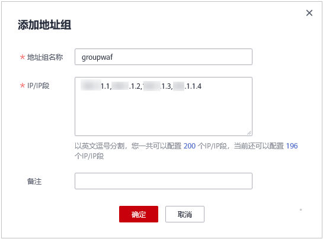

# 添加黑白名单IP地址组

IP地址组集中管理IP地址或网段，被黑白名单规则引用时可以批量设置IP/IP地址段。

> **说明：** 
>如果您已开通企业项目，您可以在“企业项目“下拉列表中选择您所在的企业项目，为该企业项目添加IP/IP段地址组。

## 前提条件

已成功购买WAF。

## 约束条件

添加IP地址组时，请确保IP地址组中的IP/IP地址段未添加到其他IP地址组，重复添加同一IP/IP地址段会导致添加IP地址组失败。

## 规格限制

WAF支持添加50个地址组。1个地址组可以添加200个IP地址/IP地址段。

## 操作步骤

1.  [登录管理控制台](https://console.huaweicloud.com/?locale=zh-cn)。
2.  进入地址组管理页面，如[图1](#fig96651149116)所示。

    **图 1**  进入地址组管理页面  
    

3.  在地址组列表左上方，单击“添加地址组“，弹出“添加地址组“对话框。
4.  在“添加地址组“对话框中，输入“地址组名称“和“IP/IP段“，如[图2](#fig1473112334013)所示。

    **图 2** “添加地址组“对话框  
    

5.  单击“确定“， 地址组创建成功。

