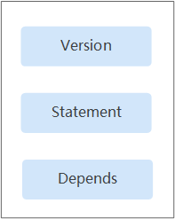

# 策略语法：RBAC<a name="waf_01_0099"></a>

## 策略结构<a name="zh-cn_topic_0169425416_section96721439267"></a>

策略结构包括：策略版本号（Version）、策略授权语句（Statement）和策略依赖（Depends）。

**图 1**  策略结构<a name="zh-cn_topic_0169425416_fig288933182617"></a>  


## 策略语法<a name="zh-cn_topic_0169425416_section76852310268"></a>

如下以SDRS服务的“SDRS Administraor“为例，说明RBAC策略语法。

**图 2**  策略内容<a name="zh-cn_topic_0169425416_fig16534154617489"></a>  


```
{ 
        "Version": "1.0", 
        "Statement": [ 
                { 
                        "Action": [ 
                                "SDRS:*:*" 
                        ], 
                        "Effect": "Allow" 
                } 
        ], 
        "Depends": [ 
                { 
                        "catalog": "BASE", 
                        "display_name": "Tenant Guest" 
                }, 
                { 
                        "catalog": "BASE", 
                        "display_name": "Server Administrator" 
                } 
        ] 
}
```

**表 1**  参数说明

<a name="zh-cn_topic_0169425416_table1968910332618"></a>
<table><thead align="left"><tr id="zh-cn_topic_0169425416_row128903372615"><th class="cellrowborder" colspan="2" valign="top" id="mcps1.2.5.1.1"><p id="zh-cn_topic_0169425416_p2089010392616"><a name="zh-cn_topic_0169425416_p2089010392616"></a><a name="zh-cn_topic_0169425416_p2089010392616"></a>参数</p>
</th>
<th class="cellrowborder" valign="top" id="mcps1.2.5.1.2"><p id="zh-cn_topic_0169425416_p1889019332617"><a name="zh-cn_topic_0169425416_p1889019332617"></a><a name="zh-cn_topic_0169425416_p1889019332617"></a>含义</p>
</th>
<th class="cellrowborder" valign="top" id="mcps1.2.5.1.3"><p id="zh-cn_topic_0169425416_p188911392611"><a name="zh-cn_topic_0169425416_p188911392611"></a><a name="zh-cn_topic_0169425416_p188911392611"></a>值</p>
</th>
</tr>
</thead>
<tbody><tr id="zh-cn_topic_0169425416_row17891153122617"><td class="cellrowborder" colspan="2" valign="top" headers="mcps1.2.5.1.1 "><p id="zh-cn_topic_0169425416_p28912312617"><a name="zh-cn_topic_0169425416_p28912312617"></a><a name="zh-cn_topic_0169425416_p28912312617"></a>Version</p>
</td>
<td class="cellrowborder" valign="top" headers="mcps1.2.5.1.2 "><p id="zh-cn_topic_0169425416_p1289110310267"><a name="zh-cn_topic_0169425416_p1289110310267"></a><a name="zh-cn_topic_0169425416_p1289110310267"></a>策略的版本</p>
</td>
<td class="cellrowborder" valign="top" headers="mcps1.2.5.1.3 "><p id="zh-cn_topic_0169425416_p5891731262"><a name="zh-cn_topic_0169425416_p5891731262"></a><a name="zh-cn_topic_0169425416_p5891731262"></a>固定为<span class="parmvalue" id="zh-cn_topic_0169425416_parmvalue142284714307"><a name="zh-cn_topic_0169425416_parmvalue142284714307"></a><a name="zh-cn_topic_0169425416_parmvalue142284714307"></a>“1.0”</span>。</p>
</td>
</tr>
<tr id="zh-cn_topic_0169425416_row14891143152611"><td class="cellrowborder" rowspan="2" valign="top" width="8.04080408040804%" headers="mcps1.2.5.1.1 "><p id="zh-cn_topic_0169425416_p20891232263"><a name="zh-cn_topic_0169425416_p20891232263"></a><a name="zh-cn_topic_0169425416_p20891232263"></a>Statement</p>
</td>
<td class="cellrowborder" valign="top" width="10.561056105610561%" headers="mcps1.2.5.1.1 "><p id="zh-cn_topic_0169425416_p14891103112610"><a name="zh-cn_topic_0169425416_p14891103112610"></a><a name="zh-cn_topic_0169425416_p14891103112610"></a>Action</p>
</td>
<td class="cellrowborder" valign="top" width="24.052405240524052%" headers="mcps1.2.5.1.2 "><p id="zh-cn_topic_0169425416_p11891033267"><a name="zh-cn_topic_0169425416_p11891033267"></a><a name="zh-cn_topic_0169425416_p11891033267"></a>定义对SDRS的具体操作。</p>
</td>
<td class="cellrowborder" valign="top" width="57.34573457345735%" headers="mcps1.2.5.1.3 "><p id="zh-cn_topic_0169425416_p1891331269"><a name="zh-cn_topic_0169425416_p1891331269"></a><a name="zh-cn_topic_0169425416_p1891331269"></a>格式为：服务名:资源类型:操作</p>
<p id="zh-cn_topic_0169425416_p289173112619"><a name="zh-cn_topic_0169425416_p289173112619"></a><a name="zh-cn_topic_0169425416_p289173112619"></a>"SDRS:*:*"，表示对SDRS的所有操作，其中SDRS为服务名称；“*”为通配符，表示对所有的资源类型可以执行所有操作。</p>
</td>
</tr>
<tr id="zh-cn_topic_0169425416_row98919352615"><td class="cellrowborder" valign="top" headers="mcps1.2.5.1.1 "><p id="zh-cn_topic_0169425416_p11891203172614"><a name="zh-cn_topic_0169425416_p11891203172614"></a><a name="zh-cn_topic_0169425416_p11891203172614"></a>Effect</p>
</td>
<td class="cellrowborder" valign="top" headers="mcps1.2.5.1.1 "><p id="zh-cn_topic_0169425416_p1689123172617"><a name="zh-cn_topic_0169425416_p1689123172617"></a><a name="zh-cn_topic_0169425416_p1689123172617"></a>定义Action中所包含的具体操作是否允许执行。</p>
</td>
<td class="cellrowborder" valign="top" headers="mcps1.2.5.1.2 "><a name="zh-cn_topic_0169425416_ul48911237264"></a><a name="zh-cn_topic_0169425416_ul48911237264"></a><ul id="zh-cn_topic_0169425416_ul48911237264"><li>Allow：允许执行。</li><li>Deny：不允许执行。</li></ul>
</td>
</tr>
<tr id="zh-cn_topic_0169425416_row18911338261"><td class="cellrowborder" rowspan="2" valign="top" width="8.04080408040804%" headers="mcps1.2.5.1.1 "><p id="zh-cn_topic_0169425416_p28913322614"><a name="zh-cn_topic_0169425416_p28913322614"></a><a name="zh-cn_topic_0169425416_p28913322614"></a>Depends</p>
</td>
<td class="cellrowborder" valign="top" width="10.561056105610561%" headers="mcps1.2.5.1.1 "><p id="zh-cn_topic_0169425416_p68918316262"><a name="zh-cn_topic_0169425416_p68918316262"></a><a name="zh-cn_topic_0169425416_p68918316262"></a>catalog</p>
</td>
<td class="cellrowborder" valign="top" width="24.052405240524052%" headers="mcps1.2.5.1.2 "><p id="zh-cn_topic_0169425416_p6891832261"><a name="zh-cn_topic_0169425416_p6891832261"></a><a name="zh-cn_topic_0169425416_p6891832261"></a>依赖的其他策略的所属目录。</p>
</td>
<td class="cellrowborder" valign="top" width="57.34573457345735%" headers="mcps1.2.5.1.3 "><p id="zh-cn_topic_0169425416_p68911537269"><a name="zh-cn_topic_0169425416_p68911537269"></a><a name="zh-cn_topic_0169425416_p68911537269"></a>服务名称。</p>
<p id="zh-cn_topic_0169425416_p88911033262"><a name="zh-cn_topic_0169425416_p88911033262"></a><a name="zh-cn_topic_0169425416_p88911033262"></a>例如：BASE</p>
</td>
</tr>
<tr id="zh-cn_topic_0169425416_row989163172617"><td class="cellrowborder" valign="top" headers="mcps1.2.5.1.1 "><p id="zh-cn_topic_0169425416_p128919317263"><a name="zh-cn_topic_0169425416_p128919317263"></a><a name="zh-cn_topic_0169425416_p128919317263"></a>display_name</p>
</td>
<td class="cellrowborder" valign="top" headers="mcps1.2.5.1.1 "><p id="zh-cn_topic_0169425416_p58911302615"><a name="zh-cn_topic_0169425416_p58911302615"></a><a name="zh-cn_topic_0169425416_p58911302615"></a>依赖的其他权限的名称。</p>
</td>
<td class="cellrowborder" valign="top" headers="mcps1.2.5.1.2 "><p id="zh-cn_topic_0169425416_p1789212318265"><a name="zh-cn_topic_0169425416_p1789212318265"></a><a name="zh-cn_topic_0169425416_p1789212318265"></a>权限名称。</p>
<p id="zh-cn_topic_0169425416_p48928382619"><a name="zh-cn_topic_0169425416_p48928382619"></a><a name="zh-cn_topic_0169425416_p48928382619"></a>例如：Tenant Administrator</p>
</td>
</tr>
</tbody>
</table>

