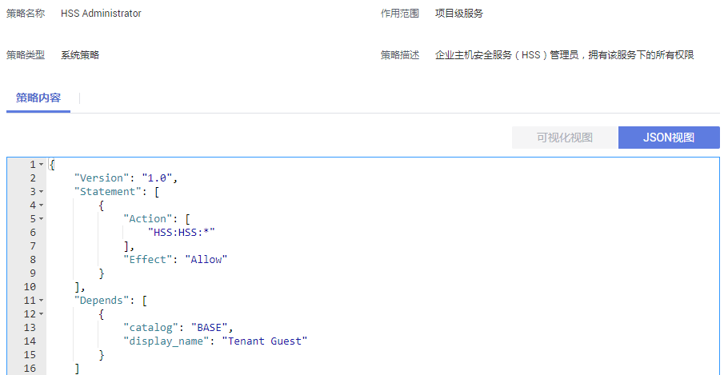

# 策略语法：RBAC<a name="waf_01_0099"></a>

## 策略结构<a name="zh-cn_topic_0169425416_section96721439267"></a>

策略结构包括：策略版本号（Version）、策略授权语句（Statement）和策略依赖（Depends）。

**图 1**  策略结构（RBAC）<a name="zh-cn_topic_0169425416_fig288933182617"></a>  


## 策略语法<a name="zh-cn_topic_0169425416_section76852310268"></a>

如下以HSS服务的“HSS Administrator“为例，说明RBAC策略语法。

**图 2**  策略内容<a name="zh-cn_topic_0169425416_fig2265593466"></a>  


```
{
    "Version": "1.0",
    "Statement": [
        {
            "Action": [
                "HSS:HSS:*"
            ],
            "Effect": "Allow"
        }
    ],
    "Depends": [
        {
            "catalog": "BASE",
            "display_name": "Tenant Guest"
        }
    ]
}
```

-   Version：标识策略的版本号，主要用于区分Role-Based Access Control（RBAC）策略和细粒度策略。
    -   1.0：RBAC策略。RBAC策略是将服务作为一个整体进行授权，授权后，用户可以拥有这个服务的所有权限。
    -   1.1：细粒度策略。相比RBAC策略，细粒度策略基于服务的API接口进行权限拆分，授权更加精细。授权后，用户可以对这个服务执行特定的操作。细粒度策略包括系统预置和用户自定义两种：

-   Statement：策略授权语句，描述策略的详细信息，包含Effect（作用）和Action（授权项）。
    -   Action（授权项）

        对资源的具体操作权限，格式为：服务名:资源类型:操作，支持单个或多个操作权限，支持通配符号\*，通配符号表示所有。

    -   Effect（作用）

        作用包含两种：Allow（允许）和Deny（拒绝），系统预置策略仅包含允许的授权语句，自定义策略中可以同时包含允许和拒绝的授权语句，当策略中既有允许又有拒绝的授权语句时，遵循Deny优先的原则。


-   Depends：策略的依赖关系，给用户组授予该策略时，需要同时勾选依赖的权限，否则该策略不会生效。
    -   catalog：依赖的策略的所属服务。
    -   display\_name：依赖的策略的名称，“HSS Administraor”依赖Base服务的“Tenant Guest”策略。


