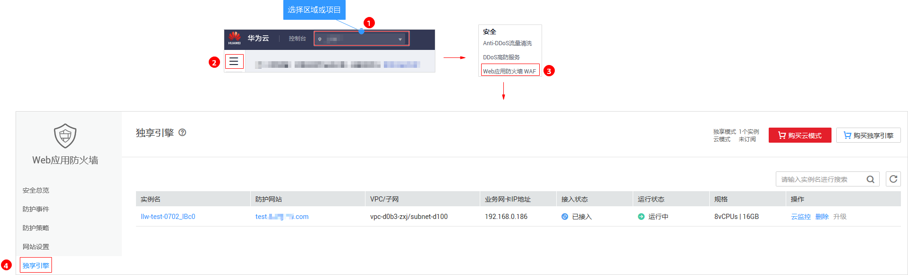

# 管理独享引擎

创建WAF独享引擎实例后，您可以查看实例信息、查看实例的监控信息、升级实例版本以及删除实例。

> **说明：** 
>如果您已开通企业项目，您可以在“企业项目“下拉列表中选择您所在的企业项目，管理该企业项目下的独享引擎。

## 前提条件

已购买独享引擎实例或ELB模式。

## 查看独享引擎实例信息

1.  [登录管理控制台](https://console.huaweicloud.com/?locale=zh-cn)。
2.  进入独享引擎页面，如[图1](#fig7658182717546)所示。

    **图 1**  进入独享引擎页面  
    

3.  查看独享引擎实例信息，如[表1](#table8106945160)所示。

    **表 1**  独享引擎实例信息说明

    
    <table><thead align="left"><tr id="row171072415165"><th class="cellrowborder" valign="top" width="21.26212621262126%" id="mcps1.2.4.1.1">
参数

    </th>
    <th class="cellrowborder" valign="top" width="45.4045404540454%" id="mcps1.2.4.1.2">
说明

    </th>
    <th class="cellrowborder" valign="top" width="33.33333333333333%" id="mcps1.2.4.1.3">
示例

    </th>
    </tr>
    </thead>
    <tbody><tr id="row131073461618"><td class="cellrowborder" valign="top" width="21.26212621262126%" headers="mcps1.2.4.1.1 ">
实例名

    </td>
    <td class="cellrowborder" valign="top" width="45.4045404540454%" headers="mcps1.2.4.1.2 ">
创建实例时自动生成的名称。

    </td>
    <td class="cellrowborder" valign="top" width="33.33333333333333%" headers="mcps1.2.4.1.3 ">
-

    </td>
    </tr>
    <tr id="row181074471612"><td class="cellrowborder" valign="top" width="21.26212621262126%" headers="mcps1.2.4.1.1 ">
防护网站

    </td>
    <td class="cellrowborder" valign="top" width="45.4045404540454%" headers="mcps1.2.4.1.2 ">
实例当前防护的网站。

    </td>
    <td class="cellrowborder" valign="top" width="33.33333333333333%" headers="mcps1.2.4.1.3 ">
www.example.com

    </td>
    </tr>
    <tr id="row41087451610"><td class="cellrowborder" valign="top" width="21.26212621262126%" headers="mcps1.2.4.1.1 ">
VPC/子网

    </td>
    <td class="cellrowborder" valign="top" width="45.4045404540454%" headers="mcps1.2.4.1.2 ">
实例所在的VPC和子网。

    </td>
    <td class="cellrowborder" valign="top" width="33.33333333333333%" headers="mcps1.2.4.1.3 ">
-

    </td>
    </tr>
    <tr id="row1588682416417"><td class="cellrowborder" valign="top" width="21.26212621262126%" headers="mcps1.2.4.1.1 ">
业务网卡IP地址

    </td>
    <td class="cellrowborder" valign="top" width="45.4045404540454%" headers="mcps1.2.4.1.2 ">
实例所在业务网卡IP地址。

    </td>
    <td class="cellrowborder" valign="top" width="33.33333333333333%" headers="mcps1.2.4.1.3 ">
192.168.0.186

    </td>
    </tr>
    <tr id="row16485935164119"><td class="cellrowborder" valign="top" width="21.26212621262126%" headers="mcps1.2.4.1.1 ">
接入状态

    </td>
    <td class="cellrowborder" valign="top" width="45.4045404540454%" headers="mcps1.2.4.1.2 ">
实例的接入状态。

    </td>
    <td class="cellrowborder" valign="top" width="33.33333333333333%" headers="mcps1.2.4.1.3 ">
已接入

    </td>
    </tr>
    <tr id="row74611846134120"><td class="cellrowborder" valign="top" width="21.26212621262126%" headers="mcps1.2.4.1.1 ">
运行状态

    </td>
    <td class="cellrowborder" valign="top" width="45.4045404540454%" headers="mcps1.2.4.1.2 ">
实例的运行状态。

    </td>
    <td class="cellrowborder" valign="top" width="33.33333333333333%" headers="mcps1.2.4.1.3 ">
运行中

    </td>
    </tr>
    <tr id="row10985193012429"><td class="cellrowborder" valign="top" width="21.26212621262126%" headers="mcps1.2.4.1.1 ">
规格

    </td>
    <td class="cellrowborder" valign="top" width="45.4045404540454%" headers="mcps1.2.4.1.2 ">
实例的资源规格。

    </td>
    <td class="cellrowborder" valign="top" width="33.33333333333333%" headers="mcps1.2.4.1.3 ">
8vCPUs | 16GB

    </td>
    </tr>
    </tbody>
    </table>

## 查看独享实例的云监控信息

当实例的“运行状态“为“运行中“时，您可以查看实例的云监控信息。

1.  [登录管理控制台](https://console.huaweicloud.com/?locale=zh-cn)。
2.  进入独享引擎页面，如[图2](#waf_01_0253_fig7658182717546)所示。

    **图 2**  进入独享引擎页面  
    

3.  在目标实例所在行的“操作“列，单击“云监控“，跳转到云监控，查看实例的CPU、内存、带宽等监控信息。

## 升级独享引擎实例版本

当实例的“运行状态“为“运行中“时，您可以通过升级操作，将WAF独享引擎实例升级到最新版本。

> **须知：** 
>-   升级大约需要5分钟。升级过程中，系统会自动将流量切换到其它正在运行的独享引擎上，对业务没有影响。
>-   当实例为最新版本时，“升级“按钮为灰化状态。

1.  [登录管理控制台](https://console.huaweicloud.com/?locale=zh-cn)。
2.  进入独享引擎页面，如[图3](#waf_01_0253_fig7658182717546_1)所示。

    **图 3**  进入独享引擎页面  
    

3.  在目标实例所在行的“操作“列，单击“升级“。
4.  在弹出的对话框中，确认业务满足后对话框所描述的条件后，单击“确定“，升级实例版本。

## 删除独享引擎实例

当您不需要使用独享引擎实例时，您可以删除实例，删除实例时将结束计费。

> **须知：** 
>删除实例后，该实例上的资源将被释放且不可恢复，请谨慎操作。

1.  [登录管理控制台](https://console.huaweicloud.com/?locale=zh-cn)。
2.  进入独享引擎页面，如[图4](#waf_01_0253_fig7658182717546_2)所示。

    **图 4**  进入独享引擎页面  
    

3.  在目标实例所在行的“操作“列，单击“删除“。
4.  在弹出的对话框中，单击“确定“。

