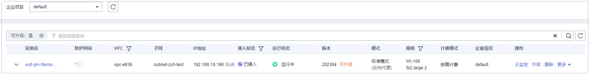

# 管理独享引擎

创建WAF独享引擎实例后，您可以查看实例信息、查看实例的监控信息、升级实例版本以及删除实例。

> **说明：** 
>如果您已开通企业项目，您需要在“企业项目“下拉列表中选择您所在的企业项目并确保已开通操作权限，才能管理该企业项目下的独享引擎。

## 前提条件

-   已购买独享引擎实例。
-   登录账号已授予“IAM ReadOnly“权限。

## 独享引擎版本迭代

<table><thead align="left"><tr id="row7120132292213"><th class="cellrowborder" valign="top" width="27.6%" id="mcps1.1.3.1.1">
引擎版本

</th>
<th class="cellrowborder" valign="top" width="72.39999999999999%" id="mcps1.1.3.1.2">
特性

</th>
</tr>
</thead>
<tbody><tr id="row12648132182810"><td class="cellrowborder" valign="top" width="27.6%" headers="mcps1.1.3.1.1 ">
2023年4月

</td>
<td class="cellrowborder" valign="top" width="72.39999999999999%" headers="mcps1.1.3.1.2 "><ul id="ul15673289302"><li>HTTP2全局开启，不需要手动开启。</li><li>默认支持流量可通过四次WAF，如果回源还是失败，会返回523错误码。</li><li>支持multipart严格格式校验。</li><li>支持独享型-网络型规格ELB实例（历史版本仅支持共享性ELB、独享性-应用型ELB实例）。</li></ul>
</td>
</tr>
<tr id="row18121122102211"><td class="cellrowborder" valign="top" width="27.6%" headers="mcps1.1.3.1.1 ">
2022年11月

</td>
<td class="cellrowborder" valign="top" width="72.39999999999999%" headers="mcps1.1.3.1.2 "><ul id="ul246644012514"><li>命中内置规则后攻击日志（hit_data）增加内置标签信息。</li><li>CC规则支持目的限速和响应码条件。</li></ul>
</td>
</tr>
<tr id="row723103102020"><td class="cellrowborder" valign="top" width="27.6%" headers="mcps1.1.3.1.1 ">
2022年9月

</td>
<td class="cellrowborder" valign="top" width="72.39999999999999%" headers="mcps1.1.3.1.2 "><ul id="ul1322168172119"><li>支持TLS v1.3。</li><li>支持IDC检测功能。</li><li>新增多种类型的攻击数据统计至心跳日志。</li><li>增加 300 个 HTTPS 端口：60700-60999。</li></ul>
</td>
</tr>
<tr id="row46221903202"><td class="cellrowborder" valign="top" width="27.6%" headers="mcps1.1.3.1.1 ">
2022年7月

</td>
<td class="cellrowborder" valign="top" width="72.39999999999999%" headers="mcps1.1.3.1.2 "><ul id="ul1818562712209"><li>支持泛域名标准匹配逻辑。</li><li>支持全局白名单功能。</li></ul>
</td>
</tr>
<tr id="row5121192232218"><td class="cellrowborder" valign="top" width="27.6%" headers="mcps1.1.3.1.1 ">
2022年5月

</td>
<td class="cellrowborder" valign="top" width="72.39999999999999%" headers="mcps1.1.3.1.2 ">
新增基于实例配置TLS最低版本的功能。

</td>
</tr>
<tr id="row212112220224"><td class="cellrowborder" valign="top" width="27.6%" headers="mcps1.1.3.1.1 ">
2022年3月

</td>
<td class="cellrowborder" valign="top" width="72.39999999999999%" headers="mcps1.1.3.1.2 "><ul id="ul1759619106820"><li>支持从管理面下发更新规则。</li><li>误报屏蔽支持全流量域名及全流量自定义域名。</li><li>误报屏蔽支持配置所有条件。</li></ul>
</td>
</tr>
<tr id="row412132212214"><td class="cellrowborder" valign="top" width="27.6%" headers="mcps1.1.3.1.1 ">
2022年2月

</td>
<td class="cellrowborder" valign="top" width="72.39999999999999%" headers="mcps1.1.3.1.2 ">
优化请求日志机制。

</td>
</tr>
<tr id="row1712142211223"><td class="cellrowborder" valign="top" width="27.6%" headers="mcps1.1.3.1.1 ">
2022年1月

</td>
<td class="cellrowborder" valign="top" width="72.39999999999999%" headers="mcps1.1.3.1.2 ">
优化部分正则匹配机制。

</td>
</tr>
<tr id="row1713113231790"><td class="cellrowborder" valign="top" width="27.6%" headers="mcps1.1.3.1.1 ">
2021年11月

</td>
<td class="cellrowborder" valign="top" width="72.39999999999999%" headers="mcps1.1.3.1.2 "><ul id="ul32786411792"><li>敏感信息泄露规则增加仅记录模式。</li><li>新增非法请求类的攻击日志。</li><li>精准防护IP条件支持全匹配XFF请求头内所有IP（仅限 IPv4）。</li><li>新增按域名设置超时时间功能。</li><li>优化部分功能。</li></ul>
</td>
</tr>
<tr id="row1213219231698"><td class="cellrowborder" valign="top" width="27.6%" headers="mcps1.1.3.1.1 ">
2021年10月

</td>
<td class="cellrowborder" valign="top" width="72.39999999999999%" headers="mcps1.1.3.1.2 ">
提升部分功能的性能。

</td>
</tr>
<tr id="row161325231695"><td class="cellrowborder" valign="top" width="27.6%" headers="mcps1.1.3.1.1 ">
2021年9月

</td>
<td class="cellrowborder" valign="top" width="72.39999999999999%" headers="mcps1.1.3.1.2 "><ul id="ul15943755121010"><li>支持对“request body”的精准防护。</li><li>精准防护支持正则匹配功能、全部子字段选择。</li><li>部分日志支持对接到 LTS 服务。</li></ul>
</td>
</tr>
<tr id="row153821819691"><td class="cellrowborder" valign="top" width="27.6%" headers="mcps1.1.3.1.1 ">
2021年6月

</td>
<td class="cellrowborder" valign="top" width="72.39999999999999%" headers="mcps1.1.3.1.2 "><ul id="ul1188118189113"><li>HTTPS 端口支持 HTTP/2 协议。</li><li>在请求日志（access log）中增加“region ID”。</li><li>在攻击日志中增加“region ID”和引擎 IP。</li></ul>
</td>
</tr>
</tbody>
</table>

## 查看独享引擎实例信息

1.  [登录管理控制台](https://console.huaweicloud.com/?locale=zh-cn)。
2.  单击管理控制台左上角的，选择区域或项目。
3.  单击页面左上方的，选择“区域“，选择“安全与合规  \>  Web应用防火墙 WAF“，进入“安全总览“页面。
4.  在左侧导航树中，选择“系统管理  \>  独享引擎“，进入“独享引擎“页面。

    **图 1**  独享引擎列表  
    

5.  查看独享引擎实例信息，如[表1](#table8106945160)所示。

    **表 1**  独享引擎实例关键参数说明

    
    <table><thead align="left"><tr id="row171072415165"><th class="cellrowborder" valign="top" width="21.26212621262126%" id="mcps1.2.4.1.1">
参数

    </th>
    <th class="cellrowborder" valign="top" width="45.4045404540454%" id="mcps1.2.4.1.2">
说明

    </th>
    <th class="cellrowborder" valign="top" width="33.33333333333333%" id="mcps1.2.4.1.3">
示例

    </th>
    </tr>
    </thead>
    <tbody><tr id="row131073461618"><td class="cellrowborder" valign="top" width="21.26212621262126%" headers="mcps1.2.4.1.1 ">
实例名

    </td>
    <td class="cellrowborder" valign="top" width="45.4045404540454%" headers="mcps1.2.4.1.2 ">
创建实例时自动生成的名称。

    </td>
    <td class="cellrowborder" valign="top" width="33.33333333333333%" headers="mcps1.2.4.1.3 ">
-

    </td>
    </tr>
    <tr id="row181074471612"><td class="cellrowborder" valign="top" width="21.26212621262126%" headers="mcps1.2.4.1.1 ">
防护网站

    </td>
    <td class="cellrowborder" valign="top" width="45.4045404540454%" headers="mcps1.2.4.1.2 ">
实例当前防护的网站。

    </td>
    <td class="cellrowborder" valign="top" width="33.33333333333333%" headers="mcps1.2.4.1.3 ">
www.example.com

    </td>
    </tr>
    <tr id="row41087451610"><td class="cellrowborder" valign="top" width="21.26212621262126%" headers="mcps1.2.4.1.1 ">
VPC

    </td>
    <td class="cellrowborder" valign="top" width="45.4045404540454%" headers="mcps1.2.4.1.2 ">
实例所在的VPC。

    </td>
    <td class="cellrowborder" valign="top" width="33.33333333333333%" headers="mcps1.2.4.1.3 ">
vpc-waf

    </td>
    </tr>
    <tr id="row175361528102120"><td class="cellrowborder" valign="top" width="21.26212621262126%" headers="mcps1.2.4.1.1 ">
子网

    </td>
    <td class="cellrowborder" valign="top" width="45.4045404540454%" headers="mcps1.2.4.1.2 ">
实例所在的子网。

    </td>
    <td class="cellrowborder" valign="top" width="33.33333333333333%" headers="mcps1.2.4.1.3 ">
subnet-62bb

    </td>
    </tr>
    <tr id="row1588682416417"><td class="cellrowborder" valign="top" width="21.26212621262126%" headers="mcps1.2.4.1.1 ">
IP地址

    </td>
    <td class="cellrowborder" valign="top" width="45.4045404540454%" headers="mcps1.2.4.1.2 ">
实例所在业务VPC的子网IP地址。

    </td>
    <td class="cellrowborder" valign="top" width="33.33333333333333%" headers="mcps1.2.4.1.3 ">
192.168.0.186

    </td>
    </tr>
    <tr id="row16485935164119"><td class="cellrowborder" valign="top" width="21.26212621262126%" headers="mcps1.2.4.1.1 ">
接入状态

    </td>
    <td class="cellrowborder" valign="top" width="45.4045404540454%" headers="mcps1.2.4.1.2 ">
实例的接入状态。

    </td>
    <td class="cellrowborder" valign="top" width="33.33333333333333%" headers="mcps1.2.4.1.3 ">
已接入

    </td>
    </tr>
    <tr id="row74611846134120"><td class="cellrowborder" valign="top" width="21.26212621262126%" headers="mcps1.2.4.1.1 ">
运行状态

    </td>
    <td class="cellrowborder" valign="top" width="45.4045404540454%" headers="mcps1.2.4.1.2 ">
实例的运行状态。

    </td>
    <td class="cellrowborder" valign="top" width="33.33333333333333%" headers="mcps1.2.4.1.3 ">
运行中

    </td>
    </tr>
    <tr id="row1435819107250"><td class="cellrowborder" valign="top" width="21.26212621262126%" headers="mcps1.2.4.1.1 ">
版本

    </td>
    <td class="cellrowborder" valign="top" width="45.4045404540454%" headers="mcps1.2.4.1.2 ">
独享引擎版本。

    </td>
    <td class="cellrowborder" valign="top" width="33.33333333333333%" headers="mcps1.2.4.1.3 ">
202304

    </td>
    </tr>
    <tr id="row13191195752215"><td class="cellrowborder" valign="top" width="21.26212621262126%" headers="mcps1.2.4.1.1 ">
模式

    </td>
    <td class="cellrowborder" valign="top" width="45.4045404540454%" headers="mcps1.2.4.1.2 ">
实例的部署模式。

    </td>
    <td class="cellrowborder" valign="top" width="33.33333333333333%" headers="mcps1.2.4.1.3 ">
标准模式(反向代理)

    </td>
    </tr>
    <tr id="row10985193012429"><td class="cellrowborder" valign="top" width="21.26212621262126%" headers="mcps1.2.4.1.1 ">
规格

    </td>
    <td class="cellrowborder" valign="top" width="45.4045404540454%" headers="mcps1.2.4.1.2 ">
实例的资源规格。

    </td>
    <td class="cellrowborder" valign="top" width="33.33333333333333%" headers="mcps1.2.4.1.3 ">
8vCPUs | 16GB

    </td>
    </tr>
    </tbody>
    </table>

## 查看独享实例的云监控信息

当实例的“运行状态“为“运行中“时，您可以查看实例的云监控信息。

1.  [登录管理控制台](https://console.huaweicloud.com/?locale=zh-cn)。
2.  单击管理控制台左上角的，选择区域或项目。
3.  单击页面左上方的，选择“区域“，选择“安全与合规  \>  Web应用防火墙 WAF“，进入“安全总览“页面。
4.  在左侧导航树中，选择“系统管理  \>  独享引擎“，进入“独享引擎“页面。

    **图 2**  独享引擎列表  
    

5.  在目标实例所在行的“操作“列，单击“云监控“，跳转到云监控，查看实例的CPU、内存、带宽等监控信息。

## 升级独享引擎实例版本

当实例的“运行状态“为“运行中“时，您可以通过升级操作，将WAF独享引擎实例升级到最新版本。根据独享引擎实例个数不同选择不同升级方法：

-   [单独享引擎实例节点升级](https://support.huaweicloud.com/bestpractice-waf/waf_06_0027.html#section1)
-   [多独享引擎实例节点升级](https://support.huaweicloud.com/bestpractice-waf/waf_06_0027.html#section2)

> **说明：** 
>当独享引擎实例为最新版本时，“升级“按钮为灰化状态。

## 切换独享引擎实例安全组

当“实例类别“为“资源租户类“时，您可以切换独享引擎所属的安全组。切换安全组后，实例将受到该安全组访问规则的保护。

1.  [登录管理控制台](https://console.huaweicloud.com/?locale=zh-cn)。
2.  单击管理控制台左上角的，选择区域或项目。
3.  单击页面左上方的，选择“区域“，选择“安全与合规  \>  Web应用防火墙 WAF“，进入“安全总览“页面。
4.  在左侧导航树中，选择“系统管理  \>  独享引擎“，进入“独享引擎“页面。

    **图 3**  独享引擎列表  
    

5.  在目标实例所在行的“操作“列，单击“更多  \>  切换安全组“。
6.  在弹出的对话框中，选择目标安全组后，单击“确认“，切换独享引擎实例安全组。

## 删除独享引擎实例

当您不需要使用独享引擎实例时，您可以删除实例，删除实例时将结束计费。

> **须知：** 
>删除实例后，该实例上的资源将被释放且不可恢复，请谨慎操作。

1.  [登录管理控制台](https://console.huaweicloud.com/?locale=zh-cn)。
2.  单击管理控制台左上角的，选择区域或项目。
3.  单击页面左上方的，选择“区域“，选择“安全与合规  \>  Web应用防火墙 WAF“，进入“安全总览“页面。
4.  在左侧导航树中，选择“系统管理  \>  独享引擎“，进入“独享引擎“页面。

    **图 4**  独享引擎列表  
    

5.  在目标实例所在行的“操作“列，单击“更多  \>  删除“。
6.  在弹出的对话框中，单击“确认“。

