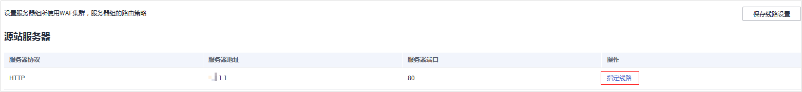
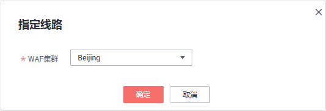

# 线路设置

当防护网站部署模式为云模式时，您可以配置防护域名流量经过的线路。

> **须知：** 
>企业版和旗舰版才能使用该功能。

## 前提条件

-   已获取管理控制台的账号和密码。
-   已添加防护域名。

## 操作步骤

1.  [登录管理控制台](https://console.huaweicloud.com/?locale=zh-cn)。
2.  进入网站设置页面入口，如[图1](#waf_01_0002_fig172535820151)所示。

    **图 1**  网站设置入口  
    

3.  在目标网站所在行的“防护网站“列中，单击目标网站，进入网站基本信息页面。
4.  在服务器信息列表的右上角，单击“线路设置“，进入“线路设置“页面，如[图2](#fig1594134613017)所示。

    **图 2**  线路设置  
    

5.  在目标源站服务器地址所在行的操作栏，单击“指定线路“。

    **图 3**  选择指定线路  
    

6.  在“WAF集群“下拉列表中，选择WAF提供的地址，单击“确定“。

    **图 4**  WAF集群  
    

7.  在“线路设置“页面，单击“保存线路设置“，在页面右上角弹出“保存成功“，则说明防护域名流量经过的线路设置成功。

    > **说明：** 
    >如果需要删除某项服务器地址配置的线路，可在“线路设置“页面，选择“WAF集群“下目标源站服务器所在行，单击“删除“。

