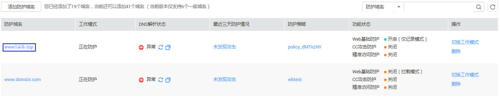
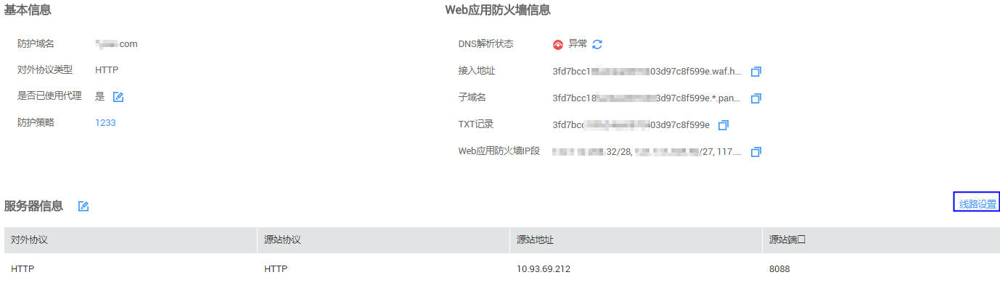
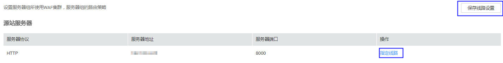
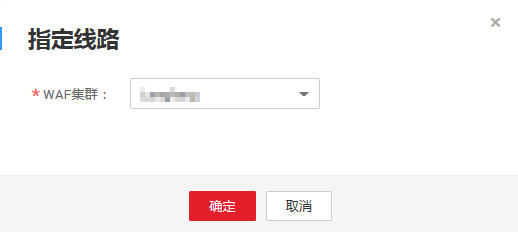

# 线路设置

该任务指导用户通过Web应用防火墙服务配置防护域名源站服务器部署位置。

## 前提条件

-   已获取管理控制台的帐号和密码。
-   已添加防护域名。

## 操作步骤

1.  登录管理控制台（https://console.huaweicloud.com/）。
2.  单击页面上方的“服务列表“，选择“安全  \>  Web应用防火墙“，在左侧导航树中选择“域名配置“，进入“域名配置“页面，如[图1](#waf_01_0001_zh-cn_topic_0110861354_fig15593418182219)所示。

    **图 1**  域名配置页面  
    

3.  在目标域名所在行的“防护域名“列中，单击目标域名，进入域名基本信息页面。

1.  单击“线路设置“，进入“线路设置“页面，如[图2](#fig1594134613017)所示。

    **图 2**  线路设置  
    

1.  在目标源站服务器地址所在行的操作栏，单击“指定线路“。

    **图 3**  选择指定线路  
    

1.  在“WAF集群“下拉列表中，选择WAF提供的地址，单击“确定“。

    **图 4**  WAF集群  
    

1.  在“线路设置“页面，单击“保存线路设置“，在页面右上角弹出“保存成功“，则说明源站服务器地址线路设置成功。

    > **说明：**   
    >如果需要删除某项服务器地址配置的线路，可在“线路设置“页面，选择“WAF集群“下目标源站服务器所在行，单击“删除“。  

