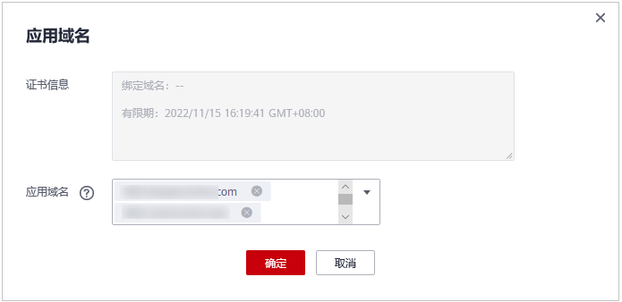

# 绑定证书到防护网站

当您的防护网站“对外协议“为“HTTPS“时，您可以将上传的证书绑定到防护网站。

> **说明：** 
>如果您已开通企业项目，您可以在“企业项目“下拉列表中选择您所在的企业项目，为该企业项目绑定证书到防护网站。

## 前提条件

-   证书未到期。
-   防护网站的“对外协议“使用了HTTPS协议。

## 约束条件

-   同一证书可以绑定多个防护网站。
-   同一防护网站只能绑定一个证书。

## 应用场景

当域名的“对外协议“设置为“HTTPS“时，需要配置证书。

## 操作步骤

1.  [登录管理控制台](https://console.huaweicloud.com/?locale=zh-cn)。
2.  进入证书管理页面，如[图1](#waf_01_0078_fig96651149116)所示。

    **图 1**  进入证书管理页面  
    

3.  在目标证书所在行的“操作“列中，单击“应用“。
4.  在弹出的“应用域名“对话框中，选择应用该证书的防护网站。

    **图 2** “应用域名“对话框  
    

5.  单击“确定“，将证书绑定到防护网站。

## 生效条件

证书的“应用域名“列显示已应用该证书的防护网站。

## 相关操作

-   当鼠标移到目标证书的名称后时，单击，您可以修改证书的名称。

    > **须知：** 
    >如果证书正在使用中，请先解除域名和证书的绑定关系，否则无法修改证书名称。

-   在目标证书所在行的“操作“列中，单击“查看“，您可以查看证书的证书文件和证书私钥信息。
-   在目标证书所在行的“操作“列中，单击“删除“，您可以删除该证书。

