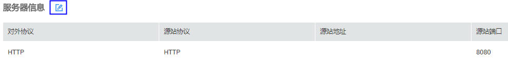
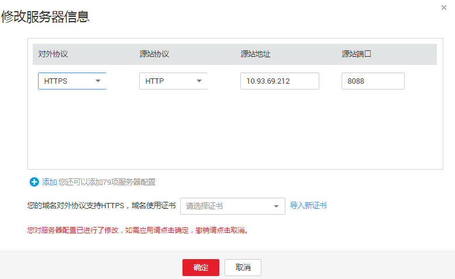

# 编辑防护域名

该任务指导用户通过Web应用防火墙服务编辑防护域名。

## 前提条件

-   已获取管理控制台的帐号和密码。
-   已添加防护域名。

## 操作步骤

1.  登录管理控制台（https://console.huaweicloud.com/）。
2.  单击页面上方的“服务列表“，选择“安全  \>  Web应用防火墙“，在左侧导航树中选择“域名配置“，进入“域名配置“页面，如[图1](#zh-cn_topic_0110861354_fig15593418182219)所示。

    **图 1**  域名配置页面  
    

3.  在目标域名所在行的“防护域名“列中，单击目标域名，进入域名基本信息页面。
4.  在“服务器信息“栏中，单击，如[图2](#fig165215137120)所示。

    **图 2**  服务器信息  
    

5.  在“修改服务器信息“页面，根据需要修改服务器的各项配置、已绑定的域名证书，如[图3](#fig3368635172714)所示。

    **图 3**  修改服务器信息  
    

