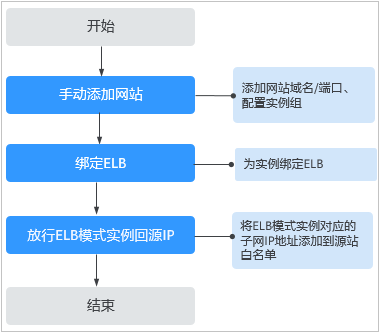

# 网站接入流程（ELB模式）

购买ELB模式后，您需要将防护域名接入WAF，使网站的访问流量全部流转到WAF进行监控防护。

## 约束限制

ELB模式可以防护华为云上通过域名或IP访问的Web应用/网站。有关ELB模式功能特性的详细介绍，请参见[云模式、独享模式和ELB模式说明](https://support.huaweicloud.com/productdesc-waf/waf_01_0106.html)。

## 网站接入流程说明

购买ELB模式后，您可以参照[图1](#fig8223418193518)所示的配置流程，快速使用WAF。

**图 1**  网站接入WAF的操作流程图-ELB模式  

## 接入失败处理

如果网站接入失败，即网站接入状态为“未接入“，请参考[域名/IP接入状态显示“未接入”，如何处理？](https://support.huaweicloud.com/waf_faq/waf_01_0278.html#section3)排查处理。

