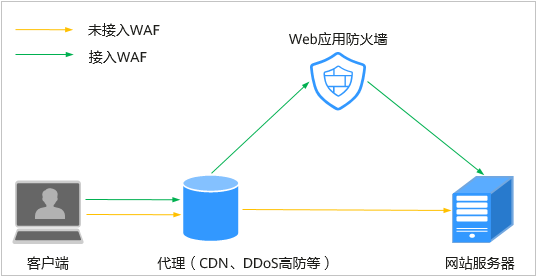
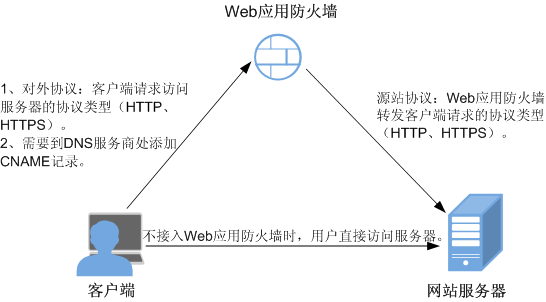

# 网站接入流程（云模式）

购买WAF云模式后，您需要将防护域名接入WAF，使网站的访问流量全部流转到WAF进行监控防护。

## 约束限制

-   WAF云模式可以防护通过域名访问的Web应用/网站，包括华为云、非华为云或线下的域名。有关WAF云模式功能特性的详细介绍，请参见[服务版本差异](https://support.huaweicloud.com/productdesc-waf/waf_01_0106.html)  。
-   将网站接入WAF后，网站的文件上传请求限制为512MB。

## 背景信息

网站在接入WAF前使用代理或未使用代理的接入配置说明如下：

-   使用代理

    网站在接入WAF前已使用高防、CDN（Content Delivery Network，内容分发网络）、云加速等代理，如[图1](#fig17855112483612)所示。

    -   当网站没有接入到WAF前，DNS解析到代理，流量先经过代理，代理再将流量直接转到源站。
    -   网站接入WAF后，需要将域名解析到WAF，这样流量才会被代理转发到WAF，WAF再将流量转到源站，实现网站流量检测和攻击拦截。
        1.  将代理回源地址修改为WAF的“CNAME“。
        2.  （可选）在DNS服务商处添加一条WAF的子域名和TXT记录。

    **图 1**  使用代理配置原理图  
    

-   未使用代理

    网站在接入WAF前未使用代理，如[图2](#fig322435810378)所示。

    -   当网站没有接入到WAF前，DNS直接解析到源站的IP，用户直接访问服务器。
    -   当网站接入WAF后，需要把DNS解析到WAF的CNAME，这样流量才会先经过WAF，WAF再将流量转到源站，实现网站流量检测和攻击拦截。

    **图 2**  未使用代理配置原理图  
    

## 网站接入流程说明

购买WAF云模式后，您可以参照[图3](#fig966313576393)所示的配置流程，快速使用WAF。

**图 3**  网站接入WAF的操作流程图-云模式  

**表 1**  域名接入WAF操作流程说明

<table><thead align="left"><tr id="row17524133512433"><th class="cellrowborder" valign="top" width="40.510000000000005%" id="mcps1.2.3.1.1">
操作步骤

</th>
<th class="cellrowborder" valign="top" width="59.489999999999995%" id="mcps1.2.3.1.2">
说明

</th>
</tr>
</thead>
<tbody><tr id="row165241835174314"><td class="cellrowborder" valign="top" width="40.510000000000005%" headers="mcps1.2.3.1.1 ">
<a href="步骤一-添加防护域名（云模式）.md">步骤一：添加防护域名（云模式）</a>

</td>
<td class="cellrowborder" valign="top" width="59.489999999999995%" headers="mcps1.2.3.1.2 ">
配置域名、协议、源站等相关信息。

</td>
</tr>
<tr id="row125615132538"><td class="cellrowborder" valign="top" width="40.510000000000005%" headers="mcps1.2.3.1.1 ">
<a href="步骤二-本地验证.md">步骤二：本地验证</a>

</td>
<td class="cellrowborder" valign="top" width="59.489999999999995%" headers="mcps1.2.3.1.2 ">
添加域名后，为了确保WAF转发正常，建议您先通过本地验证确保一切配置正常，然后再修改DNS解析。

</td>
</tr>
<tr id="row12537171895318"><td class="cellrowborder" valign="top" width="40.510000000000005%" headers="mcps1.2.3.1.1 ">
<a href="步骤三-域名接入配置.md">步骤三：域名接入配置</a>

</td>
<td class="cellrowborder" valign="top" width="59.489999999999995%" headers="mcps1.2.3.1.2 "><ul id="ul1763162614614"><li>域名在接入WAF前未使用代理
到该域名的DNS服务商处，配置防护域名的别名解析。

</li><li>域名在接入WAF前使用代理（DDoS高防、CDN等）
将使用的代理类服务（DDoS高防、CDN等）的回源地址修改为的目标域名的“CNAME”值。

</li></ul>
</td>
</tr>
<tr id="row16870033165413"><td class="cellrowborder" valign="top" width="40.510000000000005%" headers="mcps1.2.3.1.1 ">
<a href="步骤四-放行WAF回源IP.md">步骤四：放行WAF回源IP</a>

</td>
<td class="cellrowborder" valign="top" width="59.489999999999995%" headers="mcps1.2.3.1.2 ">
如果您的源站服务器安装了其他安全软件或防火墙，建议您配置只允许来自WAF的访问请求访问您的源站，这样既可保证访问不受影响，又能防止源站IP暴露后被黑客直接攻击。

</td>
</tr>
</tbody>
</table>

域名接入WAF后，WAF作为一个反向代理存在于客户端和服务器之间，服务器的真实IP被隐藏起来，Web访问者只能看到WAF的IP地址。

## 接入失败处理

如果域名接入失败，即域名接入状态为“未接入“，请参考[域名/IP接入状态显示“未接入”，如何处理？](https://support.huaweicloud.com/waf_faq/waf_01_0278.html#section1)排查处理。

