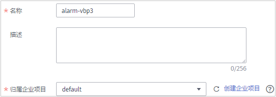
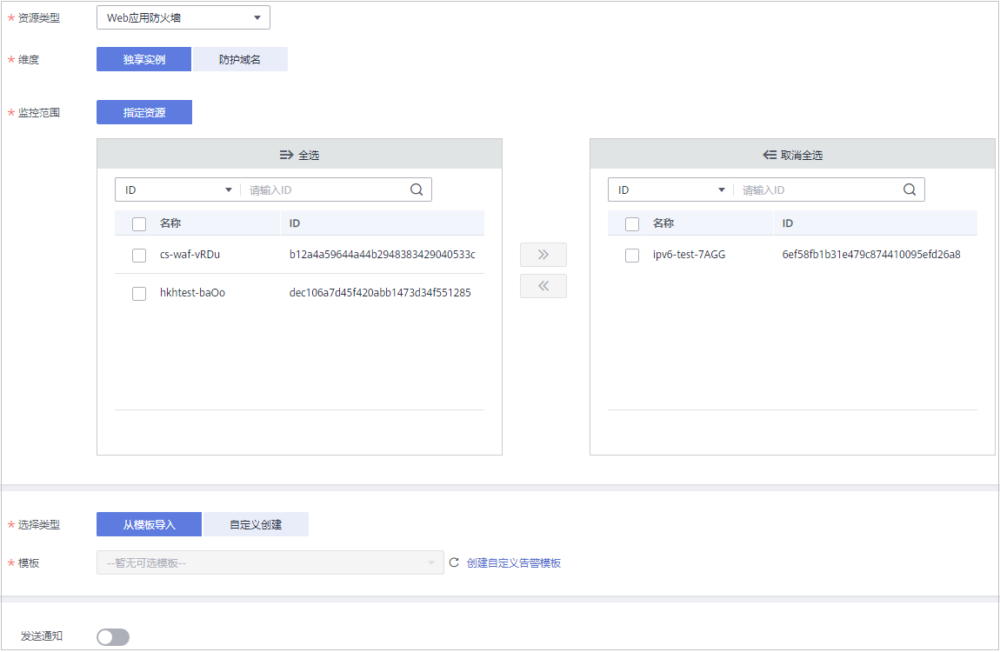

# 设置监控告警规则

通过设置WAF告警规则，用户可自定义监控目标与通知策略，设置告警规则名称、监控对象、监控指标、告警阈值、监控周期和是否发送通知等参数，帮助您及时了解WAF防护状况，从而起到预警作用。

## 前提条件

防护域名已接入WAF或已成功购买WAF独享引擎实例。

## 操作步骤

1.  [登录管理控制台](https://console.huaweicloud.com/?locale=zh-cn)。
2.  单击页面左上方的，选择“管理与监管  \>  云监控服务 CES“。
3.  在左侧导航树栏，选择“告警  \>  告警规则“，进入“告警规则“页面。
4.  在页面右上方，单击“创建告警规则“，进入“创建告警规则“界面。
5.  设置告警规则名称，选择告警规则“归属企业项目“。

    

6.  在“资源类型“下拉列表框中选择“Web应用防火墙“，选择“维度“、“监控范围“，设置告警模板、是否发送通知，如[图1](#fig1353111414520)所示。

    **图 1**  设置WAF监控告警规则  
    

7.  单击“立即创建“，在弹出的提示框中，单击“确定“， 告警规则创建成功。

