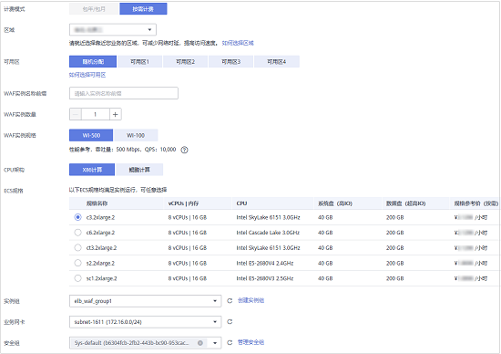

# 购买ELB模式

如果您的业务服务器部署在华为云上，您可以通过购买ELB模式实例确保重要业务可靠、安全运行。

ELB模式支持按需计费模式，按使用时长收费。

> **须知：** 
>购买ELB模式前，请确认已[提交工单](https://support.huaweicloud.com/usermanual-ticket/zh-cn_topic_0127038618.html)申请开通ELB模式。否则，您将无法购买ELB模式实例。
>原则上，在任何一个区域购买的WAF支持防护所有区域的Web业务。但是为了提高WAF的转发效率，建议您在购买WAF时，根据防护业务的所在区域就近选择购买的WAF区域。

## 前提条件

已获取管理控制台的登录帐号（拥有WAF Administrator与BSS Administrator权限）与密码。

## 规格限制

购买ELB模式实例后，规格不能修改。

## 约束条件

已购买华为云独享型ELB，且该ELB必须与ELB模式实例在同一个VPC内，否则，可能导致业务接入异常。

> **说明：** 
>当前“华北-北京四“支持购买ELB模式。
>原则上，在任何一个区域购买的WAF支持防护所有区域的Web业务。但是为了提高WAF的转发效率，建议您在购买WAF时，根据防护业务的所在区域就近选择购买的WAF区域。

## 应用场景

业务服务器部署在华为云上，防护对象为域名或IP。

大型企业网站，对业务稳定性有较高要求的安全防护需求。

## 操作步骤

1.  [登录管理控制台](https://console.huaweicloud.com/?locale=zh-cn)。
2.  单击管理控制台左上角的，选择区域或项目。
3.  单击页面左上方的，选择“安全与合规  \>  Web应用防火墙 WAF“。
4.  首次购买WAF时，在界面左侧，单击“立即购买WAF“。

    > **说明：** 
    >再次购买WAF时，请在界面右上角，单击“购买WAF/升级规格“。

5.  （可选）在“企业项目“下拉列表中选择您所在的企业项目。

    企业项目针对企业用户使用，只有开通了企业项目的客户，或者权限为企业主帐号的客户才可见。如需使用该功能，请[开通企业管理功能](https://support.huaweicloud.com/usermanual-em/em_am_0008.html)。企业项目是一种云资源管理方式，企业项目管理服务提供统一的云资源按项目管理，以及项目内的资源管理、成员管理。

    > **说明：** 
    >-   “default“为默认企业项目，帐号下原有资源和未选择企业项目的资源均在默认企业项目内。
    >-   只有注册的华为云帐号购买WAF时，“企业项目“下拉列表中才可以选择到“default“。

6.  在“购买Web应用防火墙“界面，选择“ELB模式“。
7.  配置ELB模式实例参数，如[图1](#zh-cn_topic_0110861189_fig5029231715163)所示，相关参数说明如[表1](#zh-cn_topic_0161005736_table4295843716304)所示。

    **图 1**  配置ELB模式实例  
    

    **表 1**  ELB模式实例参数说明

    
    <table><thead align="left"><tr id="zh-cn_topic_0161005736_row4338993216304"><th class="cellrowborder" valign="top" width="19.139999999999997%" id="mcps1.2.3.1.1">
参数名称

    </th>
    <th class="cellrowborder" valign="top" width="80.86%" id="mcps1.2.3.1.2">
说明

    </th>
    </tr>
    </thead>
    <tbody><tr id="row1135781814514"><td class="cellrowborder" valign="top" width="19.139999999999997%" headers="mcps1.2.3.1.1 ">
区域

    </td>
    <td class="cellrowborder" valign="top" width="80.86%" headers="mcps1.2.3.1.2 ">
原则上，在任何一个区域购买的WAF支持防护所有区域的Web业务。但是为了提高WAF的转发效率，建议您在购买WAF时，根据防护业务的所在区域就近选择购买的WAF区域。

    
 须知： 
<ul id="zh-cn_topic_0178852794_ul36575198292"><li>使用独享模式或ELB模式前，请确认已<a href="https://support.huaweicloud.com/usermanual-ticket/zh-cn_topic_0127038618.html" target="_blank" rel="noopener noreferrer">提交工单</a>申请开通独享模式或ELB模式。否则，您将无法购买独享模式或ELB模式。</li><li>当前“华北-北京四”区域支持ELB模式。</li></ul>
    

    </td>
    </tr>
    <tr id="row16462181515576"><td class="cellrowborder" valign="top" width="19.139999999999997%" headers="mcps1.2.3.1.1 ">
可用区

    </td>
    <td class="cellrowborder" valign="top" width="80.86%" headers="mcps1.2.3.1.2 ">
选择区域中的可用区。

    </td>
    </tr>
    <tr id="zh-cn_topic_0161005736_row3896937416304"><td class="cellrowborder" valign="top" width="19.139999999999997%" headers="mcps1.2.3.1.1 ">
WAF实例名称前缀

    </td>
    <td class="cellrowborder" valign="top" width="80.86%" headers="mcps1.2.3.1.2 ">
设置WAF实例名称前缀，购买多个实例时，实例前缀名称相同。

    </td>
    </tr>
    <tr id="zh-cn_topic_0161005736_row1319658616304"><td class="cellrowborder" valign="top" width="19.139999999999997%" headers="mcps1.2.3.1.1 ">
WAF实例数量

    </td>
    <td class="cellrowborder" valign="top" width="80.86%" headers="mcps1.2.3.1.2 ">
设置购买的WAF实例个数。

    </td>
    </tr>
    <tr id="zh-cn_topic_0161005736_row16837105815489"><td class="cellrowborder" valign="top" width="19.139999999999997%" headers="mcps1.2.3.1.1 ">
WAF实例规格

    </td>
    <td class="cellrowborder" valign="top" width="80.86%" headers="mcps1.2.3.1.2 ">
选择实例的规格。

    </td>
    </tr>
    <tr id="row68111281274"><td class="cellrowborder" valign="top" width="19.139999999999997%" headers="mcps1.2.3.1.1 ">
CPU架构

    </td>
    <td class="cellrowborder" valign="top" width="80.86%" headers="mcps1.2.3.1.2 ">
选择实例的CPU架构。

    </td>
    </tr>
    <tr id="row1319318472611"><td class="cellrowborder" valign="top" width="19.139999999999997%" headers="mcps1.2.3.1.1 ">
ECS规格

    </td>
    <td class="cellrowborder" valign="top" width="80.86%" headers="mcps1.2.3.1.2 ">
选择实例的ECS规格。

    </td>
    </tr>
    <tr id="row195202055162711"><td class="cellrowborder" valign="top" width="19.139999999999997%" headers="mcps1.2.3.1.1 ">
实例组

    </td>
    <td class="cellrowborder" valign="top" width="80.86%" headers="mcps1.2.3.1.2 ">
选择实例组，实例组可以管理多个ELB模式实例，您可以单击“创建实例组”，创建新的实例组。有关创建实例组的详细操作，请参见<a href="创建实例组.md">创建实例组</a>。

    </td>
    </tr>
    <tr id="zh-cn_topic_0161005736_row2550998316304"><td class="cellrowborder" valign="top" width="19.139999999999997%" headers="mcps1.2.3.1.1 ">
业务网卡

    </td>
    <td class="cellrowborder" valign="top" width="80.86%" headers="mcps1.2.3.1.2 ">
选择实例组中已配置的子网。

    </td>
    </tr>
    <tr id="row1513920102816"><td class="cellrowborder" valign="top" width="19.139999999999997%" headers="mcps1.2.3.1.1 ">
安全组

    </td>
    <td class="cellrowborder" valign="top" width="80.86%" headers="mcps1.2.3.1.2 ">
选择区域中已有的安全组，或者单击“管理安全组”，跳转到VPC管理控制台创建新的安全组。选择安全组后，该实例将受到该安全组访问规则的保护。

    
 须知： 

如果WAF独享引擎实例与源站不在同一个VPC中，需要在安全组中设置实例与源站的子网互通。

    

    </td>
    </tr>
    </tbody>
    </table>

8.  确认参数配置无误后，在页面右下角单击“立即购买“。
9.  确认订单详情无误并阅读《华为云Web应用防火墙免责声明》后，勾选“我已阅读并同意《华为云Web应用防火墙免责声明》“，单击“去支付“，完成购买操作。

1.  进入“付款“页面，选择付款方式进行付款。
2.  成功付款后，单击“返回独享引擎列表“，在独享引擎实例列表界面，可以查看实例的创建情况。

## 生效条件

创建实例大约需要5分钟。当实例的运行状态为“运行中“时，说明实例已经创建成功。

## WAF通信安全授权

如果业务使用ELB模式部署方式，直接访问VPC内的数据需要开通相应的安全组规则，而开通相应的安全组规则需要获取用户授权，此授权过程称为通信安全授权。

成功购买ELB模式后，WAF默认开启通信安全授权，即开通如[表2](#table10347925129)所示的安全组规则。

**表 2**  WAF通信安全授权安全组规则

<table><thead align="left"><tr id="waf_01_0248_row3347112513212"><th class="cellrowborder" valign="top" width="25%" id="mcps1.2.5.1.1">
协议端口

</th>
<th class="cellrowborder" valign="top" width="24.97%" id="mcps1.2.5.1.2">
类型

</th>
<th class="cellrowborder" valign="top" width="25.03%" id="mcps1.2.5.1.3">
源地址

</th>
<th class="cellrowborder" valign="top" width="25%" id="mcps1.2.5.1.4">
描述

</th>
</tr>
</thead>
<tbody><tr id="waf_01_0248_row33471925825"><td class="cellrowborder" colspan="4" valign="top" headers="mcps1.2.5.1.1 mcps1.2.5.1.2 mcps1.2.5.1.3 mcps1.2.5.1.4 ">
<strong id="waf_01_0248_b1637235551513">入方向规则</strong>

</td>
</tr>
<tr id="waf_01_0248_row5347725224"><td class="cellrowborder" valign="top" width="25%" headers="mcps1.2.5.1.1 ">
TCP: 22

</td>
<td class="cellrowborder" valign="top" width="24.97%" headers="mcps1.2.5.1.2 ">
IPv4

</td>
<td class="cellrowborder" valign="top" width="25.03%" headers="mcps1.2.5.1.3 ">
100.125.0.0/16

</td>
<td class="cellrowborder" valign="top" width="25%" headers="mcps1.2.5.1.4 ">
WAF远程运维

</td>
</tr>
<tr id="waf_01_0248_row634892513215"><td class="cellrowborder" colspan="4" valign="top" headers="mcps1.2.5.1.1 mcps1.2.5.1.2 mcps1.2.5.1.3 mcps1.2.5.1.4 ">
<strong id="waf_01_0248_b19970518131610">出方向规则</strong>

</td>
</tr>
<tr id="waf_01_0248_row00104851412"><td class="cellrowborder" valign="top" width="25%" headers="mcps1.2.5.1.1 ">
TCP: 9011

</td>
<td class="cellrowborder" valign="top" width="24.97%" headers="mcps1.2.5.1.2 ">
IPV4

</td>
<td class="cellrowborder" valign="top" width="25.03%" headers="mcps1.2.5.1.3 ">
100.125.0.0/16

</td>
<td class="cellrowborder" valign="top" width="25%" headers="mcps1.2.5.1.4 ">
WAF事件日志上报

</td>
</tr>
<tr id="waf_01_0248_row9998526142"><td class="cellrowborder" valign="top" width="25%" headers="mcps1.2.5.1.1 ">
TCP: 9012

</td>
<td class="cellrowborder" valign="top" width="24.97%" headers="mcps1.2.5.1.2 ">
IPV4

</td>
<td class="cellrowborder" valign="top" width="25.03%" headers="mcps1.2.5.1.3 ">
100.125.0.0/16

</td>
<td class="cellrowborder" valign="top" width="25%" headers="mcps1.2.5.1.4 ">
WAF事件日志上报

</td>
</tr>
<tr id="waf_01_0248_row184301249111619"><td class="cellrowborder" valign="top" width="25%" headers="mcps1.2.5.1.1 ">
TCP: 9013

</td>
<td class="cellrowborder" valign="top" width="24.97%" headers="mcps1.2.5.1.2 ">
IPV4

</td>
<td class="cellrowborder" valign="top" width="25.03%" headers="mcps1.2.5.1.3 ">
100.125.0.0/16

</td>
<td class="cellrowborder" valign="top" width="25%" headers="mcps1.2.5.1.4 ">
WAF事件日志上报

</td>
</tr>
<tr id="waf_01_0248_row1323093818185"><td class="cellrowborder" valign="top" width="25%" headers="mcps1.2.5.1.1 ">
TCP: 9018

</td>
<td class="cellrowborder" valign="top" width="24.97%" headers="mcps1.2.5.1.2 ">
IPV4

</td>
<td class="cellrowborder" valign="top" width="25.03%" headers="mcps1.2.5.1.3 ">
100.125.0.0/16

</td>
<td class="cellrowborder" valign="top" width="25%" headers="mcps1.2.5.1.4 ">
WAF策略同步

</td>
</tr>
<tr id="waf_01_0248_row1838622217206"><td class="cellrowborder" valign="top" width="25%" headers="mcps1.2.5.1.1 ">
TCP: 9019

</td>
<td class="cellrowborder" valign="top" width="24.97%" headers="mcps1.2.5.1.2 ">
IPV4

</td>
<td class="cellrowborder" valign="top" width="25.03%" headers="mcps1.2.5.1.3 ">
100.125.0.0/16

</td>
<td class="cellrowborder" valign="top" width="25%" headers="mcps1.2.5.1.4 ">
WAF心跳日志上报

</td>
</tr>
<tr id="waf_01_0248_row1099133214208"><td class="cellrowborder" valign="top" width="25%" headers="mcps1.2.5.1.1 ">
TCP: 4505

</td>
<td class="cellrowborder" valign="top" width="24.97%" headers="mcps1.2.5.1.2 ">
IPV4

</td>
<td class="cellrowborder" valign="top" width="25.03%" headers="mcps1.2.5.1.3 ">
100.125.0.0/16

</td>
<td class="cellrowborder" valign="top" width="25%" headers="mcps1.2.5.1.4 ">
WAF策略同步

</td>
</tr>
<tr id="waf_01_0248_row834864320202"><td class="cellrowborder" valign="top" width="25%" headers="mcps1.2.5.1.1 ">
TCP: 4506

</td>
<td class="cellrowborder" valign="top" width="24.97%" headers="mcps1.2.5.1.2 ">
IPV4

</td>
<td class="cellrowborder" valign="top" width="25.03%" headers="mcps1.2.5.1.3 ">
100.125.0.0/16

</td>
<td class="cellrowborder" valign="top" width="25%" headers="mcps1.2.5.1.4 ">
WAF策略同步

</td>
</tr>
<tr id="waf_01_0248_row208816565203"><td class="cellrowborder" valign="top" width="25%" headers="mcps1.2.5.1.1 ">
TCP: 50051

</td>
<td class="cellrowborder" valign="top" width="24.97%" headers="mcps1.2.5.1.2 ">
IPV4

</td>
<td class="cellrowborder" valign="top" width="25.03%" headers="mcps1.2.5.1.3 ">
100.125.0.0/16

</td>
<td class="cellrowborder" valign="top" width="25%" headers="mcps1.2.5.1.4 ">
WAF性能日志上报

</td>
</tr>
<tr id="waf_01_0248_row614481716213"><td class="cellrowborder" valign="top" width="25%" headers="mcps1.2.5.1.1 ">
TCP: 443

</td>
<td class="cellrowborder" valign="top" width="24.97%" headers="mcps1.2.5.1.2 ">
IPV4

</td>
<td class="cellrowborder" valign="top" width="25.03%" headers="mcps1.2.5.1.3 ">
100.125.0.0/16

</td>
<td class="cellrowborder" valign="top" width="25%" headers="mcps1.2.5.1.4 ">
WAF策略同步

</td>
</tr>
</tbody>
</table>

