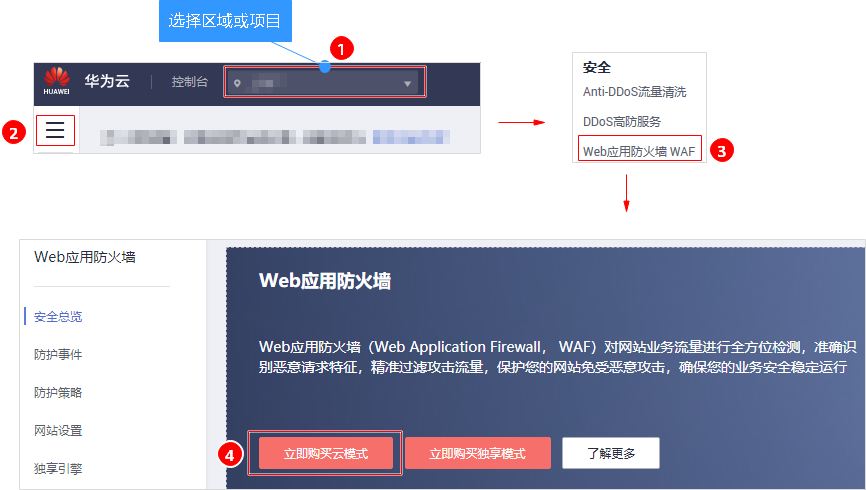
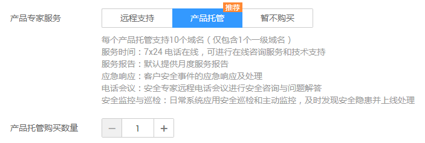
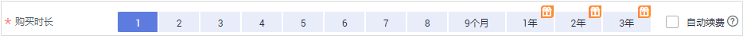
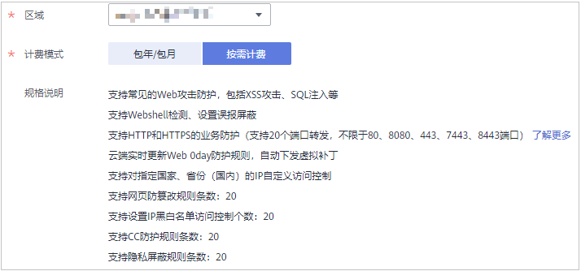

# 购买WAF云模式

Web应用防火墙云模式支持包年/包月（预付费）和按需计费（后付费）两种计费方式。同时，包周期（包年/包月）提供四个服务版本：检测版、专业版、企业版和旗舰版，两种扩展包：域名扩展包和带宽扩展包，以及产品专家服务。您可以根据业务需求购买WAF云模式。

## 操作须知

-   同一账号只能选择一种计费方式。
-   同一账号如果选择包年/包月计费方式，只能购买一个服务版本。
-   WAF支持包年/包月和按需计费模式互相切换。详细操作请参见[包年/包月和按需计费模式是否支持互相切换？](https://support.huaweicloud.com/waf_faq/waf_01_0276.html)。
-   只有通过实名认证的客户，才可以执行包周期转按需操作。
-   通过包年/包月方式购买WAF云模式，当WAF到期或退订WAF后，您可以选择包年/包月或按需计费方式开通WAF。
    -   如果选择按需计费方式开通WAF，当按需计费的WAF与原WAF为同一项目，原WAF的配置数据将保存。
    -   如果选择包年/包月方式开通WAF，当重购的WAF与原WAF为同一区域，原WAF的配置数据将保存。

-   通过按需计费方式购买WAF云模式，当关闭按需计费后，您可以选择包年/包月或按需计费方式开通WAF。

    > **须知：** 
    >关闭按需计费后，WAF将停止计费，WAF配置数据将保存，且域名的“工作模式“变更为“暂停防护“，流量正常转发，但WAF不检测攻击。

## 前提条件

已获取管理控制台的登录账号（拥有WAF Administrator与BSS Administrator权限）与密码。

## 包年/包月方式购买WAF

1.  [登录管理控制台](https://console.huaweicloud.com/?locale=zh-cn)。
2.  进入立即购买入口，如[图1](#zh-cn_topic_0110861189_fig1521873317493)所示。

    **图 1**  立即购买入口-云模式  
    

    > **说明：** 
    >[图1](#zh-cn_topic_0110861189_fig1521873317493)为首次购买WAF云模式入口。当您重新购买WAF云模式时，请参照以下步骤进入购买入口：
    >1.  单击页面左上方的，选择“安全  \>  Web应用防火墙 WAF“。
    >2.  在界面右上角，单击“购买云模式“。

3.  在“购买Web应用防火墙“界面，选择“包年/包月“计费模式和服务版本，如[图2](#zh-cn_topic_0110861189_fig5029231715163)所示。

    **图 2**  选择服务版本  
    

    > **说明：** 
    >支持购买WAF的区域：华东-上海一、华东-上海二、华北-北京一、华北-北京四、华南-广州、华南-深圳、亚太-香港、亚太-曼谷、亚太-新加坡、拉美-圣保罗一。
    >原则上，在任何一个区域购买的WAF支持防护所有区域的Web业务。但是为了提高WAF的转发效率，建议您在购买WAF时，根据防护业务的所在区域就近选择购买的WAF区域。
    >如果您需要切换区域，请在“区域“下拉框里选择区域。同一个区域只支持购买一个WAF版本。

4.  选择专业版、企业版和旗舰版时，可以选择“域名扩展包“和“带宽扩展包“的数量，如[图3](#zh-cn_topic_0110861189_fig1584718591691)所示。

    可参照[域名扩展包说明](zh-cn_topic_0178853266.md)和[带宽扩展包说明](zh-cn_topic_0178853267.md)详细了解域名扩展包和带宽扩展包。

    **图 3**  选择扩展包  
    

5.  选择“产品专家服务“以及购买数量，推荐选择“产品托管“。如[图4](#zh-cn_topic_0110861189_fig1526014115320)所示。

    **图 4**  选择产品专家服务  
    

    -   “远程支持“：提供WAF使用咨询、接入配置指导、安全事件辅助分析、简单安全规则配置等。详细介绍请参见[WAF远程支持服务](zh-cn_topic_0178853268.md)。
    -   “产品托管“：提供网站日常巡检和监控、可根据网站架构和业务进行深度策略定制、7\*24小时快速响应安全事件，默认支持10个域名（仅包含1个一级域名）。选择“产品托管“时，您需要设置“产品托管购买数量“。详细介绍请参见[WAF产品托管服务](zh-cn_topic_0178853269.md)。
    -   “暂不购买“：如果您暂时不想购买“产品专家服务“，选择“暂不购买“，后期可参照[升级云模式版本和规格](zh-cn_topic_0178873921.md)章节购买。

6.  选择“购买时长“。单击时间轴的点，选择购买时长 ，可以选择1个月～3年的时长。如[图5](#zh-cn_topic_0110861189_fig187417211963)所示。

    **图 5**  选择购买时长  
    

    > **说明：** 
    >勾选“自动续费“后，当服务期满时，系统会自动按照购买周期进行续费。

7.  确认参数配置无误后，在页面右下角单击“立即购买“。

    > **说明：** 
    >如果您对价格有疑问，可以单击页面左下角的“了解计费详情“了解产品价格。

8.  确认订单详情无误并阅读《华为云Web应用防火墙免责声明》后，勾选“我已阅读并同意《华为云Web应用防火墙免责声明》“，单击“去支付“，完成购买操作。

1.  进入“付款“页面，选择付款方式进行付款。

## 按需计费方式购买WAF

1.  [登录管理控制台](https://console.huaweicloud.com/?locale=zh-cn)。
2.  进入立即购买入口，如[图6](#waf_01_0109_zh-cn_topic_0110861189_fig1521873317493)所示。

    **图 6**  立即购买入口-云模式  
    

    > **说明：** 
    >[图6](#waf_01_0109_zh-cn_topic_0110861189_fig1521873317493)为首次购买WAF云模式入口。当您重新购买WAF云模式时，请参照以下步骤进入购买入口：
    >1.  单击页面左上方的，选择“安全  \>  Web应用防火墙 WAF“。
    >2.  在界面右上角，单击“购买云模式“。

3.  在“购买Web应用防火墙“界面，选择“按需计费“计费模式，如[图7](#fig1282912284435)所示。

    **图 7**  选择按需计费  
    

    > **说明：** 
    >支持购买WAF的区域：华东-上海一、华东-上海二、华北-北京一、华北-北京四、华南-广州、华南-深圳、亚太-香港、亚太-曼谷、亚太-新加坡、拉美-圣保罗一。
    >原则上，在任何一个区域购买的WAF支持防护所有区域的Web业务。但是为了提高WAF的转发效率，建议您在购买WAF时，根据防护业务的所在区域就近选择购买的WAF区域。
    >如果您需要切换区域，请在“区域“下拉框里选择区域。

1.  在页面右下角单击“立即开通“，开通WAF。
2.  单击“返回网站配置“，可以在“网站配置“页面添加防护域名。

    > **说明：** 
    >开通WAF后，在界面右上角，单击“关闭按需计费“，可以关闭按需计费。

