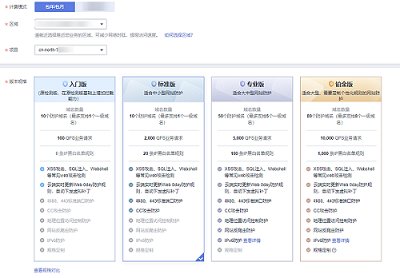
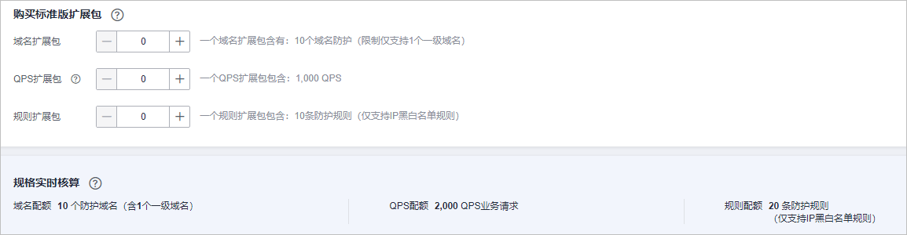

# 购买WAF云模式

Web应用防火墙云模式支持包年/包月（预付费）计费方式。同时，包周期（包年/包月）提供四个服务版本：检测版、标准版（原专业版）、专业版（原企业版）和铂金版（原旗舰版），三种扩展包：域名扩展包、带宽扩展包和规则扩展包。您可以根据业务需求购买WAF云模式。

## 前提条件

已获取管理控制台的登录帐号（拥有WAF Administrator与BSS Administrator权限）与密码。

## 约束条件

-   检测版不支持购买扩展包。
-   同一帐号在同一个大区域（例如华东区域）只能选择一个服务版本。

    > **说明：** 
    >有关支持购买WAF的区域说明，请参见[Web应用防火墙支持防护哪些区域？](https://support.huaweicloud.com/waf_faq/waf_01_0101.html)。
    >原则上，在任何一个区域购买的WAF支持防护所有区域的Web业务。但是为了提高WAF的转发效率，建议您在购买WAF时，根据防护业务的所在区域就近选择购买的WAF区域。

-   WAF不支持降低购买版本的规格。如果您需要降低购买的WAF规格，您可以先退订当前的WAF，再重新购买较低版本的WAF。
-   铂金版（原旗舰版）支持定制非标准端口，您可以[提交工单](https://support.huaweicloud.com/usermanual-ticket/zh-cn_topic_0127038618.html)申请开通定制的非标准端口。定制的非标准端口数将统计到非标准端口配额中（铂金版支持防护58个非标准端口），例如，如果您添加了6个铂金版支持的非标准端口，2个定制的非标准端口，则您还可以添加50个非标准端口。
-   扩展包与WAF版本绑定，不能单独续费或退订。

## 规格限制

-   一个域名包支持10个域名，限制仅支持1个一级域名和与一级域名相关的子域名或泛域名。
-   一个带宽扩展包包含20Mbit/s/50Mbit/s（华为云外/华为云内）或者1,000QPS（Query Per Second，即每秒钟的请求量，例如一个HTTP GET请求就是一个Query）。

    > **说明：** 
    >-   华为云外：源站服务器部署在非华为云或云下（线下）。
    >-   华为云内：源站服务器部署在华为云上。

-   一个规则扩展包包含10条IP黑白名单防护规则。

## 应用场景

业务服务器部署在华为云上、非华为云或线下，且防护对象为域名。

各服务版本推荐使用的场景说明如下：

-   检测版

    个人网站防护

-   标准版（原专业版）

    中小型网站，对业务没有特殊的安全需求

-   专业版（原企业版）

    中型企业级网站或服务对互联网公众开放，关注数据安全且具有高标准的安全需求

-   铂金版（原旗舰版）

    中大型企业网站，具备较大的业务规模，或是具有特殊定制的安全需求

## 操作步骤

1.  [登录管理控制台](https://console.huaweicloud.com/?locale=zh-cn)。
2.  单击管理控制台左上角的，选择区域或项目。
3.  单击页面左上方的，选择“安全与合规  \>  Web应用防火墙 WAF“。
4.  首次购买WAF时，在界面左侧，单击“立即购买WAF“。

    > **说明：** 
    >再次购买WAF时，请在界面右上角，单击“购买WAF/升级规格“。

5.  （可选）在“企业项目“下拉列表中选择您所在的企业项目。

    企业项目针对企业用户使用，只有开通了企业项目的客户，或者权限为企业主帐号的客户才可见。如需使用该功能，请[开通企业管理功能](https://support.huaweicloud.com/usermanual-em/em_am_0008.html)。企业项目是一种云资源管理方式，企业项目管理服务提供统一的云资源按项目管理，以及项目内的资源管理、成员管理。

    > **说明：** 
    >-   “default“为默认企业项目，帐号下原有资源和未选择企业项目的资源均在默认企业项目内。
    >-   只有注册的华为云帐号购买WAF时，“企业项目“下拉列表中才可以选择到“default“。

6.  在“购买Web应用防火墙“界面，选择“云模式“。
7.  在“购买Web应用防火墙“界面，选择“区域“和服务版本，如[图1](#zh-cn_topic_0110861189_fig5029231715163)所示。

    **图 1**  选择服务版本  
    

    > **说明：** 
    >原则上，在任何一个区域购买的WAF支持防护所有区域的Web业务。但是为了提高WAF的转发效率，建议您在购买WAF时，根据防护业务的所在区域就近选择购买的WAF区域。
    >如果您需要切换区域，请在“区域“下拉框里选择区域。同一个区域只支持购买一个WAF版本。

8.  选择标准版（原专业版）、专业版（原企业版）和铂金版（原旗舰版）时，可以设置“域名扩展包“、“带宽扩展包“或“规则扩展包“的数量，如[图2](#zh-cn_topic_0110861189_fig1584718591691)所示。

    可参照[WAF云模式域名扩展包说明](WAF云模式域名扩展包说明.md)、[WAF云模式带宽扩展包说明](WAF云模式带宽扩展包说明.md)和[WAF云模式规则扩展包说明](WAF云模式规则扩展包说明.md)详细了解域名扩展包和带宽扩展包。

    **图 2**  选择扩展包  
    

9.  选择“购买时长“。单击时间轴的点，选择购买时长 ，可以选择1个月～3年的时长。

    > **说明：** 
    >勾选“自动续费“后，当服务期满时，系统会自动按照购买周期进行续费。

10. 确认参数配置无误后，在页面右下角单击“立即购买“。
11. 确认订单详情无误并阅读《华为云Web应用防火墙免责声明》后，勾选“我已阅读并同意《华为云Web应用防火墙免责声明》“，单击“去支付“，完成购买操作。

1.  进入“付款“页面，选择付款方式进行付款。

## 生效条件

付款成功后，您可以在管理控制台右上方查看当前购买的WAF版本以及到期的天数。

## 相关操作

-   [升级云模式版本和规格](升级WAF云模式版本和规格.md)

    购买了云模式后，您可以从较低版本的WAF升级到任一更高版本，也可以根据需求增加扩展包的数量。

-   [如何退订Web应用防火墙？](https://support.huaweicloud.com/waf_faq/waf_01_0116.html)
-   [如何为Web应用防火墙续费？](https://support.huaweicloud.com/waf_faq/waf_01_0115.html)

