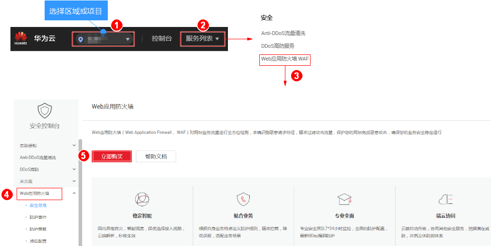
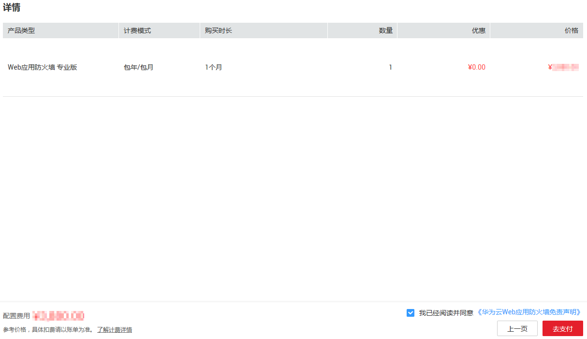

# 购买Web应用防火墙

该章节指导用户购买Web应用防火墙服务。

Web应用防火墙提供三个服务版本：专业版、企业版和旗舰版，两种扩展包：域名扩展包和带宽扩展包。

## 前提条件

已获取管理控制台的登录账号（拥有WAF Administrator与BSS Administrator权限）与密码。

## 操作步骤

1.  [登录管理控制台](https://console.huaweicloud.com/?locale=zh-cn)。
2.  进入立即购买入口，如[图1](#zh-cn_topic_0110861189_fig1521873317493)所示。

    **图 1**  立即购买入口  
    

3.  在“购买Web应用防火墙“界面，选择服务版本，如[图2](#zh-cn_topic_0110861189_fig5029231715163)所示。

    **图 2**  服务版本选择  
    

    > **说明：**   
    >如果您需要切换区域，请在“区域“下拉框里选择区域。同一个区域只支持购买一个WAF版本，如果该版本的业务带宽和域名个数不能支持您的业务量，可参照[4](#zh-cn_topic_0110861189_li107595815334)购买域名扩展包和带宽扩展包。  

4.  选择“域名扩展包“和“带宽扩展包“的数量。

    可参照[域名扩展包说明](域名扩展包说明.md)和[带宽扩展包说明](带宽扩展包说明.md)详细了解域名扩展包和带宽扩展包。

    **图 3**  选择扩展包  
    

5.  选择“产品专家服务“，推荐选择“产品托管“。如[图4](#zh-cn_topic_0110861189_fig1526014115320)所示。

    **图 4**  选择产品专家服务  
    

    -   “远程支持“：提供WAF使用咨询、接入配置指导、安全事件辅助分析、简单安全规则配置等。详细介绍请参见[WAF远程支持服务](WAF远程支持服务.md)。
    -   “产品托管“：提供网站日常巡检和监控、可根据网站架构和业务进行深度策略定制、7\*24小时快速响应安全事件，默认支持10个域名（仅包含1个一级域名）。选择“产品托管“时，您需要设置“产品托管购买数量“。详细介绍请参见[WAF产品托管服务](WAF产品托管服务.md)。
    -   “暂不购买“：如果您暂时不想购买“产品专家服务“，选择“暂不购买“，后期可参照[升级服务版本](升级服务版本.md)章节购买。

6.  选择“购买时长“。单击时间轴的点，选择购买时长 ，可以选择1个月～3年的时长。如[图5](#zh-cn_topic_0110861189_fig187417211963)所示。

    **图 5**  选择购买时长  
    

    > **说明：**   
    >-   勾选“自动续费“后，当服务期满时，系统会自动按照购买周期进行续费。  
    >-   “购买时长“选择“1年“，可享受8.3折的优惠；选择“2年“，可享受7折优惠；选择“3年“，可享受5折优惠。  
    >-   “产品专家服务“选择“产品托管“时，“产品托管“服务不享受折扣优惠。  

7.  确认参数配置无误后，在页面右下角单击“立即购买“。

    > **说明：**   
    >如果您对价格有疑问，可以单击页面左下角的“了解计费详情“了解产品价格。  

8.  确认订单详情无误并阅读《华为云Web应用防火墙免责声明》后，勾选“我已阅读并同意《华为云Web应用防火墙免责声明》“，单击“去支付“，完成购买操作。

    **图 6**  订单确认  
    

1.  进入“付款“页面，选择付款方式进行付款。

