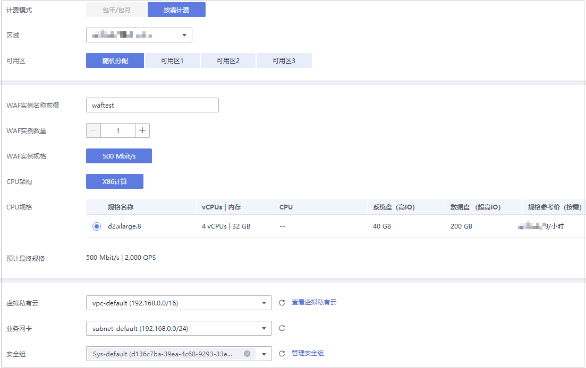

# 购买独享模式

如果您的业务服务器部署在华为云上，您可以通过购买WAF独享引擎实例对重要的域名或仅有IP的Web服务进行防护。购买独享引擎实例后，您还需要为实例配置弹性负载均衡，弹性负载均衡可以通过流量分发扩展应用系统对外的服务能力，同时通过消除单点故障提升应用系统的可用性。

独享模式支持按需计费模式，按使用时长收费。

## 前提条件

已获取管理控制台的登录帐号（拥有WAF Administrator与BSS Administrator权限）与密码。

## 规格限制

购买独享引擎实例后，实例规格不能修改。

## 约束条件

如果WAF独享引擎实例与源站不在同一个VPC中，需要在安全组中设置实例与源站的子网互通。

> **说明：** 
>支持购买WAF的区域说明如下：
>-   华东-上海二
>-   华北-北京一
>-   华北-北京二
>-   华北-北京四
>-   华南-广州
>原则上，在任何一个区域购买的WAF支持防护所有区域的Web业务。但是为了提高WAF的转发效率，建议您在购买WAF时，根据防护业务的所在区域就近选择购买的WAF区域。

## 应用场景

业务服务器部署在华为云上，防护对象为域名或IP。

大型企业网站，具备较大的业务规模且基于业务特性具有定制化的安全需求。

## 操作步骤

1.  [登录管理控制台](https://console.huaweicloud.com/?locale=zh-cn)。
2.  单击管理控制台左上角的，选择区域或项目。
3.  单击页面左上方的，选择“安全  \>  Web应用防火墙 WAF“。
4.  首次购买WAF时，在界面左侧，单击“立即购买WAF“。

    > **说明：** 
    >再次购买WAF时，请在界面右上角，单击“购买WAF“。

5.  （可选）在“企业项目“下拉列表中选择您所在的企业项目。

    企业项目针对企业用户使用，只有开通了企业项目的客户，或者权限为企业主帐号的客户才可见。如需使用该功能，请[开通企业管理功能](https://support.huaweicloud.com/usermanual-em/em_am_0008.html)。企业项目是一种云资源管理方式，企业项目管理服务提供统一的云资源按项目管理，以及项目内的资源管理、成员管理。

    > **说明：** 
    >-   “default“为默认企业项目，帐号下原有资源和未选择企业项目的资源均在默认企业项目内。
    >-   只有注册的华为云帐号购买WAF时，“企业项目“下拉列表中才可以选择到“default“。

6.  在“购买Web应用防火墙“界面，选择“独享模式“。
7.  配置WAF实例参数，如[图1](#zh-cn_topic_0110861189_fig5029231715163)所示，相关参数说明如[表1](#zh-cn_topic_0161005736_table4295843716304)所示。

    **图 1**  配置WAF独享引擎实例  
    

    **表 1**  WAF独享引擎实例参数说明

    
    <table><thead align="left"><tr id="zh-cn_topic_0161005736_row4338993216304"><th class="cellrowborder" valign="top" width="19.139999999999997%" id="mcps1.2.3.1.1">
参数名称

    </th>
    <th class="cellrowborder" valign="top" width="80.86%" id="mcps1.2.3.1.2">
说明

    </th>
    </tr>
    </thead>
    <tbody><tr id="row1135781814514"><td class="cellrowborder" valign="top" width="19.139999999999997%" headers="mcps1.2.3.1.1 ">
区域

    </td>
    <td class="cellrowborder" valign="top" width="80.86%" headers="mcps1.2.3.1.2 ">
支持购买WAF的区域说明如下：<ul id="ul1014432613519"><li>华东-上海二</li><li>华北-北京一</li><li>华北-北京二</li><li>华北-北京四</li><li>华南-广州</li></ul>
    

    
原则上，在任何一个区域购买的WAF支持防护所有区域的Web业务。但是为了提高WAF的转发效率，建议您在购买WAF时，根据防护业务的所在区域就近选择购买的WAF区域。

    </td>
    </tr>
    <tr id="row16462181515576"><td class="cellrowborder" valign="top" width="19.139999999999997%" headers="mcps1.2.3.1.1 ">
可用区

    </td>
    <td class="cellrowborder" valign="top" width="80.86%" headers="mcps1.2.3.1.2 ">
选择区域中的可用区。

    </td>
    </tr>
    <tr id="zh-cn_topic_0161005736_row3896937416304"><td class="cellrowborder" valign="top" width="19.139999999999997%" headers="mcps1.2.3.1.1 ">
WAF实例名称前缀

    </td>
    <td class="cellrowborder" valign="top" width="80.86%" headers="mcps1.2.3.1.2 ">
设置WAF实例名称前缀，购买多个实例时，实例前缀名称相同。

    </td>
    </tr>
    <tr id="zh-cn_topic_0161005736_row1319658616304"><td class="cellrowborder" valign="top" width="19.139999999999997%" headers="mcps1.2.3.1.1 ">
WAF实例数量

    </td>
    <td class="cellrowborder" valign="top" width="80.86%" headers="mcps1.2.3.1.2 ">
设置购买的WAF实例个数。

    </td>
    </tr>
    <tr id="zh-cn_topic_0161005736_row16837105815489"><td class="cellrowborder" valign="top" width="19.139999999999997%" headers="mcps1.2.3.1.1 ">
WAF实例规格

    </td>
    <td class="cellrowborder" valign="top" width="80.86%" headers="mcps1.2.3.1.2 ">
选择实例的规格。支持500Mbit/s和100Mbit/s。

    </td>
    </tr>
    <tr id="row68111281274"><td class="cellrowborder" valign="top" width="19.139999999999997%" headers="mcps1.2.3.1.1 ">
CPU架构

    </td>
    <td class="cellrowborder" valign="top" width="80.86%" headers="mcps1.2.3.1.2 ">
选择实例的CPU架构。

    </td>
    </tr>
    <tr id="row1319318472611"><td class="cellrowborder" valign="top" width="19.139999999999997%" headers="mcps1.2.3.1.1 ">
ECS规格

    </td>
    <td class="cellrowborder" valign="top" width="80.86%" headers="mcps1.2.3.1.2 ">
选择实例的ECS规格。

    </td>
    </tr>
    <tr id="row195202055162711"><td class="cellrowborder" valign="top" width="19.139999999999997%" headers="mcps1.2.3.1.1 ">
虚拟私有云

    </td>
    <td class="cellrowborder" valign="top" width="80.86%" headers="mcps1.2.3.1.2 ">
选择源站所在的VPC。

    </td>
    </tr>
    <tr id="zh-cn_topic_0161005736_row2550998316304"><td class="cellrowborder" valign="top" width="19.139999999999997%" headers="mcps1.2.3.1.1 ">
业务网卡

    </td>
    <td class="cellrowborder" valign="top" width="80.86%" headers="mcps1.2.3.1.2 ">
选择VPC中已配置的子网。

    </td>
    </tr>
    <tr id="row1513920102816"><td class="cellrowborder" valign="top" width="19.139999999999997%" headers="mcps1.2.3.1.1 ">
安全组

    </td>
    <td class="cellrowborder" valign="top" width="80.86%" headers="mcps1.2.3.1.2 ">
选择区域中已有的安全组，或者单击“管理安全组”，跳转到VPC管理控制台创建新的安全组。选择安全组后，该实例将受到该安全组访问规则的保护。

    
 须知： 

如果WAF独享引擎实例与源站不在同一个VPC中，需要在安全组中设置实例与源站的子网互通。

    

    </td>
    </tr>
    </tbody>
    </table>

8.  确认参数配置无误后，在页面右下角单击“立即购买“。
9.  确认订单详情无误并阅读《华为云Web应用防火墙免责声明》后，勾选“我已阅读并同意《华为云Web应用防火墙免责声明》“，单击“去支付“，完成购买操作。

1.  进入“付款“页面，选择付款方式进行付款。
2.  成功付款后，单击“返回独享引擎列表“，在独享引擎实例列表界面，可以查看实例的创建情况。

## 生效条件

创建实例大约需要5分钟。当实例的运行状态为“运行中“时，说明实例已经创建成功。

## 相关操作

[管理独享引擎](管理独享引擎.md)

创建WAF独享引擎实例后，您可以查看实例信息、查看实例的监控信息、升级实例版本以及删除实例。

