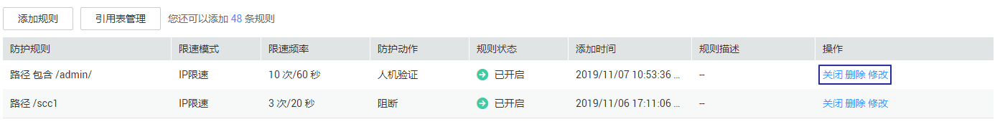

# 配置CC攻击防护规则

您可以自定义CC（Challenge Collapsar）防护规则，限制单个IP/Cookie/Referer访问者对您的网站上特定路径（URL）的访问频率，WAF会根据您配置的规则，精准识别CC攻击以及有效缓解CC攻击。例如，您可以配置该规则：当Cookie标识为name的用户在60秒内访问您域名下的“/admin\*“页面超过10次时，封禁该用户访问目标网址600秒。

> **说明：**   
>WAF会在客户请求Cookie中插入HWWAFSESID，HWWAFSESTIME等字段，这些字段服务于WAF统计和安全特性。  

## 前提条件

-   已获取管理控制台的账号和密码。
-   已添加防护域名。

## 操作步骤

1.  [登录管理控制台](https://console.huaweicloud.com/?locale=zh-cn)。
2.  进入防护配置入口，如[图1](#waf_01_0008_fig089771664710)所示。

    **图 1**  防护配置入口  
    

1.  在“CC攻击防护“配置框中，用户可根据自己的需要更改“状态“，单击“自定义CC攻击防护规则“，进入CC防护规则配置页面，如[图2](#fig102851827142620)所示。

    **图 2**  CC防护规则配置框  
    

2.  在“CC防护“规则配置页面左上角，单击“添加规则“。
3.  在弹出的对话框中，根据[表1](#table1173915209149)配置CC防护规则。

    以[图3](#fig172782071413)的配置为例，其含义为：Cookie标识为“name“的用户访问目标地址（以/admin为前缀的地址，例如，Https://www.example.com/adminlogic）时，一旦在60秒内访问超过10次，就直接阻断该Cookie用户访问目标URL地址，阻断操作持续600秒，阻断页面返回自定义的页面内容。

    **图 3**  添加CC防护规则  
    

    **表 1**  CC防护规则参数说明

    
    <table><thead align="left"><tr id="row16728112012148"><th class="cellrowborder" valign="top" width="19%" id="mcps1.2.4.1.1">
参数

    </th>
    <th class="cellrowborder" valign="top" width="54.26%" id="mcps1.2.4.1.2">
参数说明

    </th>
    <th class="cellrowborder" valign="top" width="26.740000000000002%" id="mcps1.2.4.1.3">
取值样例

    </th>
    </tr>
    </thead>
    <tbody><tr id="row948393052717"><td class="cellrowborder" valign="top" width="19%" headers="mcps1.2.4.1.1 ">
工作模式

    </td>
    <td class="cellrowborder" valign="top" width="54.26%" headers="mcps1.2.4.1.2 "><ul id="ul426016212810"><li>标准：只支持对域名的防护路径做限制。</li><li>高级：支持对路径、IP、Cookie字段做限制。仅企业版和旗舰版支持高级模式。</li></ul>
    </td>
    <td class="cellrowborder" valign="top" width="26.740000000000002%" headers="mcps1.2.4.1.3 ">
标准

    </td>
    </tr>
    <tr id="row1073012091411"><td class="cellrowborder" valign="top" width="19%" headers="mcps1.2.4.1.1 ">
路径

    </td>
    <td class="cellrowborder" valign="top" width="54.26%" headers="mcps1.2.4.1.2 ">
当“工作模式”选择“标准”时，才配置此参数。

    
CC防护的URL链接，不包含域名。

    <ul id="ul1172942091416"><li>前缀匹配：以*结尾代表以该路径为前缀。例如，需要防护的路径为“/admin/test.php”或 “/adminabc”，则路径可以填写为“/admin*”。</li><li>精准匹配：需要防护的路径需要与此处填写的路径完全一致。例如，需要防护的路径为“/admin”，该规则必须填写为“/admin”。</li></ul>
    
 说明： 
<ul id="ul19730132018148"><li>该路径不支持正则，仅支持前缀匹配和精准匹配的逻辑。</li><li>路径里不能含有连续多条斜线的配置，如“///admin”，WAF引擎会将“///”转为“/”。</li><li>该路径区分大小写。</li></ul>
    

    </td>
    <td class="cellrowborder" valign="top" width="26.740000000000002%" headers="mcps1.2.4.1.3 ">
/admin*

    </td>
    </tr>
    <tr id="row3847404486"><td class="cellrowborder" valign="top" width="19%" headers="mcps1.2.4.1.1 ">
条件列表

    </td>
    <td class="cellrowborder" valign="top" width="54.26%" headers="mcps1.2.4.1.2 ">
当“工作模式”选择“高级”时，才配置此参数。

    
单击“添加”增加新的条件，至少配置一项条件，最多可添加30项条件，多个条件同时满足时，本条规则才生效。

    <ul id="ul61829843104748"><li>字段：路径、IP、Cookie。</li><li>子字段：当“字段”选择“Cookie”时，请根据实际需求配置子字段。
 须知： 

子字段的长度不能超过2048字节，且只能由数字、字母、下划线和中划线组成。

    

    </li><li>逻辑：在“逻辑”下拉列表中选择需要的逻辑关系。
 说明： 

当“逻辑”关系选择“包含任意一个”、“不包含所有”、“等于任意一个”、“不等于所有”、“前缀为任意一个”、“前缀不为所有”、“后缀为任意一个”或者“后缀不为所有”时，需要选择引用表，创建引用表的详细操作请参见<a href="创建引用表.md">创建引用表</a>。

    

    </li><li>内容：输入或者选择条件匹配的内容。</li></ul>
    </td>
    <td class="cellrowborder" valign="top" width="26.740000000000002%" headers="mcps1.2.4.1.3 ">
“路径”包含“/admin/”

    </td>
    </tr>
    <tr id="row8733192051415"><td class="cellrowborder" valign="top" width="19%" headers="mcps1.2.4.1.1 ">
限速模式

    </td>
    <td class="cellrowborder" valign="top" width="54.26%" headers="mcps1.2.4.1.2 "><ul id="ul167322202146"><li>IP限速：根据IP区分单个Web访问者。</li><li>用户限速：根据Cookie键值区分单个Web访问者。</li><li>其他：根据Referer（自定义请求访问的来源）字段区分单个Web访问者。
 说明： 

当“防护模式”选择“其他”时，“Referer”对应的“内容”填写为包含域名的完整URL链接，仅支持前缀匹配和精准匹配的逻辑，“内容”里不能含有连续的多条斜线的配置，如“///admin”，WAF引擎会将“///”转为“/”。

    
例如：防护路径设置为“/admin”，若用户不希望访问者从“www.test.com”访问该页面，则“Referer”对应的“内容”设置为“http://www.test.com”。

    

    </li></ul>
    </td>
    <td class="cellrowborder" valign="top" width="26.740000000000002%" headers="mcps1.2.4.1.3 ">
用户限速

    </td>
    </tr>
    <tr id="row1673319205141"><td class="cellrowborder" valign="top" width="19%" headers="mcps1.2.4.1.1 ">
用户标识

    </td>
    <td class="cellrowborder" valign="top" width="54.26%" headers="mcps1.2.4.1.2 ">
“防护模式”选择“用户限速”时，需要设置Cookie字段名，即用户需要根据网站实际情况配置唯一可识别Web访问者的Cookie中的某属性变量名。用户标识的Cookie，不支持正则，必须完全匹配。如果用户没有设置Cookie键值，WAF会自动分配一个值。

    
例如：如果网站使用Cookie中的某个字段name唯一标识用户，那么可以选取name字段来区分Web访问者。

    </td>
    <td class="cellrowborder" valign="top" width="26.740000000000002%" headers="mcps1.2.4.1.3 ">
name

    </td>
    </tr>
    <tr id="row13734220141419"><td class="cellrowborder" valign="top" width="19%" headers="mcps1.2.4.1.1 ">
限速频率

    </td>
    <td class="cellrowborder" valign="top" width="54.26%" headers="mcps1.2.4.1.2 ">
单个Web访问者在限速周期内可以正常访问的次数，如果超过该访问次数，Web应用防火墙服务将根据配置的“防护动作”来处理。

    </td>
    <td class="cellrowborder" valign="top" width="26.740000000000002%" headers="mcps1.2.4.1.3 ">
10次/60秒

    </td>
    </tr>
    <tr id="row4735102013144"><td class="cellrowborder" valign="top" width="19%" headers="mcps1.2.4.1.1 ">
防护动作

    </td>
    <td class="cellrowborder" valign="top" width="54.26%" headers="mcps1.2.4.1.2 ">
当访问的请求频率超过“限速频率”时，可设置以下防护动作：

    <ul id="ul1273582011416"><li class="MsoBodyText">人机验证：表示超过“限速频率”后弹出验证码，进行人机验证，完成验证后，请求将不受访问限制。</li><li class="MsoBodyText">阻断：表示超过“限速频率”将直接阻断。</li><li>动态阻断：上一个限速周期内，请求频率超过“限速频率”将被阻断，那么在下一个限速周期内，请求频率超过“放行频率”将被阻断。
仅“工作模式”选择“高级”时，才支持此防护动作。

    </li><li class="MsoBodyText">仅记录：表示超过“限速频率”将只记录不阻断。可<a href="下载防护事件数据.md">下载防护事件数据</a>查看域名的防护日志。</li></ul>
    </td>
    <td class="cellrowborder" valign="top" width="26.740000000000002%" headers="mcps1.2.4.1.3 ">
阻断

    </td>
    </tr>
    <tr id="row230819642110"><td class="cellrowborder" valign="top" width="19%" headers="mcps1.2.4.1.1 ">
放行频率

    </td>
    <td class="cellrowborder" valign="top" width="54.26%" headers="mcps1.2.4.1.2 ">
当“防护动作”选择“动态阻断”时，可配置放行频率。

    
如果在一个限速周期内，访问超过“限速频率”触发了拦截，那么，在下一个限速周期内，拦截阈值动态调整为“放行频率”。

    
“放行频率”小于等于“限速频率”。

    
 说明： 

当“放行频率”设置为0时，表示如果上一个限速周期发生过拦截后，下一个限速周期所有的请求都不放行。

    

    </td>
    <td class="cellrowborder" valign="top" width="26.740000000000002%" headers="mcps1.2.4.1.3 ">
8次/60秒

    </td>
    </tr>
    <tr id="row7736420181410"><td class="cellrowborder" valign="top" width="19%" headers="mcps1.2.4.1.1 ">
阻断时长

    </td>
    <td class="cellrowborder" valign="top" width="54.26%" headers="mcps1.2.4.1.2 ">
当“防护动作”选择“阻断”时，可设置阻断后恢复正常访问页面的时间。

    </td>
    <td class="cellrowborder" valign="top" width="26.740000000000002%" headers="mcps1.2.4.1.3 ">
600秒

    </td>
    </tr>
    <tr id="row157374203148"><td class="cellrowborder" valign="top" width="19%" headers="mcps1.2.4.1.1 ">
阻断页面

    </td>
    <td class="cellrowborder" valign="top" width="54.26%" headers="mcps1.2.4.1.2 ">
当“防护动作”选择“阻断”时，需要设置，即当访问超过限速频率时，返回的错误页面。

    <ul id="ul47377202143"><li>当选择“默认设置”时，返回的错误页面为系统默认的阻断页面。</li><li>当选择“自定义”，返回错误信息由用户自定义。</li></ul>
    </td>
    <td class="cellrowborder" valign="top" width="26.740000000000002%" headers="mcps1.2.4.1.3 ">
自定义

    </td>
    </tr>
    <tr id="row16738920121413"><td class="cellrowborder" valign="top" width="19%" headers="mcps1.2.4.1.1 ">
页面类型

    </td>
    <td class="cellrowborder" valign="top" width="54.26%" headers="mcps1.2.4.1.2 ">
当“阻断页面”选择“自定义”时，可选择阻断页面的类型“application/json”、“text/html”或者“text/xml”。

    </td>
    <td class="cellrowborder" valign="top" width="26.740000000000002%" headers="mcps1.2.4.1.3 ">
text/html

    </td>
    </tr>
    <tr id="row87384209145"><td class="cellrowborder" valign="top" width="19%" headers="mcps1.2.4.1.1 ">
页面内容

    </td>
    <td class="cellrowborder" valign="top" width="54.26%" headers="mcps1.2.4.1.2 ">
当“阻断页面”选择“自定义”时，可设置自定义返回的内容。

    </td>
    <td class="cellrowborder" valign="top" width="26.740000000000002%" headers="mcps1.2.4.1.3 ">
不同页面类型对应的页面内容样式：

    <ul id="ul046819338313"><li>text/html：&lt;html&gt;&lt;body&gt;Forbidden&lt;/body&gt;&lt;/html&gt;</li><li>application/json：{"msg": "Forbidden"}</li><li>text/xml：&lt;?xml version="1.0" encoding="utf-8"?&gt;&lt;error&gt;	&lt;msg&gt;Forbidden&lt;/msg&gt;&lt;/error&gt;</li></ul>
    </td>
    </tr>
    <tr id="row77392201145"><td class="cellrowborder" valign="top" width="19%" headers="mcps1.2.4.1.1 ">
规则描述

    </td>
    <td class="cellrowborder" valign="top" width="54.26%" headers="mcps1.2.4.1.2 ">
可选参数，设置该规则的备注信息。

    </td>
    <td class="cellrowborder" valign="top" width="26.740000000000002%" headers="mcps1.2.4.1.3 ">
--

    </td>
    </tr>
    </tbody>
    </table>

4.  单击“确认添加“，添加的CC攻击防护规则展示在CC规则列表中。

    **图 4**  CC规则列表  
    

    -   规则添加成功后，默认的“规则状态“为“已开启“，若您暂时不想使该规则生效，可在目标规则所在行的“操作“列，单击“关闭“。
    -   若需要修改添加的CC攻击防护规则时，可单击待修改的CC攻击防护规则所在行的“修改“，修改CC攻击防护规则。
    -   若需要删除用户自行添加的CC攻击防护规则时，可单击待删除的CC攻击防护规则所在行的“删除“，删除CC攻击防护规则。

## 防护效果

假如已添加域名“www.example.com“，且配置了如[图3](#fig172782071413)所示的CC防护规则。可参照以下步骤验证防护效果：

1.  清理浏览器缓存，在浏览器中输入防护域名，测试网站域名是否能正常访问。
    -   不能正常访问，参照[域名接入WAF](zh-cn_topic_0125242653.md)章节重新完成域名接入。
    -   能正常访问，执行[2](#li88102353919)。

2.  清理浏览器缓存，在浏览器中访问满足Cookie条件的“http://www.example.com/admin“页面，在60秒内刷新页面10次，正常情况下，在第11次访问该页面时，返回自定义的拦截页面；600秒后刷新目标页面，页面访问正常。
3.  返回Web应用防火墙控制界面，在左侧导航树中，单击“防护事件“，进入“防护事件“页面，查看防护域名拦截日志，您也可以[下载防护事件数据](下载防护事件数据.md)。

