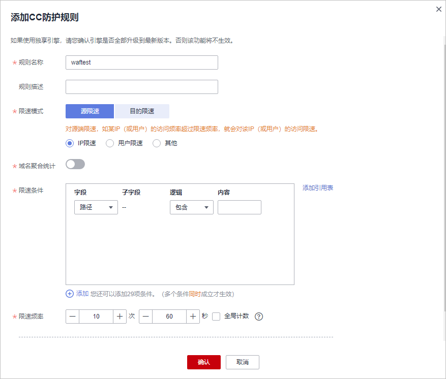

# 配置CC攻击防护规则防御CC攻击

CC攻击防护规则支持通过限制单个IP/Cookie/Referer访问者对防护网站上源端的访问频率，同时支持策略限速（同一策略下对应的所有域名请求次数合并限速）、域名限速（每个域名单独统计总请求次数）和URL限速（每个URL请求单独统计请求次数），精准识别CC攻击以及有效缓解CC攻击；当您配置完CC攻击防护规则并开启CC攻击防护后（即“CC攻击防护“配置框的“状态“为），WAF才能根据您配置的CC攻击防护规则进行CC攻击防护。

CC攻击防护规则可以添加引用表，引用表防护规则对所有防护域名都生效，即所有防护域名都可以使用CC攻击防护规则的引用表。

> **说明：** 
>如果您已开通企业项目，您需要在“企业项目“下拉列表中选择您所在的企业项目并确保已开通操作权限，才能为该企业项目下域名配置防护策略。

## 前提条件

-   已添加防护网站。
    -   云模式的接入方式参见[网站接入WAF（云模式）](网站接入WAF（云模式）.md)章节。
    -   独享模式的接入方式参见[网站接入WAF（独享模式）](网站接入WAF（独享模式）.md)章节。

-   如果使用独享WAF，确保独享引擎已升级到最新版本，具体的操作请参见[升级独享引擎实例](管理独享引擎.md)。

## 约束条件

-   添加或修改防护规则后，规则生效需要等待几分钟。规则生效后，您可以在“防护事件“页面查看防护效果。
-   当“逻辑“关系选择“包含任意一个“、“不包含所有“、“等于任意一个“、“不等于所有“、“前缀为任意一个“、“前缀不为所有“、“后缀为任意一个“或者“后缀不为所有“时，需要选择引用表，创建引用表的详细操作请参见[创建引用表对防护指标进行批量配置](创建引用表对防护指标进行批量配置.md)。
-   入门版和标准版不支持引用表管理功能。
-   仅云模式支持配置“全局计数“。
-   使用云模式WAF时，如果WAF前使用了高防、CDN（Content Delivery Network，内容分发网络）、云加速等代理时，建议“限速模式“选择“源限速  \>  用户限速“，并勾选“全局计数“。

> **说明：** 
>如果网站在接入WAF前，已经使用了CDN、高防等其他代理服务，WAF收到的访问IP会被分散到各个WAF节点进行流量转发，WAF默认为WAF节点单独计数。因此，WAF针对单个Web访问者的访问次数的计数会分散，所以“限速频率“中访问次数的设置原则如下：
>-   云模式：该模式支持“全局计数“，即支持将已经标识的请求在一个或多个WAF节点上的计数聚合，因此，配置时勾选“全局计数“即可。
>-   独享模式：该模式暂不支持“全局计数“，因此配置“限速频率“中访问次数应配置为：允许单个Web访问者在限速周期内访问网站的次数/MIN\(WAF前使用的代理服务总数：WAF节点数\)。
>    例如，WAF前已使用3个代理服务，WAF节点数（防护该网站的独享引擎实例数）为2，则取其最小值为2，如果您想当单个Web访问者在限速周期内访问网站的次数不能超过1000次，则“限速频率“中访问次数应配置为1000除以2，500。

## 操作步骤

1.  [登录管理控制台](https://console.huaweicloud.com/?locale=zh-cn)。
2.  单击管理控制台左上角的，选择区域或项目。
3.  单击页面左上方的，选择“安全与合规  \>  Web应用防火墙 WAF“。
4.  在左侧导航树中，选择“防护策略“，进入“防护策略“页面。
5.  单击目标策略名称，进入目标策略的防护配置页面。
6.  在“CC攻击防护“配置框中，用户可根据自己的需要更改“状态“，单击“自定义CC攻击防护规则“，进入CC防护规则配置页面。

    **图 1**  CC防护规则配置框  
    

7.  在“CC攻击防护“规则配置页面左上角，单击“添加规则“。
8.  在弹出的对话框中，根据[表1](#table480817611214)配置CC防护规则。

    例如，通过配置CC攻击防护规则实现以下功能：根据Cookie标识的用户字段（例如name），当WAF识别到同一name值的用户在60秒内访问您域名下的URL（例如，/admin\*）页面超过10次时，封禁该用户访问目标网址600秒。

    **图 2**  添加CC防护规则  
    

    **表 1**  CC防护规则参数说明

    
    <table><thead align="left"><tr id="row28091661216"><th class="cellrowborder" valign="top" width="19%" id="mcps1.2.4.1.1">
参数

    </th>
    <th class="cellrowborder" valign="top" width="54.26%" id="mcps1.2.4.1.2">
参数说明

    </th>
    <th class="cellrowborder" valign="top" width="26.740000000000002%" id="mcps1.2.4.1.3">
取值样例

    </th>
    </tr>
    </thead>
    <tbody><tr id="row77451636203015"><td class="cellrowborder" valign="top" width="19%" headers="mcps1.2.4.1.1 ">
规则名称

    </td>
    <td class="cellrowborder" valign="top" width="54.26%" headers="mcps1.2.4.1.2 ">
自定义规则名称。

    </td>
    <td class="cellrowborder" valign="top" width="26.740000000000002%" headers="mcps1.2.4.1.3 ">
waftest

    </td>
    </tr>
    <tr id="row1578403212304"><td class="cellrowborder" valign="top" width="19%" headers="mcps1.2.4.1.1 ">
规则描述

    </td>
    <td class="cellrowborder" valign="top" width="54.26%" headers="mcps1.2.4.1.2 ">
可选参数，设置该规则的备注信息。

    </td>
    <td class="cellrowborder" valign="top" width="26.740000000000002%" headers="mcps1.2.4.1.3 ">
--

    </td>
    </tr>
    <tr id="row41141352143411"><td class="cellrowborder" valign="top" width="19%" headers="mcps1.2.4.1.1 ">
限速模式

    </td>
    <td class="cellrowborder" valign="top" width="54.26%" headers="mcps1.2.4.1.2 "><ul id="ul7245174819362"><li>“源限速”：对源端限速，如某IP（或用户）的访问频率超过限速频率，就会对该IP（或用户）的访问限速。<ul id="ul250441619524"><li>“IP限速”：根据IP区分单个Web访问者。</li><li>“用户限速”：根据Cookie键值或者Header区分单个Web访问者。</li><li>“其他”：根据Referer（自定义请求访问的来源）字段区分单个Web访问者。</li></ul>
    
 说明： 

选择“其他”时，“Referer”对应的“内容”填写为包含域名的完整URL链接，仅支持前缀匹配和精准匹配的逻辑，“内容”里不能含有连续的多条斜线的配置，如“///admin”，WAF引擎会将“///”转为“/”。

    
例如：若用户不希望访问者从“www.test.com”访问网站，则“Referer”对应的“内容”设置为“http://www.test.com”。

    

    </li><li>“目的限速”：选择该参数时，可选择以下限速类型进行配置：<ul id="ul4124201614447"><li>“策略限速” ：当多个域名共用一个策略时，该策略下对应的所有域名请求次数合并限速(不区分访问IP)；泛域名防护场景时，该泛域名对应的所有子域名的请求次数合并限速(不区分访问IP)。</li><li>“域名限速”：每个域名单独统计总请求次数，超过设定值则触发防护动作(不区分访问IP)。</li><li>“URL限速”：每个URL请求单独统计请求次数，超过设定值则触发防护动作(不区分访问IP)。</li></ul>
    </li></ul>
    </td>
    <td class="cellrowborder" valign="top" width="26.740000000000002%" headers="mcps1.2.4.1.3 ">
--

    </td>
    </tr>
    <tr id="row9279193817572"><td class="cellrowborder" valign="top" width="19%" headers="mcps1.2.4.1.1 ">
用户标识

    </td>
    <td class="cellrowborder" valign="top" width="54.26%" headers="mcps1.2.4.1.2 ">
“限速模式”选择“源限速 &gt; 用户限速”时，需要配置此参数：

    <ul id="ul17923124914573"><li>选择Cookie时，设置Cookie字段名，即用户需要根据网站实际情况配置唯一可识别Web访问者的Cookie中的某属性变量名。用户标识的Cookie，不支持正则，必须完全匹配。
例如：如果网站使用Cookie中的某个字段name唯一标识用户，那么可以选取name字段来区分Web访问者。

    </li><li>选择Header时，设置需要防护的自定义HTTP首部，即用户需要根据网站实际情况配置可识别Web访问者的HTTP首部。</li></ul>
    </td>
    <td class="cellrowborder" valign="top" width="26.740000000000002%" headers="mcps1.2.4.1.3 ">
name

    </td>
    </tr>
    <tr id="row0629171375917"><td class="cellrowborder" valign="top" width="19%" headers="mcps1.2.4.1.1 ">
域名聚合统计

    </td>
    <td class="cellrowborder" valign="top" width="54.26%" headers="mcps1.2.4.1.2 ">
“限速模式”选择“目的限速 &gt; 策略限速”时，不需要配置此参数。

    
默认关闭，开启后，泛域名对应的所有子域名的请求次数合并限速(不区分访问IP)。例如，配置的泛域名为“*.a.com”，会将所有子域名（b.a.com，c.a.com等）的请求一起聚合统计。

    </td>
    <td class="cellrowborder" valign="top" width="26.740000000000002%" headers="mcps1.2.4.1.3 ">
--

    </td>
    </tr>
    <tr id="row88111966213"><td class="cellrowborder" valign="top" width="19%" headers="mcps1.2.4.1.1 ">
限速条件

    </td>
    <td class="cellrowborder" valign="top" width="54.26%" headers="mcps1.2.4.1.2 ">
单击“添加”增加新的条件，至少配置一项条件，最多可添加30项条件，多个条件同时满足时，本条规则才生效。

    <ul id="ul1381286182115"><li>字段。</li><li>子字段：当“字段”选择IPv4、IPv6、Cookie、Header、Params时，请根据实际需求配置子字段。
 须知： 

子字段的长度不能超过2048字节，且只能由数字、字母、下划线和中划线组成。

    

    </li><li>逻辑：在“逻辑”下拉列表中选择需要的逻辑关系。
 说明： 

当“逻辑”关系选择“包含任意一个”、“不包含所有”、“等于任意一个”、“不等于所有”、“前缀为任意一个”、“前缀不为所有”、“后缀为任意一个”或者“后缀不为所有”时，需要选择引用表，创建引用表的详细操作请参见<a href="创建引用表对防护指标进行批量配置.md">创建引用表对防护指标进行批量配置</a>。

    

    </li><li>内容：输入或者选择条件匹配的内容。</li></ul>
    </td>
    <td class="cellrowborder" valign="top" width="26.740000000000002%" headers="mcps1.2.4.1.3 ">
“路径”包含“/admin/”

    </td>
    </tr>
    <tr id="row781736152116"><td class="cellrowborder" valign="top" width="19%" headers="mcps1.2.4.1.1 ">
限速频率

    </td>
    <td class="cellrowborder" valign="top" width="54.26%" headers="mcps1.2.4.1.2 ">
单个Web访问者在限速周期内可以正常访问的次数，如果超过该访问次数，Web应用防火墙服务将根据配置的“防护动作”来处理。

    
“全局计数”：根据不同的限速模式，将已经标识的请求在一个或多个WAF节点上的计数聚合。默认为每WAF节点单独计数，开启后本区域所有节点合并计数。“IP限速”不能满足针对某个用户进行限速，需要选择“用户限速”或“其他”的Referer限速，此时标识的请求可能会访问到不同的WAF节点，开启全局计数后，将请求访问的一个或多个WAF节点访问量聚合，达到全局统计的目的。

    
 说明： 

如果网站在接入WAF前，已经使用了CDN、高防等其他代理服务，WAF收到的访问IP会被分散到各个WAF节点进行流量转发，WAF默认为WAF节点单独计数。因此，WAF针对单个Web访问者的访问次数的计数会分散，所以“限速频率”中访问次数的设置原则如下：

    <ul id="waf_01_0009_ul7545343123018"><li>云模式：该模式支持“全局计数”，即支持将已经标识的请求在一个或多个WAF节点上的计数聚合，因此，配置时勾选“全局计数”即可。</li><li>独享模式：该模式暂不支持“全局计数”，因此配置“限速频率”中访问次数应配置为：允许单个Web访问者在限速周期内访问网站的次数/MIN(WAF前使用的代理服务总数：WAF节点数)。
例如，WAF前已使用3个代理服务，WAF节点数（防护该网站的独享引擎实例数）为2，则取其最小值为2，如果您想当单个Web访问者在限速周期内访问网站的次数不能超过1000次，则“限速频率”中访问次数应配置为1000除以2，500。

    </li></ul>
    

    </td>
    <td class="cellrowborder" valign="top" width="26.740000000000002%" headers="mcps1.2.4.1.3 ">
10次/60秒

    </td>
    </tr>
    <tr id="row98183611216"><td class="cellrowborder" valign="top" width="19%" headers="mcps1.2.4.1.1 ">
防护动作

    </td>
    <td class="cellrowborder" valign="top" width="54.26%" headers="mcps1.2.4.1.2 ">
当访问的请求频率超过“限速频率”时，可设置以下防护动作：

    <ul id="ul581886182115"><li class="MsoBodyText">人机验证：表示超过“限速频率”后弹出验证码，进行人机验证，完成验证后，请求将不受访问限制。人机验证目前支持英文。</li><li class="MsoBodyText">阻断：表示超过“限速频率”将直接阻断。</li><li>动态阻断：上一个限速周期内，请求频率超过“限速频率”将被阻断，那么在下一个限速周期内，请求频率超过“放行频率”将被阻断。</li><li class="MsoBodyText">仅记录：表示超过“限速频率”将只记录不阻断。可<a href="下载防护事件数据.md">下载防护事件数据</a>查看域名的防护日志。</li></ul>
    </td>
    <td class="cellrowborder" valign="top" width="26.740000000000002%" headers="mcps1.2.4.1.3 ">
阻断

    </td>
    </tr>
    <tr id="row1485755335715"><td class="cellrowborder" valign="top" width="19%" headers="mcps1.2.4.1.1 ">
锁定验证

    </td>
    <td class="cellrowborder" valign="top" width="54.26%" headers="mcps1.2.4.1.2 ">
当“防护动作”选择“人机验证”时，需要配置该参数。

    
当人机验证未通过时，在设定时间内的访问都要进行验证。

    </td>
    <td class="cellrowborder" valign="top" width="26.740000000000002%" headers="mcps1.2.4.1.3 ">
300秒

    </td>
    </tr>
    <tr id="row198251869211"><td class="cellrowborder" valign="top" width="19%" headers="mcps1.2.4.1.1 ">
放行频率

    </td>
    <td class="cellrowborder" valign="top" width="54.26%" headers="mcps1.2.4.1.2 ">
当“防护动作”选择“动态阻断”时，可配置放行频率。

    
如果在一个限速周期内，访问超过“限速频率”触发了拦截，那么，在下一个限速周期内，拦截阈值动态调整为“放行频率”。

    
“放行频率”小于等于“限速频率”。

    
 说明： 

当“放行频率”设置为0时，表示如果上一个限速周期发生过拦截后，下一个限速周期所有的请求都不放行。

    

    </td>
    <td class="cellrowborder" valign="top" width="26.740000000000002%" headers="mcps1.2.4.1.3 ">
8次/60秒

    </td>
    </tr>
    <tr id="row48261163219"><td class="cellrowborder" valign="top" width="19%" headers="mcps1.2.4.1.1 ">
阻断时长

    </td>
    <td class="cellrowborder" valign="top" width="54.26%" headers="mcps1.2.4.1.2 ">
当“防护动作”选择“阻断”时，可设置阻断后恢复正常访问页面的时间。

    </td>
    <td class="cellrowborder" valign="top" width="26.740000000000002%" headers="mcps1.2.4.1.3 ">
600秒

    </td>
    </tr>
    <tr id="row178278614219"><td class="cellrowborder" valign="top" width="19%" headers="mcps1.2.4.1.1 ">
阻断页面

    </td>
    <td class="cellrowborder" valign="top" width="54.26%" headers="mcps1.2.4.1.2 ">
当“防护动作”选择“阻断”时，需要设置该参数，即当访问超过限速频率时，返回的错误页面。

    <ul id="ul58276611212"><li>当选择“默认设置”时，返回的错误页面为系统默认的阻断页面。</li><li>当选择“自定义”，返回错误信息由用户自定义。</li></ul>
    </td>
    <td class="cellrowborder" valign="top" width="26.740000000000002%" headers="mcps1.2.4.1.3 ">
自定义

    </td>
    </tr>
    <tr id="row11828126112117"><td class="cellrowborder" valign="top" width="19%" headers="mcps1.2.4.1.1 ">
页面类型

    </td>
    <td class="cellrowborder" valign="top" width="54.26%" headers="mcps1.2.4.1.2 ">
当“阻断页面”选择“自定义”时，可选择阻断页面的类型“application/json”、“text/html”或者“text/xml”。

    </td>
    <td class="cellrowborder" valign="top" width="26.740000000000002%" headers="mcps1.2.4.1.3 ">
text/html

    </td>
    </tr>
    <tr id="row118281863218"><td class="cellrowborder" valign="top" width="19%" headers="mcps1.2.4.1.1 ">
页面内容

    </td>
    <td class="cellrowborder" valign="top" width="54.26%" headers="mcps1.2.4.1.2 ">
当“阻断页面”选择“自定义”时，可设置自定义返回的内容。

    </td>
    <td class="cellrowborder" valign="top" width="26.740000000000002%" headers="mcps1.2.4.1.3 ">
不同页面类型对应的页面内容样式：

    <ul id="ul15828206152120"><li>text/html：&lt;html&gt;&lt;body&gt;Forbidden&lt;/body&gt;&lt;/html&gt;</li><li>application/json：{"msg": "Forbidden"}</li><li>text/xml：&lt;?xml version="1.0" encoding="utf-8"?&gt;&lt;error&gt;	&lt;msg&gt;Forbidden&lt;/msg&gt;&lt;/error&gt;</li></ul>
    </td>
    </tr>
    </tbody>
    </table>

9.  单击“确认“，添加的CC攻击防护规则展示在CC规则列表中。
    -   规则添加成功后，默认的“规则状态“为“已开启“，若您暂时不想使该规则生效，可在目标规则所在行的“操作“列，单击“关闭“。
    -   若需要修改添加的CC攻击防护规则时，可单击待修改的CC攻击防护规则所在行的“修改“，修改CC攻击防护规则。
    -   若需要删除用户自行添加的CC攻击防护规则时，可单击待删除的CC攻击防护规则所在行的“删除“，删除CC攻击防护规则。

## 防护效果

假如已添加域名“www.example.com“，且配置了如[图2](#fig1083929152617)所示“阻断“防护动作的CC防护规则。可参照以下步骤验证防护效果：

1.  清理浏览器缓存，在浏览器中输入防护域名，测试网站域名是否能正常访问。
    -   不能正常访问，参照[网站设置](网站设置.md)章节重新完成域名接入。
    -   能正常访问，执行[2](#li88102353919)。

2.  清理浏览器缓存，在浏览器中访问满足Cookie条件的“http://www.example.com/admin“页面，在60秒内刷新页面10次，正常情况下，在第11次访问该页面时，返回自定义的拦截页面；600秒后刷新目标页面，页面访问正常。

    如果您设置了“人机验证“防护动作，当用户访问超过限制后需要输入验证码才能继续访问。

    

3.  返回Web应用防火墙控制界面，在左侧导航树中，单击“防护事件“，进入“防护事件“页面，查看防护域名拦截日志，您也可以[下载防护事件数据](下载防护事件数据.md)。

## 配置示例-人机验证

假如防护域名“www.example.com“已接入WAF，您可以参照以下操作步骤验证人机验证防护效果。

1.  添加防护动作为“人机验证“CC防护规则。

    **图 3**  添加“人机验证“防护规则  
    

2.  开启CC攻击防护。

    **图 4**  CC防护规则配置框  
    

3.  清理浏览器缓存，在浏览器中访问“http://www.example.com/admin/“页面。

    当您在60秒内访问页面10次，在第11次访问该页面时，页面弹出验证码。此时，您需要输入验证码才能继续访问。

    

4.  返回Web应用防火墙管理控制台，在左侧导航树中，单击“防护事件“，进入“防护事件“页面，您可以查看该防护事件。

    **图 5**  查看防护事件-人机验证  
    

