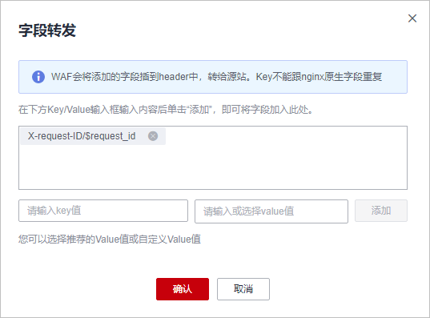

# 配置Header字段转发<a name="waf_01_2157"></a>

如果您想通过WAF添加额外的Header头部信息，例如$request\_id让整个链路的请求都可以关联起来。可参考本章节配置字段转发，WAF会将添加的字段插到Header中，转发给源站。配置的Key值不能跟nginx原生字段重复。

## 前提条件<a name="section819148182513"></a>

已添加防护网站且部署模式为“云模式“或“独享模式“。

## 约束条件<a name="section12217331278"></a>

-   仅“云模式“和“独享模式“支持。
-   支持配置Header字段转发的区域，请参考[功能总览](https://support.huaweicloud.com/function-waf/index.html#)。
-   最多支持配置8个Key/Value值。
-   key值客户可以任意配置，但是不能跟Nginx原生字段重复。
-   Value值可以自定义一个字符串，也可以配置为以$开头的变量。以$开头的变量仅支持配置如下字段：

    ```
    $time_local
    $request_id
    $connection_requests
    $tenant_id
    $project_id
    $remote_addr
    $remote_port
    $scheme
    $request_method
    $http_host
    $origin_uri
    $request_length
    $ssl_server_name
    $ssl_protocol
    $ssl_curves
    $ssl_session_reused
    ```

## 操作步骤<a name="section3405957173615"></a>

1.  [登录管理控制台](https://console.huaweicloud.com/?locale=zh-cn)。
2.  单击管理控制台左上角的，选择区域或项目。
3.  单击页面左上方的，选择“安全与合规  \>  Web应用防火墙 WAF“。
4.  在左侧导航树中，选择“网站设置“，进入“网站设置“页面。
5.  在目标网站所在行的“域名“列中，单击目标网站，进入网站基本信息页面。
6.  在“字段转发“列，单击，在弹出的“字段转发“弹框中，输入Key/Value值，并单击“添加“，可添加多个字段。

    **图 1**  字段转发<a name="fig230343411427"></a>  
    

7.  确认字段添加完成后，单击“确认“。

